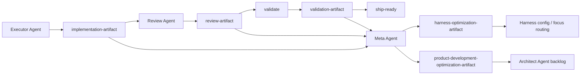

# Agent Runtime Artifacts

**Status:** Published (Agent Runtime Phase 5)  
**Authority:** [ADR-003](../adr/003-ai-native-cicd-policy.md) for CI gate fields; this file for runtime artifact routing, schemas, and persistence  
**Canonical runtime:** [`agent-runtime.md`](agent-runtime.md)

Machine-readable execution feedback for the agent-phase harness. Source documents
(PRDs, ADRs, GitHub issues, handoff markdown) are planning inputs — they are **not**
substitutes for runtime artifacts.

---

## Artifact taxonomy

| Artifact | Producer | Primary consumers | Path pattern |
|----------|----------|-------------------|--------------|
| **implementation** | Executor Agent | Review Agent, Meta Agent | `agent-runtime/artifacts/implementations/implementation-issue-<n>.json` |
| **intent_review** | Review Agent (`intent-review` skill) | Guardrails (as given) | `agent-runtime/artifacts/intent-reviews/intent-review-issue-<n>.json` |
| **review** | Review Agent (`guardrails` skill) | Validate, `pr.yml`, Meta Agent | `agent-runtime/artifacts/reviews/review-issue-<n>.json` |
| **validation** | Review Agent (`validate` skill, `pr.yml`) | Ship, Meta Agent | `agent-runtime/artifacts/validation/validation-issue-<n>.json` |
| **harness_optimization** | Meta Agent | Harness config, benchmark reruns | `agent-runtime/artifacts/optimization/harness-issue-<n>-<phaseRunId>.json` |
| **product_development_optimization** | Meta Agent (occasional) | Architect Agent backlog | `agent-runtime/artifacts/optimization/product-development-<id>.json` |
| **release** *(ADR-003)* | Ship skill, `release.yml` | Rollback / hotfix agents | `agent-runtime/artifacts/releases/release-<version>.json` |
| **audit** *(ADR-003)* | `architecture-audit.yml` | Triage to GitHub issues | `agent-runtime/artifacts/validation/audit-<type>-<date>.json` |

JSON Schema definitions: [`schemas/README.md`](schemas/README.md).

---

## Workflow cache — public release (#500 / ADR-035)

Child cache path: `agent-runtime/artifacts/workflow-cache/issue-context-cache-<n>.json`
(schema: [`issue-context-cache-artifact.schema.json`](schemas/issue-context-cache-artifact.schema.json)).

| Field | Role | Gate / consumer |
|-------|------|-----------------|
| `publicRelease` | Meta classifier result persisted on cache | Meta gate `public_release_classification` (#513) |
| `publicReleaseReasons` | Reason codes (`path:` / `surface:` / `body:` / …) | Audit trail; must match live classifier |
| `issueLoadProfile.releaseEvidencePlan` | ADR-035 contract object | Meta gate `public_release_evidence_plan` (#513); validated against [`release-evidence-plan.schema.json`](schemas/release-evidence-plan.schema.json) |
| `injectionPlan.tddContract` | Executor TDD requirements | Emitted by `meta_prepare_executor.py` when `readyForExecutor: true` (#514) |
| `injectionPlan.releaseEvidencePlan` | Full plan copy for Executor | Present only when `publicRelease: true` (#514) |
| `implementation.releaseEvidencePlanId` | Plan continuity key | Validate check `release_evidence_plan_continuity` (#515) |
| `validation.releaseEvidencePlanId` | Echo for ship continuity | Same check (#515) |

Sub-agents must not infer or waive `releaseEvidencePlan`; incomplete plans halt Meta with
`missingFields` (see [ADR-035](../../docs/adr/035-public-release-evidence-and-automatic-rollback.md)).

### META enforcement ownership (#500 epic)

| Slice | Issue | Owns |
|-------|-------|------|
| META-1 | [#513](https://github.com/thienphung00/Juli-AI/issues/513) | `public_release_classification` + `public_release_evidence_plan` Meta gates; classifier/plan unit coverage |
| META-2 | [#514](https://github.com/thienphung00/Juli-AI/issues/514) | `injectionPlan` contract (`tddContract`, `releaseEvidencePlan` injection); injection unit coverage |
| META-3 | [#515](https://github.com/thienphung00/Juli-AI/issues/515) | Validate gate scripts under `agent-runtime/scripts/validate/check_*.py`; unit suites `tests/unit/test_implementation_*.py`, `test_executor_domain_matches_cache.py`, `test_phase_run_correlation.py`, `test_release_evidence_plan_continuity.py`, `test_release_metadata_honesty.py` |
| META-4 | [#516](https://github.com/thienphung00/Juli-AI/issues/516) | E2E harness `tests/harness/test_meta_validate_e2e_public_release.py`; `CHECKS` wiring in `generate_validation_artifact.py`; docs (this slice) |

---

## Routing diagram



No execution artifact bypasses Meta after validation completes. Meta may read source
documents for explanation, but scoring and optimization must use artifact fields
where deterministic evidence exists.

---

## ADR-003 compatibility

ADR-003 review and validation artifacts remain the **CI gate contract**. Agent Runtime
schemas **extend** those contracts — they do not replace gate-required fields.

| Concern | ADR-003 / CI gate field | Meta optimization field | Notes |
|---------|-------------------------|-------------------------|-------|
| Review pass/fail | `status` | `reviewStatus` (optional mirror) | CI reads `status` only |
| Critical findings | `criticalFindings[]` | `findings`, `reviewFailures` | Gate uses `criticalFindings`; Meta aggregates `reviewFailures` count |
| Acceptance mapping | `testCoverage.acceptance` | — | Unchanged for `check_acceptance_mapping.py` |
| Validation pass/fail | `status`, `readyForMerge` | `readyForShip` (optional mirror) | CI reads `status` and `readyForMerge` |
| Per-check results | `checks[]` | `validationFailures` | Gate uses `checks`; Meta uses failure count |

**Phase 4** updates skills to emit optimization fields. Gate scripts under
`agent-runtime/scripts/validate/` continue to validate only ADR-003 required fields.

---

## Persistence policy

### Commit on feature branches

| Path | Commit? | Rationale |
|------|---------|-----------|
| `agent-runtime/artifacts/intent-reviews/intent-review-issue-*.json` | **Yes** | Guardrails handoff contract (ADR-022) |
| `agent-runtime/artifacts/reviews/review-issue-*.json` | **Yes** | ADR-003: CI `pr.yml` requires branch-persistent review artifacts |
| `agent-runtime/artifacts/validation/validation-issue-*.json` | **Yes** | ADR-003: ship and CI consume validation artifacts |
| `agent-runtime/artifacts/implementations/implementation-issue-*.json` | **Yes** | Small JSON; Meta optimization input |
| `agent-runtime/artifacts/optimization/harness-issue-*.json` | **Yes** | Primary Meta output; benchmark before/after comparison |
| `agent-runtime/artifacts/optimization/product-development-*.json` | **Yes** | Architect backlog routing evidence |
| `agent-runtime/artifacts/releases/release-*.json` | **Yes** | ADR-003 rollback metadata |
| `agent-runtime/artifacts/validation/audit-*.json` | **Yes** | Nightly audit summaries (structured JSON) |

### Never commit

| Path | Rationale |
|------|-----------|
| `artifacts/runtime/raw/` | Large raw tool logs, full test stdout, screenshots |
| `artifacts/runtime/logs/` | Verbose session telemetry |
| `.agent-state/` | Local session resumption only |

### Editing rules

- **Intent-review artifact:** regenerate via `intent-review` skill or `generate_intent_review_artifact.py`.
- **Review artifact:** regenerate via `guardrails` skill or `generate_review_artifact.py` — do not edit from `validate`.
- **Validation artifact:** produced by `validate` skill or `generate_validation_artifact.py` after gates pass.
- **Implementation / optimization artifacts:** produced by Executor / Meta agents per Phase 4 skill updates; manual edits only for harness benchmark fixtures.

See [`artifacts/README.md`](../../agent-runtime/artifacts/README.md) for directory layout.

---

## Schema versions

All runtime artifacts include `schemaVersion` (semver string). Current version: **`1.0.0`**.

| Schema file | `artifactType` / role |
|-------------|------------------------|
| `implementation-artifact.schema.json` | `implementation` |
| `intent-review-artifact.schema.json` | `intent_review` |
| `review-artifact.schema.json` | `review` |
| `validation-artifact.schema.json` | `validation` |
| `harness-optimization-artifact.schema.json` | `harness_optimization` |
| `product-development-optimization-artifact.schema.json` | `product_development_optimization` |
| `promotion-candidate-artifact.schema.json` | `harness_promotion_candidate` |
| `parent-cache-artifact.schema.json` | `parent_cache` (gitignored workflow cache) |
| `issue-context-cache-artifact.schema.json` | `issue_context_cache` — includes `publicRelease`, `releaseEvidencePlan` |
| `release-evidence-plan.schema.json` | Embedded object (not a standalone artifact file) |
| `harness-config.schema.json` | `agent-runtime.config.yml` shape (not an execution artifact) |

Full index: [`schemas/README.md`](schemas/README.md).

Bump `schemaVersion` minor for backward-compatible field additions; major for breaking
changes to required CI gate fields (requires ADR and gate script updates).

---

## Field reference (by artifact)

### implementation-artifact

Executor → Review + Meta execution signal.

**Required:** `schemaVersion`, `artifactType`, `issueId`, `executorDomain`, `phaseRunId`,
`startedAt`, `completedAt`, `executionDurationMs`, `toolsUsed`, `toolInvocationCount`,
`contextFilesLoaded`, `skillsLoaded`, `rulesLoaded`, `mcpsUsed`, `filesModified`, `testsAdded`, `testsUpdated`,
`redGreenRefactorEvidence`, `implementationSummary`, `assumptions`, `risks`.

**Optional:** `tokenUsage` (input/output/total when available).

`redGreenRefactorEvidence` is an array of TDD cycles: failing test evidence, passing test
evidence, refactor notes, and commands/results when available.

`executorDomain` enum: `ui-ux` | `backend` | `data-platform` | `machine-learning` | `integrations`.

### review-artifact

Review → Validate + Meta quality signal. **All ADR-003 fields remain required for CI.**

**ADR-003 required (CI):** `id`, `issue`, `status`, `criticalFindings`, `modulesTouched`,
`testCoverage` (with `acceptance.total`, `acceptance.mapped`, `acceptance.mappings`).

**Meta extensions (optional until Phase 4):** `schemaVersion`, `artifactType`,
`sourceImplementationArtifact`, `reviewStatus`, `reviewFailures`, `findings`, `severity`,
`securityFindings`, `architectureFindings`, `maintainabilityFindings`,
`suggestedRemediation`, `staticAnalysisExecuted`, `dynamicTestsExecuted`, `reviewDurationMs`.

### validation-artifact

Validate → Ship + Meta objective-quality signal.

**ADR-003 required (CI):** `id`, `issue`, `status`, `checks`, `readyForMerge`.

**Meta extensions (optional until Phase 4):** `schemaVersion`, `artifactType`,
`sourceReviewArtifact`, `testsExecuted`, `testsPassed`, `testsFailed`, `coveragePercentage`,
`benchmarkStatus`, `executionDurationMs`, `retryCount`, `validationFailures`, `readyForShip`.

`readyForShip` mirrors `readyForMerge` when both are present; CI continues to read
`readyForMerge`.

### harness-optimization-artifact

Meta → Harness config. Emitted after every complete agent-phase run (Phase 6 automation).

Captures the **eight baseline metrics:**

| Metric | Primary artifact field(s) |
|--------|---------------------------|
| Execution Time | `executionDurationMs`, `baselineMetrics.executionTimeMs` |
| Token Usage | `tokenUsage`, `baselineMetrics.tokenUsageTotal` |
| Test Pass Rate | `baselineMetrics.testPassRate` (from validation artifact) |
| Test Coverage | `baselineMetrics.coveragePercentage` |
| Review Failure Rate | `reviewFailures`, `baselineMetrics.reviewFailureRate` |
| Validation Failure Rate | `validationFailures`, `baselineMetrics.validationFailureRate` |
| Retry Count | `retryCount`, `baselineMetrics.retryCount` |
| Tool Invocation Count | `toolInvocationCount`, `baselineMetrics.toolInvocationCount` |

**Required:** `schemaVersion`, `artifactType`, `issueId`, `phaseRunId`, `phasePath`,
`executorAssigned`, `contextFilesLoaded`, `skillsLoaded`, `rulesLoaded`, `mcpsUsed`, `tokenUsage`, `executionDurationMs`,
`reviewFailures`, `validationFailures`, `retryCount`, `contextTransferCount`,
`toolInvocationCount`, `baselineMetrics`, `rootCauseCategory`, `proposedOptimization`,
`expectedMetricImpact`, `harnessConfigTargets`, `autoApplyEligible`, `appliedStatus`,
`sourceArtifacts`.

`appliedStatus` enum: `proposed` | `accepted` | `rejected` | `applied` | `measured`.

`rootCauseCategory` enum: `context_underloaded`, `context_overloaded`, `wrong_executor_domain`,
`insufficient_tdd_evidence`, `review_gap`, `validation_failure`, `tool_overuse`, `phase_loop`,
`artifact_incomplete`, `architecture_unclear`.

### product-development-optimization-artifact

Meta → Architect backlog (occasional). Emitted when repeated evidence indicates process or
architecture improvement.

**Required:** `schemaVersion`, `artifactType`, `id`, `sourceIssueIds`, `detectedPattern`,
`rootCauseCategory`, `planningSignal`, `architectureSignal`, `decompositionSignal`,
`reviewSignal`, `recommendedBacklogItem`, `requiresADR`, `requiresPRDUpdate`,
`requiresIssueTemplateUpdate`, `priority`, `evidenceArtifacts`, `acceptedByArchitect`.

**Optional:** `sourceBenchmarkRunIds`.

`acceptedByArchitect` enum: `pending` | `accepted` | `rejected`.

`priority` enum: `low` | `medium` | `high`.

---

## phaseRunId convention

Correlates artifacts from one complete agent-phase execution:

```
<issueId>-<ISO8601-date>-<short-hash>
```

Example: `42-2026-06-23-a1b2c3`

All artifacts from the same run share `phaseRunId`. Harness optimization artifacts
append it to the filename for uniqueness when multiple runs exist per issue.

---

## Validation workflow

1. **CI gates (mandatory):** `agent-runtime/scripts/validate/*.py` — ADR-003 fields plus
   META-1/META-3 gates (wired into `CHECKS` by #516):

   | Check name | Script | Notes |
   |------------|--------|-------|
   | `public_release_classification` | `check_public_release_classification.py` | Child cache matches live classifier (#513) |
   | `public_release_evidence_plan` | `check_public_release_evidence_plan.py` | Schema-valid plan when `publicRelease` (#513) |
   | `implementation_schema_valid` | `check_implementation_schema_valid.py` | JSON Schema for implementation artifact |
   | `implementation_tdd_evidence` | `check_implementation_tdd_evidence.py` | TDD cycles when code paths touched |
   | `executor_domain_matches_cache` | `check_executor_domain_matches_cache.py` | Matches child `issueLoadProfile.executorDomain` |
   | `phase_run_correlation` | `check_phase_run_correlation.py` | Shared `phaseRunId` across phase artifacts |
   | `release_evidence_plan_continuity` | `check_release_evidence_plan_continuity.py` | Skipped when not `publicRelease`; else `releaseEvidencePlanId` chain |
   | `release_metadata_honesty` | `check_release_metadata_honesty.py` | No hardcoded release success without evidence |

   Orchestrator: [`generate_validation_artifact.py`](../scripts/ci/generate_validation_artifact.py).
   Meta session entry also runs `public_release_*` in
   [`check_workflow_cache.GATE_SEQUENCE`](../scripts/validate/check_workflow_cache.py)
   before Executor.
2. **Schema check (advisory):** validate JSON against `schemas/*.schema.json`
   before committing optimization artifacts or during benchmark runs.
3. **Meta scoring:** derive the eight baseline metrics from `baselineMetrics`
   on harness optimization artifacts; compare across benchmark reruns per
   [`agent-runtime-benchmarks.md`](agent-runtime-benchmarks.md).
4. **E2E harness (#516):** `tests/harness/test_meta_validate_e2e_public_release.py` —
   fixture-driven Meta prepare → Validate for public and non-public issues
   (complements #513–#515 unit suites).

---

## Related documents

| Document | Owns |
|----------|------|
| [`agent-runtime.md`](agent-runtime.md) | Agent phases, ownership, optimization loop intent |
| [`agent-runtime-benchmarks.md`](agent-runtime-benchmarks.md) | Benchmark protocol and scoring |
| [ADR-003](../adr/003-ai-native-cicd-policy.md) | CI enforcement, gate ordering |
| [`docs/deployment/implementation-guide.md`](../ci/implementation-guide.md) | Gate scripts, ADR-003 schema examples |
| [`artifacts/README.md`](../../agent-runtime/artifacts/README.md) | Directory layout and commit policy |
