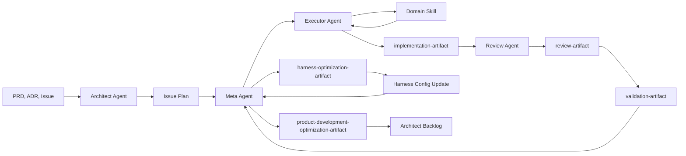

# Agent Runtime Architecture

**Status:** Published (Agent Runtime Phase 5)  
**Authority:** [`EXECUTION.md`](../../EXECUTION.md) > this file > skills and rules  
**CI gates:** [ADR-003](../adr/003-ai-native-cicd-policy.md) for review → validate → ship; runtime schemas in [`agent-runtime-artifacts.md`](agent-runtime-artifacts.md).

This document is the canonical harness architecture for Juli AI development. It describes
an **agent-phase model** over the existing skills-first harness — not a new orchestration
framework, runtime service, or AutoAgent-style executor.

> **Routing:** Open this file when the task touches agent phases, agent ownership,
> executor domains, context routing, or harness optimization. For deployed modules see
> [`map.md`](map.md); for data-source policy see [`data-sources.md`](data-sources.md).

---

## Purpose

The repository is built and operated by AI agents using skills under
[`.cursor/skills/`](../../.cursor/skills/). Conversations are session-local; durable
memory lives in repository docs, issues, and machine-readable runtime artifacts
(see [`agent-runtime-artifacts.md`](agent-runtime-artifacts.md)).

The Agent Runtime replaces workflow-chain language (`discover → … → ship`) with four
explicit phases, each owned by a named agent role. **Focus** remains the core routing
primitive — reframed as the Meta Agent's context and skill router, also used by the
Architect Agent during Planning to load the right canonical docs.

---

## Runtime flow



| Phase | Owner | Canonical sequence |
|-------|-------|-------------------|
| **Planning** | Architect Agent | `focus` → `to-prd` → `to-issues` |
| **Scope Alignment** | Meta Agent + `grill-with-docs` + `prompt-caching` | Parent cache (constant) + child grill cache (unique per #N) |
| **Implementation** | Meta Agent + Executor Agent | Inject cache blocks; Meta → Executor; append `phaseCacheBlocks` per phase |
| **Review + Testing** | Review Agent | Inject review cache block → `review` → `validate` → ship-ready |
| **Harness Optimization** | Meta Agent | Consumes execution artifacts; emits optimization artifacts |

Source documents (PRDs, ADRs, GitHub issues, handoff markdown) are continuity and planning
inputs. They are **not** execution feedback artifacts. First-class runtime artifacts
(defined in [`agent-runtime-artifacts.md`](agent-runtime-artifacts.md)) are limited to:
`implementation-artifact`, `review-artifact`, `validation-artifact`,
`harness-optimization-artifact`, `product-development-optimization-artifact`, and
`grill-cache` / `parent-cache` workflow prompt caches (continuity inputs, not execution feedback).

---

## Agent specifications

### Architect Agent — Planning

**Responsibilities**

- Own the Planning phase and the sequence `focus` → `to-prd` → `to-issues`.
- Govern PRD generation, issue decomposition, ADR governance, architecture evolution,
  system design, module boundaries, and technical debt analysis.
- Absorb canonical-documentation responsibilities formerly in the `discover` skill
  (see [Planning responsibilities](#planning-responsibilities-formerly-discover) below).
- Consume `product-development-optimization-artifact` entries when they indicate
  architecture debt, unclear ownership, repeated boundary violations, weak issue
  decomposition, or recurring planning failures.

**Must**

- Ask clarifying questions to eliminate TBDs before planning artifacts are produced.
- Perform **Research & Reuse** before proposing net-new design (search repo, prior art,
  primary vendor docs).
- Update `EXECUTION.md`, `docs/architecture/system-design.md`, `docs/architecture/`, and
  `docs/adr/` when scope or architecture changes.
- Produce PRDs, ADRs, GitHub issues, architecture docs, and backlog items.

**Must not**

- Route implementation context or assign executor domains (Meta Agent).
- Implement issues, validate code, or ship.

`focus` during Planning loads planning context — it does **not** enter an implementation
pipeline.

---

### Meta Agent — Implementation routing and Harness Optimization

**Responsibilities**

- Central optimization node built on top of `focus`.
- Own context routing, skill routing, executor domain assignment, harness optimization,
  execution telemetry interpretation, and product-development optimization recommendations.
- After every complete agent-phase execution, consume `implementation-artifact`,
  `review-artifact`, and `validation-artifact` (Phase 3+).
- Produce `harness-optimization-artifact` (every run) and
  `product-development-optimization-artifact` (occasionally).

**Must**

- Run **workflow prompt cache** check before any phase on issue #N (see [Workflow prompt cache](#workflow-prompt-cache); skill: `.cursor/skills/standalone/prompt-caching/SKILL.md`).
- Invoke `grill-with-docs` when scope conflicts need resolution; invoke `prompt-caching` when cache is missing, stale, or ready to inject.
- After Meta routing, append `phaseCacheBlocks.meta` and `harnessUtility` to grill cache.
- Select exactly one primary executor domain unless the issue clearly spans domains.
- Record routing decisions and execution signals for optimization.

**Must not**

- Assign Executor while grill cache `cacheStatus` is not `valid`.

- Implement features, review its own routing decisions, or bypass Review Agent / Validate.
- Automatically edit skills, rules, architecture docs, PRDs, ADRs, or product scope.
  Safe auto-apply is limited to harness configuration, benchmark thresholds, context
  budget hints, and executor routing hints (Phase 6+).

---

### Executor Agent — Implementation

**Responsibilities**

- Own issue implementation with **mandatory built-in TDD**: Red → Green → Refactor.
- Load exactly one primary domain-specific skill (UI/UX, Backend, Data Platform, or
  Machine Learning) unless the issue clearly spans domains.
- Produce `implementation-artifact` for Review Agent.

**Must**

- Write a failing test first (Red), make it pass with minimal code (Green), then
  refactor while keeping tests green (Refactor).
- Read workflow cache (`promptCacheBlock` + `phaseCacheBlocks.executor` + `harnessUtility`) before Red phase.
- After TDD completes, append `phaseCacheBlocks.executor`; set `workflowPhase: review`; write grill cache.
- Document TDD cycles with failing/passing test evidence and commands when available.
- Stay within issue acceptance criteria and affected module boundaries.

**Must not**

- Start TDD when grill cache `cacheStatus` is not `valid`.
- Resolve scope conflicts by picking a doc — escalate to `grill-with-docs`.

- Ship, validate, or optimize the harness.
- Skip TDD for behavior changes (exceptions: pure docs/config with no executable
  surface — note rationale in implementation summary).

TDD rules live in domain executor skills — especially
[`.cursor/skills/domain/backend/SKILL.md`](../../.cursor/skills/domain/backend/SKILL.md).
The standalone `tdd` skill was removed in Phase 2.

---

### Review Agent — Review + Testing

**Responsibilities**

- Own `review`, `validate`, and `ship` with mandatory ordering:
  `review` → `validate` → ship-ready.
- Static analysis / security scanning, dynamic testing, and structured feedback.
- Produce `review-artifact` and `validation-artifact` for Meta Agent.
- Prepare release artifacts through the existing ADR-003 ship model when validation passes.

**Must**

- Load workflow prompt cache (`grill-cache-issue-<n>.json`) before review checks; inject `phaseCacheBlocks.review` + `harnessUtility`.
- After review, update cache (`workflowPhase: validate`); write grill cache JSON.
- Block ship until validation passes.
- Emit structured findings consumable by Validate and Meta Agent.

**Must not**

- Reload full review skill or upstream scope docs when valid cache blocks exist.
- Route context, assign executors, or ship before validation passes.

---

## Workflow prompt cache

Two-tier model: **parent issue is the only constant**; each child issue loads differently.

| File | Key | Shared across siblings? |
|------|-----|-------------------------|
| `parent-cache-issue-<P>.json` | Parent PRD/epic (#278) | Yes — `parentScopeBlock` + epic `doNotLoad` |
| `grill-cache-issue-<n>.json` | Child implementation (#301) | No — unique `issueLoadProfile`, `harnessUtility`, phase blocks |

Sibling children under the same parent (#297 reads vs #299 ETL vs #301 writes) inject the
same parent block but **never** copy each other's child cache fields.

### Injection order

1. `parent-cache.parentScopeBlock`
2. Child `promptCacheBlock` / `phaseCacheBlocks.<phase>`
3. Child `issueLoadProfile` (requiredDocs, requiredModules, acceptanceCriteria)
4. Child `harnessUtility`
5. Code + MODULE.md from child `issueLoadProfile` only

### Phase progression (child cache)

`scope_alignment` → `meta` → `executor` → `review` → `validate` → `complete`

Parent cache refreshes only on epic rescope — not on every child completion.

Schemas: [`parent-cache-artifact.schema.json`](schemas/parent-cache-artifact.schema.json),
[`grill-cache-artifact.schema.json`](schemas/grill-cache-artifact.schema.json).
Protocol: [`.cursor/skills/standalone/grill-with-docs/SKILL.md`](../../.cursor/skills/standalone/grill-with-docs/SKILL.md).

---

## Domain executor model

Executor Agent specializes by domain. Skills live under `.cursor/skills/domain/`.

| Domain | Primary surfaces | Required skills / context | Testing | Review focus | Validation |
|--------|------------------|----------------------------|---------|--------------|------------|
| **UI/UX** | `web/`, `ios/` UI | [`ui-ux`](../../.cursor/skills/domain/ui-ux/SKILL.md), `ui-ux-design`, `nextjs`, `react-best-practices`; `shadcn` when adding registry components | Component/route behavior, a11y, interaction tests | A11y, state/hydration boundaries, visual consistency | Web lint/typecheck/tests, acceptance mapping |
| **Backend** | `src/apps/`, `src/modules/`, FastAPI | [`backend`](../../.cursor/skills/domain/backend/SKILL.md), `python-patterns`, `patterns.mdc`; security/reliability/observability when APIs or user input touched | API integration tests, service boundary tests, repo tests | Auth/authz, error handling, idempotency, API envelopes | pytest, ruff, mypy, migration checks |
| **Data Platform** | `src/shared/utils/data/`, migrations, ETL | [`data-platform`](../../.cursor/skills/domain/data-platform/SKILL.md), `postgres-patterns`; Supabase when DB work involved | Migration up/down, repo integration, ETL idempotency | Data-source legality, PII, schema reversibility, indexing | Migration checks, module drift, data-source policy |
| **Machine Learning** | `src/modules/ml/` | [`machine-learning`](../../.cursor/skills/domain/machine-learning/SKILL.md), ML module docs, feature specs, model artifact thresholds | Golden dataset, metric threshold, artifact schema tests | Leakage, reproducibility, metric validity, promotion rules | pytest, artifact smoke tests, benchmark status |

**Context baseline for all domains:** `EXECUTION.md` slice, `docs/architecture/system-design.md`,
`docs/architecture/map.md`, `docs/architecture/data-sources.md`, and `MODULE.md` for
each affected module.

---

## TDD lifecycle (Executor built-in)

TDD is **mandatory** for Executor Agent behavior changes. It is not a reusable skill
abstraction.

```
Red     → Write a failing test that encodes the acceptance criterion or bug reproduction
Green   → Implement the minimum code to pass
Refactor → Improve structure without changing behavior; tests stay green
```

Each cycle should be evidenced in the implementation artifact: failing test
output, passing test output, refactor notes, and commands run. Multiple cycles are
expected for non-trivial issues.

---

## Planning responsibilities (Architect Agent)

Architect Agent owns canonical doc governance formerly in the removed `discover` skill:

| Duty | Owner |
|------|-------|
| Clarifying questions, scope alignment | Architect Agent |
| Research & Reuse (repo search, prior art, vendor docs) | Architect Agent |
| Updates to `EXECUTION.md`, `system-design.md`, `architecture/`, `decisions/` | Architect Agent |
| Context routing for planning | `focus` |
| PRD synthesis | `to-prd` |
| Issue decomposition | `to-issues` |

Architect Agent **must not** generate docs under `docs/product/features/<feature>/`, extract
vendor API material (`api-docs`, `platform-docs`), or start implementation.

---

## Meta optimization loop (overview)

[`agent-runtime-artifacts.md`](agent-runtime-artifacts.md). Skill emission is documented
in domain executor and review/validate skills; harness automation lands in Phase 6.

### Signal collection

- Meta consumes every execution artifact after Review Agent completes validation.
- No execution artifact bypasses Meta.
- Scoring and optimization are driven by artifacts wherever deterministic evidence exists;
  source docs explain context but do not replace artifact fields.

### Baseline metrics (initial set)

1. Execution Time  
2. Token Usage  
3. Test Pass Rate  
4. Test Coverage  
5. Review Failure Rate  
6. Validation Failure Rate  
7. Retry Count  
8. Tool Invocation Count  

### Root cause categories (initial set)

`context_underloaded`, `context_overloaded`, `wrong_executor_domain`,
`insufficient_tdd_evidence`, `review_gap`, `validation_failure`, `tool_overuse`,
`phase_loop`, `artifact_incomplete`, `architecture_unclear`

### Harness optimization

- Meta emits `harness-optimization-artifact` after each complete run.
- Safe, config-scoped changes may be marked `autoApplyEligible`.
- Approved harness update targets: `focus` routing tables, context budgets,
  `docs/handoffs/context-plan-template.md`, `agent-runtime.config.yml` (Phase 6+),
  benchmark task definitions ([`agent-runtime-benchmarks.md`](agent-runtime-benchmarks.md)).

### Product-development optimization

- Emitted **occasionally** when repeated evidence indicates process or architecture
  improvement (unclear decomposition, boundary violations, missing acceptance criteria,
  repeated review failures in one module, executor domain mismatch).
- Routed to Architect Agent backlog; Architect accepts or rejects.

### Improvement measurement

- Re-run the same benchmark task or comparable issue class after an approved harness change
  (protocol: [`agent-runtime-benchmarks.md`](agent-runtime-benchmarks.md)).
- Compare before/after using the eight baseline metrics.
- Mark optimization `measured` only when benchmarks show improvement or no regression.

---

## Legacy workflow chain (removed Phase 2)

| Removed | Replacement |
|---------|-------------|
| `build-feature` / `fix-bug` orchestrators | Agent phases + ad-hoc Focus routing |
| `discover` skill | Architect Agent planning responsibilities |
| Standalone `tdd` skill | Executor built-in TDD + domain executor skills |
| `focus → tdd → review → ship` chain language | Meta routing + Review Agent phases |
| `.cursor/skills/workflow/` folder | Retired — use agent phases |

ADR-003 gate ordering (`review → validate → ship`) is unchanged. Harness routing is
documented in this file; CI artifact schemas remain in ADR-003 and `docs/deployment/`.

---

## Skill organization (target)

| Location | Contents |
|----------|----------|
| `.cursor/skills/standalone/` | Agent-owned skills: `focus`, `to-prd`, `to-issues`, `review`, `validate`, `ship`, utilities |
| `.cursor/skills/domain/` | Executor domain skills: `ui-ux`, `backend`, `data-platform`, `machine-learning` |
| `.cursor/skills/workflow/` | **Removed** (Phase 2) |

---

## Migration roadmap

| Phase | Focus |
|-------|-------|
| **1** | Canonical docs + routing alignment |
| **2** | Remove legacy skills; domain executor skills under `.cursor/skills/domain/` |
| **3** | Artifact schemas, persistence policy, CI doc alignment |
| **4** | Skill updates to emit/consume artifacts per agent boundaries |
| **5** (current) | Unified benchmark framework (`agent-runtime-benchmarks.md`, migration doc) |
| **6** | Optimization loop proof — harness change proposed, applied, measured |

Full rollout details: [`agent-runtime-migration.md`](agent-runtime-migration.md).

---

## Related documents

| Document | Owns |
|----------|------|
| [`EXECUTION.md`](../../EXECUTION.md) | Product phases, slices, exit gates |
| [`map.md`](map.md) | As-built module registry |
| [`data-sources.md`](data-sources.md) | External data availability by phase |
| [ADR-003](../adr/003-ai-native-cicd-policy.md) | Artifact-driven CI/CD gates |
| [`agent-runtime-artifacts.md`](agent-runtime-artifacts.md) | Runtime artifact schemas, paths, persistence |
| [`agent-runtime-benchmarks.md`](agent-runtime-benchmarks.md) | Unified benchmark protocol, scoring, task types |
| [`agent-runtime-migration.md`](agent-runtime-migration.md) | Phase rollout and rollback |
| [`benchmarks/`](benchmarks/) | Task fixture specs (types A–D) |
| [`schemas/`](schemas/) | JSON Schema definitions |
| [`.cursor/skills/standalone/focus/SKILL.md`](../../.cursor/skills/standalone/focus/SKILL.md) | Context Plan router |
| [`docs/handoffs/context-plan-template.md`](../handoffs/context-plan-template.md) | Context Plan output template |
