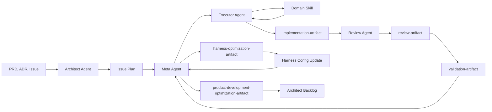

# Agent Runtime Architecture

**Status:** Published (Agent Runtime Phase 5)  
**Authority:** [`EXECUTION.md`](../../EXECUTION.md) > this file > skills and rules  
**CI gates:** [ADR-003](../adr/003-ai-native-cicd-policy.md) for review → validate → ship; runtime schemas in [`agent-runtime-artifacts.md`](agent-runtime-artifacts.md).

This document is the canonical harness architecture for Juli AI development. It describes
an **agent-phase model** over the existing skills-first harness — not a new orchestration
framework, runtime service, or AutoAgent-style executor.

> **Routing:** Open this file when the task touches agent phases, agent ownership,
> executor domains, context routing, or harness optimization. For deployed modules see
> [`map.md`](map.md); for data-source policy see [`data-sources.md`](data-sources.md).

---

## Purpose

The repository is built and operated by AI agents using skills under
[`.cursor/skills/`](../../.cursor/skills/). Conversations are session-local; durable
memory lives in repository docs, issues, and machine-readable runtime artifacts
(see [`agent-runtime-artifacts.md`](agent-runtime-artifacts.md)).

The Agent Runtime replaces workflow-chain language (`discover → … → ship`) with four
explicit phases, each owned by a named agent role. **Focus** remains the core routing
primitive — reframed as the Meta Agent's context and skill router, also used by the
Architect Agent during Planning to load the right canonical docs.

---

## Runtime flow



| Phase | Owner | Canonical sequence |
|-------|-------|-------------------|
| **Planning** | Architect Agent | `focus` → `grill-with-docs` → `to-prd` → `to-issues` |
| **Implementation** | Meta Agent + Executor Agent | Meta runs `focus`, assigns domain executor; Executor implements with built-in TDD |
| **Review + Testing** | Review Agent | `intent-review` → `guardrails` → `validate` → ship-ready |
| **Harness Optimization** | Meta Agent | Consumes execution artifacts; emits optimization artifacts |

Source documents (PRDs, ADRs, GitHub issues, handoff markdown) are continuity and planning
inputs. They are **not** execution feedback artifacts. First-class runtime artifacts
(defined in [`agent-runtime-artifacts.md`](agent-runtime-artifacts.md)) are limited to:
`implementation-artifact`, `review-artifact`, `validation-artifact`,
`harness-optimization-artifact`, and `product-development-optimization-artifact`.

---

## Agent specifications

### Architect Agent — Planning

**Responsibilities**

- Own the Planning phase and the sequence
  `focus` → `grill-with-docs` → `to-prd` → `to-issues`.
- Use `grill-with-docs` for scope alignment and rescoping — one clarifying question at
  a time with a recommended answer — while updating `CONTEXT.md` and ADRs as decisions
  crystallise. Skip or shorten grilling only when scope is already fixed (e.g. pure
  issue decomposition from an existing PRD).
- Govern PRD generation, issue decomposition, ADR governance, architecture evolution,
  system design, module boundaries, and technical debt analysis.
- Absorb canonical-documentation responsibilities formerly in the `discover` skill
  (see [Planning responsibilities](#planning-responsibilities-formerly-discover) below).
- Consume `product-development-optimization-artifact` entries when they indicate
  architecture debt, unclear ownership, repeated boundary violations, weak issue
  decomposition, or recurring planning failures.

**Must**

- Ask clarifying questions to eliminate TBDs before planning artifacts are produced
  (prefer `grill-with-docs` for planning and rescoping).
- Perform **Research & Reuse** before proposing net-new design (search repo, prior art,
  primary vendor docs).
- Update `EXECUTION.md`, `docs/architecture/system-design.md`, `docs/architecture/`, and
  `docs/adr/` when scope or architecture changes.
- Produce PRDs, ADRs, GitHub issues, architecture docs, and backlog items.

**Must not**

- Route implementation context or assign executor domains (Meta Agent).
- Implement issues, validate code, or ship.

`focus` during Planning loads planning context — it does **not** enter an implementation
pipeline.

---

### Meta Agent — Implementation routing and Harness Optimization

**Responsibilities**

- Central optimization node built on top of `focus`.
- Own context routing, skill routing, executor domain assignment, harness optimization,
  execution telemetry interpretation, and product-development optimization recommendations.
- After every complete agent-phase execution, consume `implementation-artifact`,
  `review-artifact`, and `validation-artifact` (Phase 3+).
- Produce `harness-optimization-artifact` (every run) and
  `product-development-optimization-artifact` (occasionally).

**Must**

- Run `focus` before Implementation to produce a Context Plan.
- **Before assigning Executor**, run the workflow-cache prepare entrypoint (no human
  reminder required):

  ```bash
  python agent-runtime/scripts/meta_prepare_executor.py --issue <N>
  ```

  This ensures parent + child caches exist (`ensure_workflow_cache`), runs the gate
  chain (staleness → scope precedence → bootstrap pin → issueLoadProfile), and
  unlocks Executor only when `cacheStatus == valid` and `readyForExecutor: true`.
- Select exactly one primary executor domain (from `issueLoadProfile.executorDomain`
  / `slice-routing.yml`) — never dual-load backend + data-platform skills.
- Inject only Executor-phase skills in `harnessUtility`; defer intent-review /
  guardrails / validate to their phase blocks.
- Record routing decisions and execution signals for optimization.

**Must not**

- Assign Executor or start TDD when `meta_prepare_executor.py` exits non-zero.
- Implement features, review its own routing decisions, or bypass Review Agent / Validate.
- Automatically edit skills, rules, architecture docs, PRDs, ADRs, or product scope.
  Safe auto-apply is limited to harness configuration, benchmark thresholds, context
  budget hints, and executor routing hints (Phase 6+).

Config: `workflow_prompt_cache.requireValidCacheBeforeExecutor` and
`agents.meta.pre_executor_command` in
[`agent-runtime.config.yml`](../config/agent-runtime.config.yml).

#### Composer sub-agents

Parent agents may delegate path-disjoint work via Task subagents. Full policy:
[`.cursor/rules/core-orchestration.mdc`](../../.cursor/rules/core-orchestration.mdc) § Composer sub-agents.
Always `model: composer-2.5-fast`; prefer several small parallel Composers over one parent doing
everything; **≤3 concurrent** — ask the user before more. Parent keeps grill/alignment, Meta gates,
security, and final synthesis.

#### Quick commit / skip artifact gates (`scratch/debug`)

Declarative policy: [`agent-runtime.config.yml`](../config/agent-runtime.config.yml) →
`artifact_gates.quickCommitSkip`. When the session is under `.worktrees/debug` and the
branch name lacks `issue-<N>`, agents skip ADR-003 artifact emit; CI already skips
`validate-artifacts` for those branch names (`pr.yml`). **Do not** change `pr.yml` or
Tier-1 rules from the debug slot (it resets to `main`); promote harness/config edits via
`agent/runtime`.

---

### Executor Agent — Implementation

**Responsibilities**

- Own issue implementation with **mandatory built-in TDD**: Red → Green → Refactor.
- Load exactly one primary domain-specific skill (UI/UX, Backend, Data Platform, or
  Machine Learning) unless the issue clearly spans domains.
- Produce `implementation-artifact` for Review Agent.

**Must**

- Refuse to start if Meta did not produce `readyForExecutor: true` (valid workflow cache).
- Write a failing test first (Red), make it pass with minimal code (Green), then
  refactor while keeping tests green (Refactor).
- Populate `contextFilesLoaded` (non-empty) and `tokenUsage.total` on the
  implementation artifact for harness optimization telemetry.
- Obey structure authority ([ADR-022](../adr/022-intent-review-guardrails-split.md)):

  > Executor MAY clean up structure during GREEN (refactor step). Only intent-review MAY block merge on structure.

  Refactor is advisory and non-blocking. Do not treat a GREEN refactor as structure approval.
- Document TDD cycles with failing/passing test evidence and commands when available.
- Stay within issue acceptance criteria and affected module boundaries.

**Must not**

- Ship, validate, or optimize the harness.
- Skip TDD for behavior changes (exceptions: pure docs/config with no executable
  surface — note rationale in implementation summary).

TDD rules live in domain executor skills — especially
[`.cursor/skills/domain/backend/SKILL.md`](../../.cursor/skills/domain/backend/SKILL.md).
The standalone `tdd` skill was removed in Phase 2.

---

### Review Agent — Review + Testing

**Responsibilities**

- Own `intent-review`, `guardrails`, `validate`, and `ship` with mandatory ordering:
  `intent-review` → `guardrails` → `validate` → ship-ready.
- Run Spec fidelity × structure review via `intent-review` (parallel sub-agents +
  intent-review artifact) before `guardrails` emits the ADR-003 review artifact.
- Domain quality (reliability / security / observability / performance), dynamic
  testing gates (`validate`), and structured feedback.
- Produce `intent-review-artifact`, `review-artifact`, and `validation-artifact` for
  Meta Agent.
- Prepare release artifacts through the existing ADR-003 ship model when validation passes.

**Must**

- Block ship until validation passes.
- Treat intent-review `spec_fidelity` as given inside Guardrails (see
  [BOUNDARY.md](../../.cursor/skills/standalone/intent-review/BOUNDARY.md)).
- Emit structured findings consumable by Validate and Meta Agent.
- For parallel (or any long-lived) PRs: enforce **sync-before-merge** — rebase/merge
  onto current `origin/main` immediately before merge, re-green CI, then merge
  ([`issue-workflow.mdc`](../../.cursor/rules/issue-workflow.mdc), `ship` skill).
  Individual PRs only; no batched parallel landings.

**Must not**

- Route context, assign executors, or ship before validation passes.
- Re-judge Spec intent-match or re-run smell-baseline inside Guardrails.
- Merge a branch tip that is behind `origin/main` when sibling work may have landed.

---

## Domain executor model

Executor Agent specializes by domain. Skills live under `.cursor/skills/domain/`.

| Domain | Primary surfaces | Required skills / context | Testing | Review focus | Validation |
|--------|------------------|----------------------------|---------|--------------|------------|
| **UI/UX** | `web/`, `ios/` UI | [`ui-ux`](../../.cursor/skills/domain/ui-ux/SKILL.md), `ui-ux-design`, `nextjs`, `react-best-practices`; `shadcn` when adding registry components | Component/route behavior, a11y, interaction tests | A11y, state/hydration boundaries, visual consistency | Web lint/typecheck/tests, acceptance mapping |
| **Backend** | `src/apps/`, `src/modules/`, FastAPI | [`backend`](../../.cursor/skills/domain/backend/SKILL.md), `python-patterns`, `patterns.mdc`; security/reliability/observability when APIs or user input touched | API integration tests, service boundary tests, repo tests | Auth/authz, error handling, idempotency, API envelopes | pytest, ruff, mypy, migration checks |
| **Data Platform** | `src/shared/utils/data/`, migrations, ETL | [`data-platform`](../../.cursor/skills/domain/data-platform/SKILL.md), `postgres-patterns`; Supabase when DB work involved | Migration up/down, repo integration, ETL idempotency | Data-source legality, PII, schema reversibility, indexing | Migration checks, module drift, data-source policy |
| **Machine Learning** | `src/modules/ml/` | [`machine-learning`](../../.cursor/skills/domain/machine-learning/SKILL.md), ML module docs, feature specs, model artifact thresholds | Golden dataset, metric threshold, artifact schema tests | Leakage, reproducibility, metric validity, promotion rules | pytest, artifact smoke tests, benchmark status |

**Context baseline for all domains:** `EXECUTION.md` slice, `docs/architecture/system-design.md`,
`docs/architecture/map.md`, `docs/architecture/data-sources.md`, and `MODULE.md` for
each affected module.

---

## TDD lifecycle (Executor built-in)

TDD is **mandatory** for Executor Agent behavior changes. It is not a reusable skill
abstraction.

```
Red     → Write a failing test that encodes the acceptance criterion or bug reproduction
Green   → Implement the minimum code to pass
Refactor → Improve structure without changing behavior; tests stay green
```

Each cycle should be evidenced in the implementation artifact: failing test
output, passing test output, refactor notes, and commands run. Multiple cycles are
expected for non-trivial issues.

---

## Planning responsibilities (Architect Agent)

Architect Agent owns canonical doc governance formerly in the removed `discover` skill:

| Duty | Owner |
|------|-------|
| Clarifying questions, scope alignment | Architect Agent (`grill-with-docs`) |
| Research & Reuse (repo search, prior art, vendor docs) | Architect Agent |
| Updates to `EXECUTION.md`, `system-design.md`, `architecture/`, `decisions/` | Architect Agent |
| Context routing for planning | `focus` |
| Scope grilling / rescoping | `grill-with-docs` |
| PRD synthesis | `to-prd` |
| Issue decomposition | `to-issues` |

Architect Agent **must not** generate docs under `docs/product/features/<feature>/`, extract
vendor API material (`api-docs`, `platform-docs`), or start implementation.

---

## Meta optimization loop (overview)

[`agent-runtime-artifacts.md`](agent-runtime-artifacts.md). Skill emission is documented
in domain executor and review/validate skills; harness automation lands in Phase 6.

### Signal collection

- Meta consumes every execution artifact after Review Agent completes validation.
- No execution artifact bypasses Meta.
- Scoring and optimization are driven by artifacts wherever deterministic evidence exists;
  source docs explain context but do not replace artifact fields.

### Baseline metrics (initial set)

1. Execution Time  
2. Token Usage  
3. Test Pass Rate  
4. Test Coverage  
5. Review Failure Rate  
6. Validation Failure Rate  
7. Retry Count  
8. Tool Invocation Count  

### Root cause categories (initial set)

`context_underloaded`, `context_overloaded`, `wrong_executor_domain`,
`insufficient_tdd_evidence`, `review_gap`, `validation_failure`, `tool_overuse`,
`phase_loop`, `artifact_incomplete`, `architecture_unclear`

### Harness optimization

- Meta emits `harness-optimization-artifact` after each complete run.
- Safe, config-scoped changes may be marked `autoApplyEligible`.
- Approved harness update targets: `focus` routing tables, context budgets,
  `docs/handoffs/context-plan-template.md`, `agent-runtime.config.yml` (Phase 6+),
  benchmark task definitions ([`agent-runtime-benchmarks.md`](agent-runtime-benchmarks.md)).

### Product-development optimization

- Emitted **occasionally** when repeated evidence indicates process or architecture
  improvement (unclear decomposition, boundary violations, missing acceptance criteria,
  repeated review failures in one module, executor domain mismatch).
- Routed to Architect Agent backlog; Architect accepts or rejects.

### Improvement measurement

- Re-run the same benchmark task or comparable issue class after an approved harness change
  (protocol: [`agent-runtime-benchmarks.md`](agent-runtime-benchmarks.md)).
- Compare before/after using the eight baseline metrics.
- Mark optimization `measured` only when benchmarks show improvement or no regression.

---

## Legacy workflow chain (removed Phase 2)

| Removed | Replacement |
|---------|-------------|
| `build-feature` / `fix-bug` orchestrators | Agent phases + ad-hoc Focus routing |
| `discover` skill | Architect Agent planning responsibilities |
| Standalone `tdd` skill | Executor built-in TDD + domain executor skills |
| `focus → tdd → review → ship` chain language | Meta routing + Review Agent phases |
| `.cursor/skills/workflow/` folder | Retired — use agent phases |

ADR-003 gate ordering (`review artifact → validate → ship`) is unchanged; Review Agent
runs `intent-review` before `guardrails` writes the review artifact (ADR-022). Harness routing is
documented in this file; CI artifact schemas remain in ADR-003 and `docs/deployment/`.

---

## Skill organization (target)

| Location | Contents |
|----------|----------|
| `.cursor/skills/standalone/` | Agent-owned skills: `focus`, `grill-with-docs`, `to-prd`, `to-issues`, `intent-review`, `guardrails`, `validate`, `ship`, utilities |
| `.cursor/skills/domain/` | Executor domain skills: `ui-ux`, `backend`, `data-platform`, `machine-learning` |
| `.cursor/skills/workflow/` | **Removed** (Phase 2) |

---

## Migration roadmap

| Phase | Focus |
|-------|-------|
| **1** | Canonical docs + routing alignment |
| **2** | Remove legacy skills; domain executor skills under `.cursor/skills/domain/` |
| **3** | Artifact schemas, persistence policy, CI doc alignment |
| **4** | Skill updates to emit/consume artifacts per agent boundaries |
| **5** (current) | Unified benchmark framework (`agent-runtime-benchmarks.md`, migration doc) |
| **6** | Optimization loop proof — harness change proposed, applied, measured |

Full rollout details: [`agent-runtime-migration.md`](agent-runtime-migration.md).

---

## Context hierarchy (efficiency)

Canonical load order for **issue implementation**. Machine-readable twin:
[`agent-runtime.config.yml`](../config/agent-runtime.config.yml) → `context_hierarchy`.
Focus must follow this; do not paste the full table into every Context Plan.

| Layer | Component | Role |
|-------|-----------|------|
| **L0** | Tier-1 rules | Always-on, tiny |
| **L1** | Workflow cache (`parent` + `issue-context`) | Planned scope, DO NOT Load; local, gitignored; **highest reuse** |
| **L1b** | `harnessUtility` (in child cache) | Index of skills / Tier-2 rules / MCPs / tools for this issue |
| **L2** | Focus Context Plan | Session filter over L1 — Load / If Needed / DO NOT Load |
| **L3** | One domain skill → selected Tier-2 rules → `issueLoadProfile` docs/MODULE → code | Model payload; code is majority of the window |
| **L4** | Implementation artifact | **Observed** telemetry (`contextFilesLoaded`, `skillsLoaded`, `rulesLoaded`, `mcpsUsed`, `toolsUsed`, `tokenUsage`) |
| **L5** | Review / validation / harness-optimization artifacts | CI gates + Meta input — **not** default next-turn prompt filler |

**Cache injection order** (stable → volatile): `workflow_prompt_cache.injectionOrder` in config
(parentScopeBlock → parentDoNotLoad → harnessUtility → issueLoadProfile → phaseCacheBlocks →
promptCacheBlock → requiredModules code/MODULE.md).

**Pass-through**

- Docs/issues → **distilled into cache** (not full bodies every turn).
- Cache → Focus → only selected skills/rules/docs/code enter the model.
- Session → L4 lists what was **actually** loaded; Meta reads L4+L5 for optimization.

**Anti-patterns:** load all Tier-2 rules or all skills; inject sibling issue caches; paste prior
artifacts into the next turn; ignore `doNotLoad`.

---

## Related documents

| Document | Owns |
|----------|------|
| [`EXECUTION.md`](../../EXECUTION.md) | Product phases, slices, exit gates |
| [`map.md`](map.md) | As-built module registry |
| [`data-sources.md`](data-sources.md) | External data availability by phase |
| [ADR-003](../adr/003-ai-native-cicd-policy.md) | Artifact-driven CI/CD gates |
| [`agent-runtime-artifacts.md`](agent-runtime-artifacts.md) | Runtime artifact schemas, paths, persistence |
| [`agent-runtime-benchmarks.md`](agent-runtime-benchmarks.md) | Unified benchmark protocol, scoring, task types |
| [`agent-runtime-migration.md`](agent-runtime-migration.md) | Phase rollout and rollback |
| [`benchmarks/`](benchmarks/) | Task fixture specs (types A–D) |
| [`schemas/`](schemas/) | JSON Schema definitions |
| [`.cursor/skills/standalone/focus/SKILL.md`](../../.cursor/skills/standalone/focus/SKILL.md) | Context Plan router |
| [`docs/handoffs/context-plan-template.md`](../handoffs/context-plan-template.md) | Context Plan output template |
| This file § Context hierarchy | Efficiency layers L0–L5; pairs with `context_hierarchy` in config |
