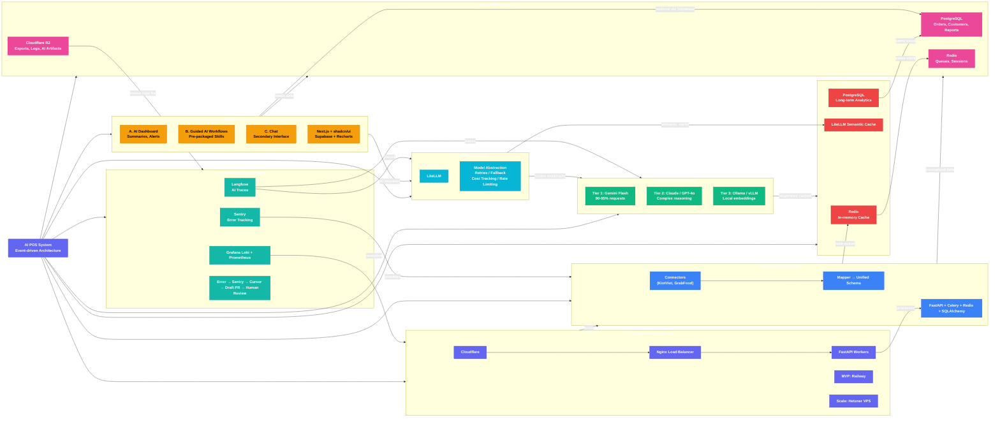

# AI POS System Architecture - Mermaid Graph

Cross-layer relationship diagram showing how each architectural layer connects and communicates.

## Cross-Layer Relationships

| From | To | Relationship |
|------|-----|-------------|
| Interface (4) | AI Gateway (2) | Sends AI requests |
| AI Gateway (2) | Model Layer (3) | Routes workloads by tier |
| AI Gateway (2) | Caching (5) | Semantic cache lookup |
| API Connectors (1) | Data Architecture (6) | Stores normalized data |
| API Connectors (1) | Caching (5) | Task queue via Redis |
| Interface (4) | Data Architecture (6) | Reads operational data |
| Load Balancing (7) | API Layer (1) | Hosts and routes traffic |
| Monitoring (8) | Gateway (2) + Models (3) | Langfuse traces AI calls |
| Monitoring (8) | Hosting (7) | Grafana monitors infra |
| Data Architecture (6) | Monitoring (8) | R2 stores logs |
| Caching (5) | Data Architecture (6) | Shares Redis + PostgreSQL |
