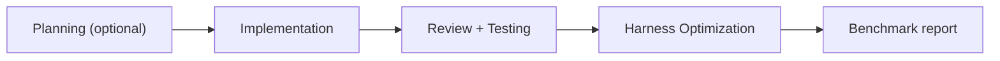

# Agent Runtime Benchmarks

**Status:** Published (Agent Runtime Phase 5)  
**Authority:** [`agent-runtime.md`](agent-runtime.md) > this file > task specs under [`docs/benchmarks/agent-runtime/`](../benchmarks/agent-runtime/)  
**Artifacts:** [`agent-runtime-artifacts.md`](agent-runtime-artifacts.md)

One **unified** benchmark framework for the complete agent-phase harness. There are no
separate per-phase benchmark systems for Planning, Review, or Validate in isolation.

> **Routing:** Open this file when measuring harness quality, comparing optimization
> before/after, or defining a benchmark fixture. For artifact schemas see
> [`agent-runtime-artifacts.md`](agent-runtime-artifacts.md).

---

## Benchmark unit

The benchmark unit is a **complete agent phase run**, not a single skill invocation.



| Phase | Owner | Required for benchmark? |
|-------|-------|-------------------------|
| Planning | Architect Agent | Optional — scored when task type includes decomposition |
| Implementation | Meta + Executor | **Yes** |
| Review + Testing | Review Agent | **Yes** |
| Harness Optimization | Meta Agent | **Yes** |

A benchmark run produces or references these artifacts (when applicable):

| Artifact | Path pattern |
|----------|--------------|
| Implementation | `artifacts/implementations/implementation-issue-<n>.json` |
| Review | `artifacts/reviews/review-issue-<n>.json` |
| Validation | `artifacts/validation/validation-issue-<n>.json` |
| Harness optimization | `artifacts/optimization/harness-issue-<n>-<phaseRunId>.json` |
| Product-development optimization | `artifacts/optimization/product-development-<id>.json` |

Source documents (issue body, PRD, handoff markdown) inform **Planning Score** checks
only. Execution scores are derived from artifacts wherever deterministic evidence exists.

---

## Task types

Four task types cover harness scenarios. Each has a fixture spec under
[`docs/benchmarks/agent-runtime/`](../benchmarks/agent-runtime/).

| Type | ID | Measures | Fixture |
|------|-----|----------|---------|
| **A** | `new-feature` | Feature delivery through artifacts | [`task-type-a-new-feature.md`](../benchmarks/agent-runtime/task-type-a-new-feature.md) |
| **B** | `bug-fix` | Root cause accuracy, regression tests, TDD evidence | [`task-type-b-bug-fix.md`](../benchmarks/agent-runtime/task-type-b-bug-fix.md) |
| **C** | `architecture-refactor` | Boundaries, drift, ADR compliance, test preservation | [`task-type-c-architecture-refactor.md`](../benchmarks/agent-runtime/task-type-c-architecture-refactor.md) |
| **D** | `multi-agent-workflow` | Handoffs, context quality, phase routing | [`task-type-d-multi-agent-workflow.md`](../benchmarks/agent-runtime/task-type-d-multi-agent-workflow.md) |

Pick **one task type** per benchmark run. Do not mix scoring rules across types in a
single report.

---

## Repeated-run protocol

Use this protocol for baseline capture, harness change, and optimization measurement
(Phase 6).

### 1. Baseline run

1. Select a task fixture (type A–D) or a real GitHub issue that matches the type.
2. Record `benchmarkRunId`: `<taskType>-<date>-<short-hash>` (e.g. `bug-fix-2026-06-23-a1b2`).
3. Execute the full agent phase run; commit all runtime artifacts on a branch.
4. Write benchmark report to `artifacts/benchmarks/<benchmarkRunId>.json` (see [Report format](#report-format)).
5. Set harness optimization `appliedStatus: "proposed"` on first run.

### 2. Harness change (manual, Phase 6)

1. Architect or operator approves one `autoApplyEligible` optimization.
2. Apply change only to approved surfaces: `focus` routing, context budgets,
   `context-plan-template.md`, benchmark task definitions — never skills/rules/ADRs in
   auto-apply.
3. Set prior harness artifact `appliedStatus: "accepted"` then `"applied"`.

### 3. Rerun

1. Re-execute the **same** fixture with the same acceptance criteria.
2. New `phaseRunId`; new artifact set; new `benchmarkRunId` suffix `-rerun-1`.
3. Compare `baselineMetrics` in harness optimization artifacts.

### 4. Measured

Mark optimization `appliedStatus: "measured"` when:

- All eight baseline metrics improve or stay within [no-regression thresholds](#no-regression-thresholds), **and**
- Validation artifact `status == "PASS"` on the rerun.

---

## Eight baseline metrics

All benchmark scoring emphasizes these metrics (from harness optimization
`baselineMetrics`):

| # | Metric | Field | Lower is better? |
|---|--------|-------|------------------|
| 1 | Execution Time | `executionTimeMs` | Yes |
| 2 | Token Usage | `tokenUsageTotal` | Yes |
| 3 | Test Pass Rate | `testPassRate` | No (higher better) |
| 4 | Test Coverage | `coveragePercentage` | No |
| 5 | Review Failure Rate | `reviewFailureRate` | Yes |
| 6 | Validation Failure Rate | `validationFailureRate` | Yes |
| 7 | Retry Count | `retryCount` | Yes |
| 8 | Tool Invocation Count | `toolInvocationCount` | Yes* |

\*Tool count may increase legitimately when fixing under-tested paths; pair with pass rate
and coverage when interpreting.

### No-regression thresholds

Default tolerances for declaring a harness change **measured** (no regression):

| Metric | Threshold |
|--------|-----------|
| `executionTimeMs` | ≤ 10% increase vs baseline |
| `tokenUsageTotal` | ≤ 10% increase |
| `testPassRate` | ≥ baseline (must not decrease) |
| `coveragePercentage` | ≥ baseline − 2 percentage points |
| `reviewFailureRate` | ≤ baseline |
| `validationFailureRate` | ≤ baseline |
| `retryCount` | ≤ baseline |
| `toolInvocationCount` | ≤ 15% increase |

Override thresholds per task fixture only with Architect approval documented in the
benchmark report `notes` field.

---

## Sub-scores (deterministic)

Report five sub-scores (0–100) inside each benchmark report. Derive from artifacts only.

### Planning Score (0–100)

Applies when Planning phase ran or fixture includes planning checklist.

| Check | Pass condition | Points |
|-------|----------------|--------|
| Acceptance criteria present | Issue/fixture has numbered AC | 25 |
| AC maps to tests (post-impl) | `review.testCoverage.acceptance.mapped == total` | 25 |
| Module scope declared | `modulesTouched` non-empty or fixture lists modules | 25 |
| ADR linkage when required | `validation.checks[adr_requirement].status == PASS` | 25 |

If Planning skipped (implementation-only rerun), omit Planning Score from overall weighting.

### Implementation Score (0–100)

| Check | Pass condition | Points |
|-------|----------------|--------|
| Implementation artifact present | File exists, `artifactType == implementation` | 20 |
| TDD evidence | `redGreenRefactorEvidence.length >= 1` | 30 |
| Tests added/updated | `testsAdded` or `testsUpdated` non-empty | 25 |
| Files modified documented | `filesModified` non-empty | 15 |
| Executor domain set | `executorDomain` matches fixture expectation | 10 |

### Review Score (0–100)

| Check | Pass condition | Points |
|-------|----------------|--------|
| Review artifact present | `status` in PASS / PASS_WITH_WARNINGS | 20 |
| No CRITICAL at PASS | If `status != FAIL`, no CRITICAL findings | 25 |
| Acceptance mapping complete | `acceptance.mapped == acceptance.total` | 25 |
| Domain findings populated | At least one of security/architecture/maintainability arrays present when findings exist | 15 |
| Remediation hints | `suggestedRemediation` non-empty when `reviewFailures > 0` | 15 |

### Validation Score (0–100)

| Check | Pass condition | Points |
|-------|----------------|--------|
| Validation PASS | `status == PASS` and `readyForMerge == true` | 40 |
| All gate checks pass | `failedChecks == 0` | 30 |
| Tests executed recorded | `testsExecuted` present and > 0 when tests exist | 15 |
| Retry count acceptable | `retryCount <= 1` | 15 |

### Optimization Score (0–100)

| Check | Pass condition | Points |
|-------|----------------|--------|
| Harness artifact present | `artifactType == harness_optimization` | 25 |
| Root cause identified | `rootCauseCategory != none` when any failure metric > 0 | 25 |
| Concrete proposal | `proposedOptimization.summary` non-empty | 25 |
| Measured improvement | `appliedStatus == measured` on rerun (Phase 6) | 25 |

On baseline-only runs, cap Optimization Score at 75 (no measured rerun yet).

### Overall Agent Runtime Score

Weighted average (when Planning ran):

```
Overall = 0.15 * Planning + 0.25 * Implementation + 0.20 * Review
        + 0.25 * Validation + 0.15 * Optimization
```

Implementation-only rerun (no Planning):

```
Overall = 0.30 * Implementation + 0.25 * Review + 0.30 * Validation + 0.15 * Optimization
```

Also report raw `baselineMetrics` for the eight metrics — they drive Meta harness
optimization, not subjective review.

---

## Report groupings

Group evidence in the benchmark report for human triage:

| Group | Metrics / fields |
|-------|------------------|
| **Speed** | `executionTimeMs`, `reviewDurationMs`, validation `executionDurationMs` |
| **Cost** | `tokenUsageTotal`, `toolInvocationCount` |
| **Quality** | `testPassRate`, `coveragePercentage`, review `severity`, validation `status` |
| **Efficiency** | `contextFilesLoaded.length`, `skillsLoaded.length`, `contextTransferCount` |
| **Stability** | `retryCount`, `reviewFailureRate`, `validationFailureRate`, phase loops |

---

## Report format

Write `artifacts/benchmarks/<benchmarkRunId>.json`:

```json
{
  "schemaVersion": "1.0.0",
  "benchmarkRunId": "bug-fix-2026-06-23-a1b2",
  "taskType": "bug-fix",
  "taskSpec": "docs/benchmarks/agent-runtime/task-type-b-bug-fix.md",
  "issueId": 42,
  "phaseRunId": "42-2026-06-23-a1b2c3",
  "timestamp": "2026-06-23T10:00:00Z",
  "baselineRun": true,
  "rerunOf": null,
  "scores": {
    "planning": 100,
    "implementation": 90,
    "review": 100,
    "validation": 100,
    "optimization": 75,
    "overall": 92
  },
  "baselineMetrics": {
    "executionTimeMs": 120000,
    "tokenUsageTotal": 45000,
    "testPassRate": 1.0,
    "coveragePercentage": 78.5,
    "reviewFailureRate": 0.0,
    "validationFailureRate": 0.0,
    "retryCount": 0,
    "toolInvocationCount": 85
  },
  "artifactPaths": {
    "implementation": "artifacts/implementations/implementation-issue-42.json",
    "review": "artifacts/reviews/review-issue-42.json",
    "validation": "artifacts/validation/validation-issue-42.json",
    "harnessOptimization": "artifacts/optimization/harness-issue-42-42-2026-06-23-a1b2c3.json"
  },
  "deterministicChecks": [
    {"id": "tdd_red_green", "passed": true},
    {"id": "validation_pass", "passed": true}
  ],
  "notes": ""
}
```

Commit benchmark reports on the benchmark branch alongside runtime artifacts.

---

## Deterministic checks by task type

Each task spec lists type-specific checks. Common checks across all types:

| Check ID | Source artifact | Pass condition |
|----------|-----------------|----------------|
| `impl_artifact_present` | implementation | File exists, valid `artifactType` |
| `review_artifact_present` | review | `status` not FAIL |
| `validation_pass` | validation | `status == PASS`, `readyForMerge == true` |
| `harness_artifact_present` | harness optimization | File exists, `baselineMetrics` complete |
| `phase_run_id_consistent` | all | Same `phaseRunId` on impl/review/validation when set |

Type-specific checks are defined in each task spec file.

---

## Out of scope

Do **not** create separate benchmark frameworks for:

- Planning-only (`to-prd` / `to-issues`) without a full implementation run
- Review-only without validation
- Validate-only without implementation context
- Per-domain executor micro-benchmarks (use task type + `executorDomain` field instead)

Qualitative narrative (review prose, chat summaries) may be attached in `notes` but must
not drive automated harness changes until reflected in artifact fields.

---

## Related documents

| Document | Owns |
|----------|------|
| [`agent-runtime.md`](agent-runtime.md) | Agent phases, ownership |
| [`agent-runtime-artifacts.md`](agent-runtime-artifacts.md) | Artifact paths and schemas |
| [`agent-runtime-migration.md`](agent-runtime-migration.md) | Phase rollout and rollback |
| [`docs/benchmarks/agent-runtime/README.md`](../benchmarks/agent-runtime/README.md) | Task fixture index |
