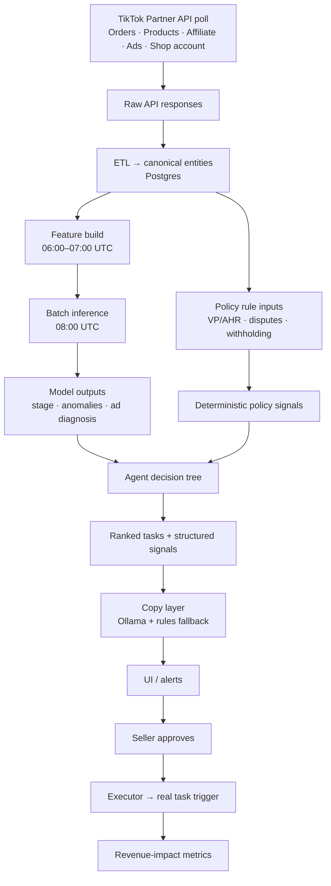

# Phase 2 Target Architecture (target-v2)

**Status:** Published (Phase 1.5 exit gate P1.5-7)  
**Authority:** [`EXECUTION.md`](../../EXECUTION.md) Phase 2 slices · [`system-design.md`](../system-design.md) subsystem columns · this file for the **end-to-end inference pipeline**.

Phase 2 wires TikTok Shop Partner API polling, daily batch ML inference, an Ollama
copy layer, and live task execution into the **operations-system pipeline**
(classify → health → rank → reason → approve → execute → track). Phase 1 validates
copilot UX with mock data; Phase 1.5 trains models offline; Phase 1.8 validates the
orchestration spine on mock fixtures ([ADR-026](../decisions/026-operations-system-orchestration.md)).
Phase 2 swaps mock loaders for live data (P2-11) while preserving stage envelopes.

---

## Phase 1 vs Phase 2 — what stays mock vs goes live

| Subsystem | Phase 1 (UI) | Phase 1.5 (ML) | Phase 1.8 (orchestration) | Phase 2 (APIs) |
|-----------|--------------|----------------|---------------------------|----------------|
| **Data ingestion** | Mock JSON fixtures | Backtest parquet only | `unified_operational_data_model` fixtures | **Live** TikTok API poll → ETL → Postgres |
| **Health / classification** | Per-workflow implicit | — | Rules-based `health_check_results` + `shop_profile` | Live health + classifier |
| **Recommendation** | Per-copilot task cards | — | Ranked `workflow_recommendations` (6 workflows) | Live ranking + impact filter |
| **Feature build** | N/A | Offline parquet readers | N/A | **Live** daily feature build (06:00–07:00 UTC) |
| **ML models** | None | Trained + serialized (`models/`) | None | **Live** batch inference (08:00 UTC) |
| **Policy signals** | Hardcoded mock thresholds | N/A | Mock probation/SPS/AHR in fixtures | **Live** VP/AHR/proxy per P2-1 gate |
| **Copy / reasoning** | Hardcoded Vietnamese copy | Rules-only templates | Rules-only Why / Impact / Next steps | **Live** Ollama + rules fallback |
| **UI** | Copilot task cards | N/A | Operations pipeline shell + existing modals | Live scores replace mocks |
| **Executor** | No-op (intent only) | N/A | NPL + Refund Spike executable; 5 no-op | **Live** — P2-5…P2-15 executors |

Phase 1.8 runs the **full operations pipeline shape** on mock data. Phase 2 replaces
each mock loader with its live counterpart (P2-11) without changing stage envelopes.

---

## End-to-end flow (Phase 2 pipeline)



ASCII equivalent:

```
[TikTok API: Orders · Products · Affiliate · Ads · (optional) Shop Account health]
        │  daily poll (ingestion: tiktok_api/endpoints.md)
        ▼
   Raw API responses
        │  ETL → canonical entities (data-models/canonical-entities.md)
        ▼
   Postgres (canonical entity tables + policy state)
        │  06:00–07:00 UTC feature build (data-models/feature-store-schema.md)
        ▼
   feature tables (+ platform policy rule inputs)
        │  08:00 UTC daily batch inference
        ▼
   model outputs (stage · anomalies · ad diagnosis)
        │  + deterministic policy signals (VP/AHR · disputes · withholding)
        ▼
   agent decision tree → workflow + ranked tasks
        │
        ▼
   structured signals → copy layer (Ollama summarize + localize · rules fallback)
        │
        ▼
   UI / alerts (real inferences replace mock)
        │  seller approves
        ▼
   executor → real task trigger
        │
        ▼
   revenue-impact metrics (recovered refunds · avoided cancellations · ROAS lift)
```

---

## Daily schedule (UTC)

| Time (UTC) | Job | Runner | Notes |
|------------|-----|--------|-------|
| Overnight | TikTok API poll | cron / APScheduler | Orders, Products, Affiliate, Ads; optional shop account health |
| 06:00–07:00 | Feature build | Same scheduler | Postgres → feature matrices per [`feature-store-schema.md`](../data-models/feature-store-schema.md) |
| **08:00 UTC** | **Batch inference** | Same scheduler | Loads promoted artifacts from `models/`; writes inference results to Postgres |
| After inference | Copy layer (Ollama) | Inline after inference job | Structured signals → Vietnamese copy; **rules fallback** on timeout/error/budget |
| Business hours | UI read + executor | FastAPI + Next.js | Serves latest inference + copy; executor fires on approval |

Phase 2 uses a **simple daily scheduler** (cron / APScheduler). Jobs are **runner-agnostic** — separate feature build, inference, and copy steps so the scheduler is a runner swap, not an ML rewrite ([ADR-013](../decisions/013-phase-15-ml-module-tree.md)).

---

## Model artifacts (#141) and inference signatures (#142)

Serialized models from Phase 1.5 live on disk at:

```
models/seller_stage/{version}/model.joblib + metadata.json + metrics.json
models/anomaly/{version}/model.joblib + metadata.json + metrics.json
models/ad_performance/{version}/model.joblib + metadata.json + metrics.json
```

Phase 2 batch inference (08:00 UTC) loads artifacts via `load_model()` from [`src/modules/ml/artifacts`](../../src/modules/ml/artifacts/MODULE.md). Each `metadata.json` records `feature_schema_hash` so training/inference drift is caught at load time.

Public inference entrypoints and input/output schemas are defined in [`feature-store-schema.md`](../data-models/feature-store-schema.md) § Inference signatures:

| Suite | Entrypoint | Primary output |
|-------|------------|----------------|
| Seller stage | `predict_seller_stage(model, features)` | `stage`, `confidence` |
| Anomaly (buyer-behavior) | `predict_anomaly(model, features)` | `anomaly_class`, `confidence`, `feature_summary`, `is_anomaly` |
| Ad performance | `predict_ad_action(model, features)` | `action`, `confidence`, `predicted_roas` |

Promotion targets (Product sign-off #142): seller stage precision/recall ≥ 0.50; anomaly per-class precision/recall ≥ 0.50; ad ROAS MAPE ≤ 50%.

---

## Anomaly ML — buyer-behavior only ([ADR-011](../decisions/011-buyer-behavior-anomaly-scope.md))

The **anomaly detector** scores buyer return patterns that bleed seller GMV:

- **`item_swap`** — buyer returns a different item than shipped
- **`empty_return`** — buyer returns an empty parcel or packaging without the product

Affiliate fraud, creator-attributed refund spikes, and commission disputes are **excluded** from anomaly ML training and inference. Those signals surface via **deterministic platform-policy rules** in Phase 2 (not ML):

- VP/AHR milestone alerts ([ADR-008](../decisions/008-alert-vp-ahr-milestones.md))
- Balance withholding, appeal windows, SFCR/LDR thresholds
- Commission dispute policy alerts (TikTok Affiliate polling still runs for policy context)

TikTok Affiliate data is polled in Phase 2 for Growth Copilot and commission-dispute **policy alerts**, but **not** fed into the anomaly model.

---

## Account health — `health_data_source` contract

VP/AHR/withholding fields are **not assumed** to be exposed in the TikTok Partner API. Phase 2 must track per-shop:

```
health_data_source: api | proxy | unavailable
```

| Tier | Value | Behavior |
|------|-------|----------|
| **Tier 1** | `api` | Partner API exposes VP/AHR/withholding/violation fields → poll daily; dual-read VP + AHR during May–July 2026 transition ([ADR-009](../decisions/009-dual-read-vp-ahr-transition.md)) |
| **Tier 2** | `proxy` | Fields not exposed → compute **proxies** from Orders/Products/Affiliate signals; **never fabricate** VP/AHR numbers |
| **Tier 3** | `unavailable` | Neither API nor reliable proxy → UI shows "health score unavailable"; no false certainty |

**P2-1 gate:** Verify field exposure via Partner Center API Reference + API Testing Tool before enabling Tier 1. If fields are **not exposed**, degrade explicitly — do **not** assume numeric VP/AHR scores exist.

Schema authority: [`canonical-entities.md`](../data-models/canonical-entities.md) § Shop · [`data-sources.md`](data-sources.md) row TikTok Shop Account.

---

## Copy layer — Ollama placement (after inference)

Ollama runs **after** batch inference completes and **before** UI render:

1. Decision tree produces structured signals (stage, anomaly evidence, ad action, policy alerts).
2. Copy layer receives the same structured JSON that rules templates use.
3. Ollama summarizes + localizes to Vietnamese seller-facing copy.
4. On timeout, error, or daily token budget exceeded → **rules fallback** templates (same signal keys, no generic degradation).
5. Missing Ollama must **not** block API writes, inference persistence, or task execution.

Ollama server runs on a local inference node (`OLLAMA_HOST`, model tag in env). See [`system-design.md`](../system-design.md) § Copy layer.

---

## Executor (Phase 2)

Phase 1 executor is a **no-op** — approval captures intent only. Phase 2 fires **real task triggers** against TikTok APIs / seller tooling when the seller approves a ranked task. Executor failures are logged and surfaced in UI; they do not roll back inference results.

---

## Explicitly out of scope (Phase 2)

The following are **forbidden or deferred** — not part of Phase 2 architecture:

| Item | Status |
|------|--------|
| **Seller Center scraping** | **Forbidden** — use Partner API + explicit degradation only |
| **Buyer PII storage** | **Forbidden** — `buyer_id` is masked/hashed; no raw buyer contact data |
| **Celery / multi-node workers** | **Out of scope** — Phase 3+; simple cron/APScheduler in Phase 2 |
| **Kafka / event streams** | **Out of scope** — Phase 3+ |
| Creator↔shop matching | Phase 3+ |
| Vendor scrapers (Kalodata / Shoplus / FastMoss) | Phase 2.5+ |
| Realtime unofficial livestream websockets | Permanently forbidden |
| `src/` folder reshaping | Phase 2.5+ |

---

## Cross-references

| Document | Role |
|----------|------|
| [`EXECUTION.md`](../../EXECUTION.md) | Phase 2 slices (P2-1 … P2-6), exit gates |
| [`system-design.md`](../system-design.md) | Subsystem phase columns, decision tree, metrics |
| [`map.md`](map.md) | As-built module registry |
| [`data-sources.md`](data-sources.md) | Data-status matrix, health_data_source tiers |
| [`feature-store-schema.md`](../data-models/feature-store-schema.md) | Feature groups + inference signatures (#142) |
| [`canonical-entities.md`](../data-models/canonical-entities.md) | ETL target schemas |
| [`tiktok_api/endpoints.md`](../tiktok_api/endpoints.md) | Ingestion layer field maps |
| [`tiktok_platform/seller/implementation-hooks.md`](../tiktok_platform/seller/implementation-hooks.md) | Policy alert thresholds |

---

## Phase 2 implementation slices (from EXECUTION.md)

- **P2-1** — TikTok API polling live + P2-1 VP/AHR verification gate
- **P2-2** — Daily batch inference job (08:00 UTC)
- **P2-3** — Ollama copy layer + rules fallback
- **P2-4** — Swap mock → real inferences + Ollama copy in UI
- **P2-5** — Live task execution
- **P2-6** — Revenue-impact instrumentation
