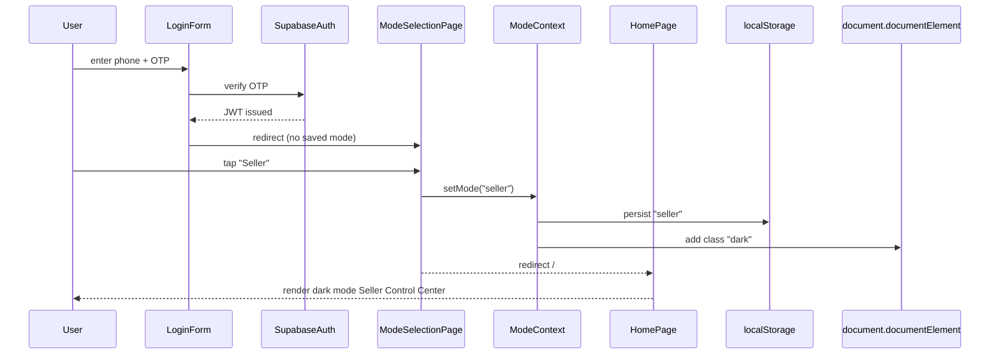
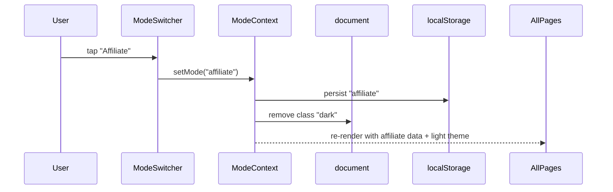
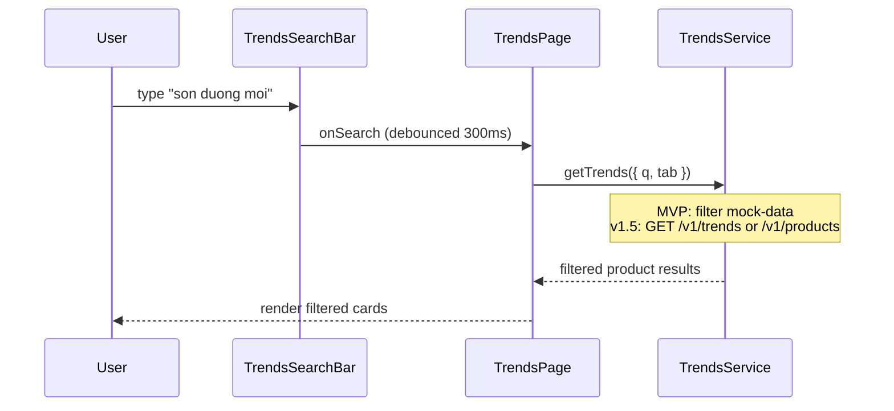

# Feature: Navigation Redesign & UI Layer Restructure

## Problem Statement

The current Juli AI web app exposes six navigation tabs — Home, Livestream, Xu hướng (mis-routed to `/products`), Cảnh báo (Alerts), Vận hành (Orders only), and Gợi ý (Recommendations standalone) — that do not match the mental model described in the Juli AI Core Architecture. Recommendation is buried in its own tab rather than surfaced as contextual intelligence on Home. Alerts exist as a dead-end tab. The "Trends" tab routes to `/products` with no search or discovery capability. There is no conversational AI entry point. The result is fragmented UX that does not express Juli as an **operating system** for TikTok Shop.

Additionally, there is no Mode Selection step in the login flow — users land directly on Home without ever choosing whether they are operating as a Seller or an Affiliate. This means the platform cannot tailor KPIs, intelligence, or navigation intent from the first moment.

This redesign consolidates the navigation to five purposeful tabs, gates the entire experience behind a post-login Mode Selection screen, integrates AI recommendations into the Home control-center experience, introduces a proper Trends discovery layer with role-differentiated discovery intent, merges operational modules under one cohesive Operations tab, and adds a dedicated AI Chat (Juli) tab — all while preserving the existing Next.js/FastAPI/Supabase architecture.

## Architecture Phases (how this PRD fits)

This feature ships in **Phase 1 (MVP)** of [`migration_path.md`](../../migration_path.md). Later phases wire real data without restructuring the UI.

| Phase | Nav redesign scope | Data |
|-------|-------------------|------|
| **MVP** (this PRD) | 5-tab nav, Mode Selection, Seller/Affiliate themes, all screens | `NEXT_PUBLIC_UI_ONLY=1` + `web/src/lib/mock-data/*` via `web/src/lib/services/*` |
| **v1.5** | Same UI; flip service layer to real APIs | TikTok Partner API, daily ML (`src/intelligence/*`), Scrapy vendor feeds (`src/jobs/scraping/`), APScheduler nightly pipeline |
| **v2.0** | Same UI; near-realtime freshness | Redis + Celery workers, WebSocket live updates — runner swap only; job logic unchanged |

Canonical references: [`docs/architecture/map.md`](../../architecture/map.md) · [`docs/architecture/data-sources.md`](../../architecture/data-sources.md) · [`docs/architecture/branch-runtime-strategy.md`](../../architecture/branch-runtime-strategy.md).

## Authentication & Onboarding Flow

```
/login  ──(OTP verified)──→  /mode-select  ──(mode chosen)──→  /
  │                               │
Phone Number Entry            Seller  or  Affiliate
OTP Verification              (persisted to profile +
                               localStorage)
```

- **First login:** After OTP verification, always redirect to `/mode-select`.
- **Returning user:** If `mode` is already persisted in their profile or localStorage, skip `/mode-select` and go directly to `/`.
- **Mode switch mid-session:** Available from the header on every screen — no need to log out.
- **Hybrid users** (both a seller shop and an affiliate persona): Mode Selection shows both options; switching via the header changes the active workspace instantly.

## Success Criteria

- [ ] Login flow includes a Mode Selection screen between OTP verification and Home
- [ ] Navigation collapses from 6 tabs to 5 tabs with no increase in cognitive load
- [ ] Home Page surfaces AI recommendations inline — no separate `/recommendations` route required
- [ ] Trends page loads with a search bar and 3 role-differentiated tabs (Product / Creator / Shop) within 1 interaction
- [ ] Operations tab exposes role-appropriate sub-sections (Seller: Products+GMV/ROI, Creators, Orders, Returns; Affiliate: Products+Commission, Orders, Returns)
- [ ] AI Chat tab opens Juli conversational assistant within 1 tap
- [ ] Mode switcher (Seller / Affiliate) is accessible from the top-right header of every screen
- [ ] Alert bell icon sits in the top-right header to the right of the Mode switcher
- [ ] Seller Mode renders in Dark Mode; Affiliate Mode renders in Light Mode
- [ ] All screens render with mock data in `NEXT_PUBLIC_UI_ONLY=1` mode (MVP — no TikTok API / ML / scrape required)
- [ ] Components fetch data only via `web/src/lib/services/*` (ready for v1.5 real-mode flip)
- [ ] Zero regression on existing auth flow (`/login`) and shop selection

## User Stories

### Seller Mode

- As a **seller**, I want to see today's GMV, active livestream status, best-performing creator, and top AI recommendation on one Home screen so I can make operational decisions in under 30 seconds.
- As a **seller**, I want to search trending creators and viral products in Trends so I can recruit the right creator for my next product push.
- As a **seller**, I want a single Operations tab that shows orders, inventory risk, creator CRM, and refund flags so I don't have to bounce between tabs.
- As a **seller**, I want to ask Juli "Which SKU is about to run out?" and get an answer in the AI Chat tab without leaving the app.

### Affiliate Mode

- As an **affiliate**, I want my Home to show commission revenue, trending products, and audience-fit opportunities — not inventory alerts that don't apply to me.
- As an **affiliate**, I want Trends to surface trending products, rising shops, and viral creators so I can identify what to promote next.
- As an **affiliate**, I want Operations to show my commission tracking, sample requests, and order visibility (status only) — not fulfillment tools.
- As an **affiliate**, I want to ask Juli "Which product is trending before it saturates?" and get a recommendation with timing context.

### Shared

- As a **hybrid user** (both seller and affiliate), I want to switch between Seller and Affiliate workspaces without re-authenticating or losing context.
- As any user, I want every screen to feel fast-paced, data-dense where it matters, and always surface one clear next action.

## Constraints

- **Tech stack:** Next.js 14 (App Router), Tailwind CSS, shadcn/ui, Supabase Auth, FastAPI backend — no new frameworks.
- **MVP data:** Phase 1 uses **mock data only** for screen content. Auth may use Supabase (real OTP) to validate onboarding; operational KPIs, Trends, Operations, and Juli chat do **not** call TikTok API or ML backends in MVP.
- **Data sources (v1.5+):** Real ingestion follows `docs/architecture/data-sources.md`. Cross-shop creator/shop intel (#10) and official TikTok API (#1) are **v1.5**. Seller Center scraping (#9) and in-stream websockets (#8) are **forbidden**. Redis pub/sub (#13) is **v2.0**.
- **Frontend data layer:** Components import `@/lib/services/*` only — never `@/lib/api-client` directly (`branch-runtime-strategy.md`).
- **Route backward compatibility:** `/login` and `/` must continue to work. Deprecated routes (`/alerts`, `/recommendations`) redirect to their new homes.
- **UI-only mode:** All screens must render with mock data under `NEXT_PUBLIC_UI_ONLY=1` until v1.5 service wiring.
- **Performance:** Bottom nav renders under 50 ms; tab switches are instant (no loading spinner on navigation).
- **i18n:** All UI labels are Vietnamese; AI chat supports both Vietnamese and English input.
- **Theming:** `ModeContext` drives both role-based data AND the color scheme. Seller = `dark` class on `<html>`; Affiliate = remove `dark` class (light mode). Theme switch must apply within one render cycle — no flash.
- **Header layout:** All authenticated pages share a consistent header with: `[Logo / Page Title]` on the left and `[Mode Switcher] [Alert Bell]` on the right. No mode label in the bottom nav.

## Acceptance Criteria

| # | Given | When | Then |
|---|-------|------|------|
| 1 | User completes OTP login for the first time | Auth succeeds | They are redirected to `/mode-select`, not `/` |
| 2 | User on `/mode-select` selects "Seller" | Mode saved | Redirected to `/`; page renders in Dark Mode |
| 3 | User on `/mode-select` selects "Affiliate" | Mode saved | Redirected to `/`; page renders in Light Mode |
| 4 | Returning user with saved mode | App loads | `/mode-select` is skipped; correct theme and KPIs shown immediately |
| 5 | User is on any authenticated screen | They look at the header | Mode switcher and Alert bell are both in the top-right corner |
| 6 | User is on any authenticated screen | They look at the bottom nav | They see exactly 5 tabs: Trang chủ, Trực tiếp, Xu hướng, Vận hành, Juli — no mode label |
| 7 | User is on Home (Seller, Dark Mode) | Page loads | AI Recommendation card is visible without scrolling; background is dark |
| 8 | User is on Home (Affiliate, Light Mode) | Page loads | AI Recommendation card shows commission opportunity; background is light |
| 9 | User taps Xu hướng (Seller) | Tab renders | Creator tab shows Fit Score + brand alignment; Shop tab shows competitor analysis |
| 10 | User taps Xu hướng (Affiliate) | Tab renders | Creator tab shows competitor creators; Shop tab shows best-fit partnership shops |
| 11 | User types in Trends search bar | After 300 ms debounce | Results filter within the active tab |
| 12 | User taps Vận hành (Seller) | Tab renders | Sub-tabs: Sản phẩm (GMV/ROI), Creator, Đơn hàng, Hoàn trả |
| 13 | User taps Vận hành (Affiliate) | Tab renders | Sub-tabs: Sản phẩm (Commission), Đơn hàng, Hoàn trả |
| 14 | User taps Mode Switcher (Seller ↔ Affiliate) | Mode changes | Theme flips, all screens update to correct role data without reload |
| 15 | User taps Juli tab | Tab renders | Chat interface opens with role-aware welcome + suggested prompts |
| 16 | `/alerts` is navigated to directly | — | 301 redirect to `/` (alerts surfaced as Home cards) |
| 17 | `/recommendations` is navigated to directly | — | 301 redirect to `/` (recommendations embedded in Home) |
| 18 | `NEXT_PUBLIC_UI_ONLY=1` is set | Any tab is opened | Mock data renders on all 5 tabs with no API calls |

---

# Architecture: Navigation Redesign

## Overview

The redesign restructures the `web` module's navigation and page tree from 6 flat routes to 5 purposeful routes with internal sub-navigation. It inserts a `/mode-select` screen between OTP login and Home so every session starts with an explicit Seller or Affiliate context. `ModeContext` stores that choice and drives two things simultaneously: (1) which data, KPIs, and AI recommendations appear on each screen, and (2) the global color theme (Seller = Dark Mode, Affiliate = Light Mode).

**MVP (Phase 1):** No new backend endpoints are required. All screen data flows through `web/src/lib/services/*`, which returns mock fixtures when `NEXT_PUBLIC_UI_ONLY=1`. **v1.5:** The same service functions call existing `/v1/*` endpoints (and new Trends feed endpoints) without component changes. A new `/trends` route replaces the misrouted `/products` surface; `/ai-chat` implements the Juli conversational interface (mock in MVP).

## Navigation Architecture

### Current (before)

```
NavBar (6 tabs)
├── /                    Trang chủ      (Home)
├── /livestreams         Trực tiếp      (Livestream)
├── /products            Xu hướng       ← WRONG: shows product list, not trends
├── /alerts              Cảnh báo       ← STANDALONE: dead-end alert log
├── /orders              Vận hành       ← NARROW: orders only
└── /recommendations     Gợi ý          ← ISOLATED: AI recs in own tab
```

### New (after)

```
NavBar (5 tabs)
├── /                    Trang chủ      (Home + Recommendations embedded)
├── /livestreams         Trực tiếp      (Livestream Intelligence)
├── /trends              Xu hướng       (Trends Discovery — search + 3 tabs)
├── /operation           Vận hành       (Operations Hub — sub-sections)
└── /ai-chat             Juli           (AI Conversational Assistant)

Redirects:
├── /alerts              → /            (alerts surfaced as Home cards)
├── /recommendations     → /            (AI recs embedded in Home)
└── /products            → /trends      (trend surface renamed + moved)
```

livestream, trends/marketplace -> (shop, creator, product), operation (analytics, metrics), alerts (inventory risk, returns), recommendation (shop -> creator, creator -> shop, creator -> product)
## Components

| Component | Responsibility | Layer | New / Existing |
|-----------|---------------|-------|----------------|
| `ModeSelectionPage` | Post-login screen to choose Seller or Affiliate; sets mode + theme | web/components | **New** |
| `ModeContext` | React context: stores mode (`seller`/`affiliate`), drives data AND `dark` CSS class on `<html>` | web/lib | **New** |
| `services/*` | Frontend data layer: `isUiOnly` → mock else `api-client`; **only** import surface for page data | web/lib | **New** |
| `ui-only.ts` | `isUiOnly` flag + demo auth fixtures | web/lib | **Existing** |
| `PageHeader` | Shared header component: `[Title]` left · `[ModeSwitcher] [AlertBell]` right | web/components | **New** |
| `ModeSwitcher` | Compact chip in `PageHeader` — switches mode + theme instantly | web/components | **New** |
| `AlertBell` | Icon button in `PageHeader` top-right; badge count; expands to alert drawer | web/components | **New** |
| `NavBar` | 5-tab bottom navigation — no mode label; mode-aware active color only | web/components | **Modify** |
| `HomePage` | Control center with role-based KPI cards + inline AI recs | web/components | **Modify** |
| `LivestreamsPage` | Post-stream intelligence; role-gated metrics | web/components | **Modify** |
| `TrendsPage` | Search bar + 3 role-differentiated tabs (Product / Creator / Shop) | web/components | **New** |
| `TrendsSearchBar` | Debounced search input with category context | web/components | **New** |
| `TrendsProductTab` | Trending product cards — shared across modes | web/components | **New** |
| `TrendsCreatorTab` | Seller: best fit + brand alignment. Affiliate: competitor creators | web/components | **New** |
| `TrendsShopTab` | Seller: competitor shop analysis. Affiliate: best-fit partnership shops | web/components | **New** |
| `OperationPage` | Tabbed hub: role-specific sub-tabs | web/components | **New** |
| `SellerOperationProducts` | Seller product list with GMV, ROI, inventory signals | web/components | **New** |
| `SellerOperationCreators` | Creator network performance: GMV, conversion, refund rate | web/components | **New** |
| `AffiliateOperationProducts` | Affiliate product list with commission rate, earnings focus | web/components | **New** |
| `OperationOrders` | Order status list — full CRUD (Seller) / read-only (Affiliate) | web/components | **New** |
| `OperationReturns` | Returns list — full processing (Seller) / impact view (Affiliate) | web/components | **New** |
| `AiChatPage` | Juli conversational interface with role-aware prompt context | web/components | **New** |
| `AiRecommendationCard` | Inline AI insight card for Home; role-aware | web/components | **New** |
| `AlertBannerCard` | Alert card surfaced on Home (replaces standalone /alerts tab) | web/components | **New** |

## Route Tree

```
app/
├── login/page.tsx               → LoginForm (unchanged)
├── mode-select/page.tsx         → ModeSelectionPage (NEW; post-login gate)
├── page.tsx                     → HomePage (Seller=Dark or Affiliate=Light)
├── livestreams/page.tsx         → LivestreamsPage (existing, enhanced)
├── trends/page.tsx              → TrendsPage (NEW)
├── operation/page.tsx           → OperationPage (NEW; replaces /orders)
├── ai-chat/page.tsx             → AiChatPage (NEW)
│
│   [Redirects via next.config redirects]
├── /alerts          → /
├── /recommendations → /
├── /products        → /trends
├── /orders          → /operation
├── /inventory       → /operation
└── /creators        → /operation
```

## Sequence Diagram — First Login with Mode Selection



## Sequence Diagram — Mode Switch (Header)



## Sequence Diagram — Trends Search



## Data Flow

### MVP (UI-only) — default for this PRD

```
Component → web/src/lib/services/<screen>.ts
              └─ if isUiOnly → web/src/lib/mock-data/*
              └─ (v1.5) else → api-client.ts → FastAPI /v1/*
```

ModeContext (Seller|Affiliate) shapes which mock variant or API params the service layer selects.

### v1.5 (real mode) — after `NEXT_PUBLIC_UI_ONLY` unset

```
ModeContext (Seller|Affiliate)
    │
    ├─→ HomePage          ← services/home.ts → /v1/orders, /v1/alerts, /v1/recommendations
    ├─→ LivestreamsPage   ← services/livestreams.ts → /v1/livestreams (#7)
    ├─→ TrendsPage
    │       ├─ Product tab  ← /v1/products?trending=true (#1)
    │       ├─ Creator tab  ← /v1/creators (#1) + vendor feed (#10) where available
    │       └─ Shop tab     ← ingestion output (#10); mock + label until pipeline ready
    ├─→ OperationPage     ← services/operation.ts → /v1/orders, inventory, creators, settlements
    └─→ AiChatPage        ← services/ai-chat.ts → POST /v1/ai/chat (new in v1.5)
```

Daily batch jobs (`src/jobs/*` → `src/pipelines/daily.py` → APScheduler) populate intelligence and vendor intel; see `migration_path.md`.

## Failure Modes

| Failure | Impact | Mitigation |
|---------|--------|------------|
| ModeContext lost (localStorage cleared) | User sees Mode Selection screen again | Redirect to `/mode-select`; re-persist after selection |
| Theme flash on load (FOUC) | Brief wrong color scheme before hydration | Inline script in `<head>` reads localStorage and applies `dark` class before React hydrates |
| Mode switch mid-session (stale data) | Wrong KPIs briefly visible | Wrap mode-dependent data fetches in mode key; flush cache on switch |
| Trends API slow/down | Search returns no results | Show skeleton + "Đang tải xu hướng..." message; fallback to cached top-10 |
| AI Chat endpoint 5xx | Chat message fails | Show retry button; surface last known recommendation card |
| `/alerts` hard-linked from push notification | User lands on removed route | 301 redirect to `/`; alert bell badge incremented; card at top of Home |
| User deep-links to authenticated page before mode is set | No mode context | Catch in middleware; redirect to `/mode-select` first |

---

# Screen Specifications & Mock Data

## 0. Login Flow — Phone OTP → Mode Selection → Home

### Screen 0a: Login (/login) — unchanged

Standard phone OTP flow. On success, check for saved mode in localStorage:
- Mode found → go directly to `/`
- No mode → go to `/mode-select`

### Screen 0b: Mode Selection (/mode-select)

```
┌─────────────────────────────────────────┐
│              ✨ Juli                    │
│         Chào mừng bạn trở lại          │
│                                         │
│    Bạn đang hoạt động với tư cách?     │
│                                         │
│  ┌──────────────────────────────────┐   │
│  │  🏪  Người bán                  │   │
│  │  Seller                         │   │  ← Dark chip; selects Seller + Dark Mode
│  │  Quản lý shop, creator, GMV      │   │
│  └──────────────────────────────────┘   │
│                                         │
│  ┌──────────────────────────────────┐   │
│  │  🎥  Creator / Affiliate         │   │
│  │  Affiliate                       │   │  ← Light chip; selects Affiliate + Light Mode
│  │  Khám phá sản phẩm, hoa hồng    │   │
│  └──────────────────────────────────┘   │
│                                         │
│  Bạn có thể đổi chế độ bất kỳ lúc nào │
│  từ góc trên bên phải màn hình.        │
└─────────────────────────────────────────┘
```

**Behavior:**
- Tapping Seller → `setMode("seller")` → `document.documentElement.classList.add("dark")` → redirect `/`
- Tapping Affiliate → `setMode("affiliate")` → `document.documentElement.classList.remove("dark")` → redirect `/`
- Mode + theme persisted to `localStorage` immediately on tap

### Mock Data — Mode Selection

```typescript
export const MOCK_MODE_SELECT = {
  options: [
    {
      id: "seller",
      label: "Người bán",
      sub_label: "Seller",
      description: "Quản lý shop, creator, GMV",
      icon: "🏪",
      theme: "dark",
    },
    {
      id: "affiliate",
      label: "Creator / Affiliate",
      sub_label: "Affiliate",
      description: "Khám phá sản phẩm, hoa hồng",
      icon: "🎥",
      theme: "light",
    },
  ],
};
```

---

## 1. Home Page — "Control Center"

### Header Pattern (applies to ALL authenticated screens)

```
┌─────────────────────────────────────────────────────┐
│ [Page Title / Logo]         [Seller ▾]  [🔔 (2)]   │
│                              ↑ ModeSwitcher  ↑AlertBell
└─────────────────────────────────────────────────────┘
```

- **ModeSwitcher**: Compact pill chip (`Seller` or `Affiliate`) with dropdown to switch. Positioned second-from-right.
- **AlertBell**: Bell icon with unread badge. Positioned rightmost. Tapping opens an alert drawer/sheet from the bottom.
- Bottom NavBar contains **no mode label** — just the 5 tab icons.

### Visual Layout (Seller Mode — Dark)

```
┌─────────────────────────────────────────┐  ← dark background
│ Juli / BeautyShop VN   [Seller ▾] [🔔2]│  ← header right: mode + alerts
├─────────────────────────────────────────┤
│ ┌─────────────────────────────────────┐ │
│ │ 🔴 ALERT  Tồn kho sắp hết          │ │  ← AlertBannerCard (priority-1)
│ │ Son dưỡng môi Laneige còn 12 units  │ │
│ │ Dự kiến hết hàng sau 3 ngày  [Xem] │ │
│ └─────────────────────────────────────┘ │
│                                         │
│ ┌────────────┐  ┌────────────────────┐  │
│ │ GMV hôm nay│  │ Livestream đang chạy│  │
│ │ ₫84.2M     │  │ 2 phiên · 1,240 xem│  │
│ │ ▲ +18% WoW │  │ [Xem chi tiết →]   │  │
│ └────────────┘  └────────────────────┘  │
│                                         │
│ ┌────────────────────────────────────┐  │
│ │ ✨ Gợi ý AI                        │  │  ← AiRecommendationCard
│ │ Creator Linh Nhi (+42% chuyển đổi  │  │
│ │ với đồ dưỡng da) sẵn sàng tối nay  │  │
│ │ [Nhắn tin ngay]  [Bỏ qua]         │  │
│ └────────────────────────────────────┘  │
│                                         │
│ ┌──────────────────────────────────┐    │
│ │ Creator tốt nhất hôm nay         │    │
│ │ @linh.nhi.beauty · ₫23.4M GMV    │    │
│ │ Tỷ lệ chuyển đổi: 8.3%  ▲ +2.1% │    │
│ └──────────────────────────────────┘    │
│                                         │
│ ┌──────────────────────────────────┐    │
│ │ Sản phẩm bán chạy               │    │
│ │ Son dưỡng môi Laneige #3 Berry   │    │
│ │ 312 đơn · GMV ₫31.2M · CTR 9.2%│    │
│ └──────────────────────────────────┘    │
└─────────────────────────────────────────┘
         [■ Home] [Live] [Trend] [Ops] [Juli]
```

### Visual Layout (Affiliate Mode — Light)

```
┌─────────────────────────────────────────┐  ← light background
│ Juli / @linh.nhi.beauty [Affiliate ▾][🔔]│
├─────────────────────────────────────────┤
│ ┌─────────────────────────────────────┐ │
│ │ ✨ Cơ hội hoa hồng hôm nay         │ │  ← AiRecommendationCard (opportunity)
│ │ Son Romand #Berry đang bùng nổ      │ │
│ │ Hoa hồng 12% · Chuyển đổi 9.1%    │ │
│ │ [Đăng ký ngay]  [Xem chi tiết]    │ │
│ └─────────────────────────────────────┘ │
│                                         │
│ ┌────────────┐  ┌────────────────────┐  │
│ │ Hoa hồng   │  │ Livestream hôm nay │  │
│ │ ₫12.8M     │  │ 1 phiên · ₫8.4M  │  │
│ │ ▲ +31% WoW │  │ Tỷ lệ chuyển đổi 7.2%│ │
│ └────────────┘  └────────────────────┘  │
│                                         │
│ ┌──────────────────────────────────┐    │
│ │ Sản phẩm phù hợp với audience    │    │
│ │ Son Laneige Berry · Phù hợp 94% │    │
│ │ Son 3CE Velvet · Phù hợp 88%    │    │
│ │ [Xem thêm →]                    │    │
│ └──────────────────────────────────┘    │
│                                         │
│ ┌──────────────────────────────────┐    │
│ │ Hiệu suất nội dung               │    │
│ │ Video hôm qua: 48K lượt xem      │    │
│ │ Tỷ lệ click sản phẩm: 6.8%      │    │
│ └──────────────────────────────────┘    │
└─────────────────────────────────────────┘
         [■ Home] [Live] [Trend] [Ops] [Juli]
```

### Mock Data — Home (Seller)

```typescript
export const MOCK_HOME_SELLER = {
  mode: "seller",
  shop: { name: "BeautyShop VN", tiktok_shop_id: "7123456789" },
  kpis: {
    gmv_today_vnd: 84_200_000,
    gmv_wow_pct: 18,
    active_livestreams: 2,
    active_livestream_viewers: 1240,
  },
  alerts: [
    {
      id: "alert-001",
      type: "inventory_risk",
      severity: "high",
      title: "Tồn kho sắp hết",
      body: "Son dưỡng môi Laneige còn 12 units. Dự kiến hết hàng sau 3 ngày.",
      action_label: "Xem",
      action_href: "/operation?section=inventory",
    },
  ],
  ai_recommendation: {
    id: "rec-001",
    type: "creator_push",
    headline: "Creator Linh Nhi (+42% chuyển đổi với đồ dưỡng da) sẵn sàng tối nay",
    primary_action: { label: "Nhắn tin ngay", href: "/operation?section=creators&id=creator-linh-nhi" },
    secondary_action: { label: "Bỏ qua" },
    confidence: 0.87,
  },
  top_creator: {
    id: "creator-linh-nhi",
    handle: "@linh.nhi.beauty",
    gmv_today_vnd: 23_400_000,
    conversion_rate: 0.083,
    conversion_delta: 0.021,
  },
  top_product: {
    id: "prod-laneige-berry-3",
    name: "Son dưỡng môi Laneige #3 Berry",
    orders_today: 312,
    gmv_today_vnd: 31_200_000,
    ctr: 0.092,
  },
};
```

### Mock Data — Home (Affiliate)

```typescript
export const MOCK_HOME_AFFILIATE = {
  mode: "affiliate",
  creator: { handle: "@linh.nhi.beauty", follower_count: 284_000 },
  kpis: {
    commission_today_vnd: 12_800_000,
    commission_wow_pct: 31,
    livestream_sessions_today: 1,
    livestream_gmv_vnd: 8_400_000,
    livestream_conversion_rate: 0.072,
  },
  ai_recommendation: {
    id: "rec-aff-001",
    type: "product_opportunity",
    headline: "Son Romand #Berry đang bùng nổ — Hoa hồng 12% · Chuyển đổi 9.1%",
    primary_action: { label: "Đăng ký ngay", href: "/trends?tab=product&q=romand+berry" },
    secondary_action: { label: "Xem chi tiết" },
    confidence: 0.91,
  },
  audience_fit_products: [
    { id: "prod-laneige-berry", name: "Son Laneige Berry", fit_score: 0.94, commission_pct: 10 },
    { id: "prod-3ce-velvet", name: "Son 3CE Velvet", fit_score: 0.88, commission_pct: 8 },
    { id: "prod-mac-ruby", name: "MAC Ruby Woo", fit_score: 0.81, commission_pct: 9 },
  ],
  content_performance: {
    video_yesterday_views: 48_000,
    product_click_rate: 0.068,
  },
};
```

---

## 2. Livestream Page — "Live Intelligence"

### Visual Layout

```
┌─────────────────────────────────────────┐
│ Trực tiếp              [Seller ▾] [🔔] │
├─────────────────────────────────────────┤
│ ● 2 phiên đang chạy                    │
│                                         │
│ ┌──────────────────────────────────────┐│
│ │ [LIVE]  @linh.nhi.beauty             ││
│ │ Son dưỡng Laneige · 842 đang xem    ││
│ │ GMV: ₫18.4M · CTR: 9.2%            ││
│ │ Thời gian: 1h 23m                   ││
│ │ [Xem phân tích]                     ││
│ └──────────────────────────────────────┘│
│                                         │
│ ┌──────────────────────────────────────┐│
│ │ [LIVE]  @beauty.hanoi                ││
│ │ Skincare combo · 398 đang xem       ││
│ │ GMV: ₫6.2M · CTR: 6.8%             ││
│ │ Thời gian: 0h 41m                   ││
│ │ [Xem phân tích]                     ││
│ └──────────────────────────────────────┘│
│                                         │
│ ─── Phiên gần đây ────────────────────  │
│                                         │
│ ┌──────────────────────────────────────┐│
│ │ Hôm qua · @linh.nhi.beauty          ││
│ │ Tổng GMV: ₫42.1M · Đỉnh: 1,840 xem││
│ │ Điểm phiên: 87/100 ✨               ││
│ │ Điểm sentiment: Tích cực 78%        ││
│ │ [Xem chi tiết phân tích]            ││
│ └──────────────────────────────────────┘│
└─────────────────────────────────────────┘
         [Home] [Live ●] [Trend] [Ops] [Juli]
```

### Role-gated Fields

| Field | Seller | Affiliate |
|-------|--------|-----------|
| Live GMV | ✓ Full | Partial (own streams) |
| Viewer count | ✓ | ✓ |
| CTR | ✓ | ✓ |
| Creator performance vs. others | ✓ (full CRM data) | Compare similar creators |
| Inventory risk overlay | ✓ | ✗ |
| Commission revenue | ✓ | ✓ |
| Stream score (0-100) | ✓ | ✓ |
| Sentiment analysis | ✓ | ✓ |

### Mock Data — Livestreams

```typescript
export const MOCK_LIVESTREAMS = {
  active: [
    {
      id: "live-001",
      creator_handle: "@linh.nhi.beauty",
      creator_id: "creator-linh-nhi",
      title: "Son dưỡng môi Laneige mới nhất",
      viewers_current: 842,
      gmv_so_far_vnd: 18_400_000,
      ctr: 0.092,
      duration_minutes: 83,
      status: "live",
    },
    {
      id: "live-002",
      creator_handle: "@beauty.hanoi",
      creator_id: "creator-beauty-hanoi",
      title: "Skincare combo giảm giá sốc",
      viewers_current: 398,
      gmv_so_far_vnd: 6_200_000,
      ctr: 0.068,
      duration_minutes: 41,
      status: "live",
    },
  ],
  recent: [
    {
      id: "stream-hist-001",
      creator_handle: "@linh.nhi.beauty",
      date: "2026-05-26",
      total_gmv_vnd: 42_100_000,
      peak_viewers: 1840,
      stream_score: 87,
      sentiment_positive_pct: 78,
      duration_minutes: 142,
      orders: 421,
      products_featured: ["prod-laneige-berry-3", "prod-laneige-lip-sleeping"],
    },
  ],
};
```

---

## 3. Trends Page — "Discovery Engine"

> The Product tab is **shared** across modes. The Creator and Shop tabs have **opposite intent** per mode:
> - **Seller**: Creator = "who fits my brand best?" / Shop = "what are competitors doing?"
> - **Affiliate**: Creator = "who are my competitors in this niche?" / Shop = "which shops should I partner with?"

### Visual Layout — Product Tab (shared)

```
┌─────────────────────────────────────────┐
│ Xu hướng               [Seller ▾] [🔔] │
├─────────────────────────────────────────┤
│ ┌─────────────────────────────────────┐ │
│ │ 🔍  Tìm sản phẩm, creator, shop... │ │  ← TrendsSearchBar (debounced 300ms)
│ └─────────────────────────────────────┘ │
│                                         │
│ [Sản phẩm]  [Creator]  [Shop]          │  ← 3 tabs (intent differs by mode)
│ ─────────────────────────────────────── │
│                                         │
│  (Sản phẩm tab — same layout both modes)│
│                                         │
│ ┌──────────────────────────────────────┐│
│ │ 🔥 #1  Son Romand Juicy Lasting      ││
│ │ Tint Cherry  · ₫185,000              ││
│ │ +340% lượt bán 7 ngày qua            ││
│ │ Seller view: [Điểm creator phù hợp: 94%] [Tìm creator →] ││
│ │ Affiliate view: [Hoa hồng: 12%] [Đăng ký hợp tác →]     ││
│ └──────────────────────────────────────┘│
│                                         │
│ ┌──────────────────────────────────────┐│
│ │ 🔥 #2  Kem chống nắng Anessa SPF50  ││
│ │ · ₫420,000 · +185% lượt bán 7 ngày  ││
│ │ Seller view: [Điểm creator phù hợp: 87%] [Tìm creator →] ││
│ │ Affiliate view: [Hoa hồng: 8%] [Đăng ký hợp tác →]      ││
│ └──────────────────────────────────────┘│
└─────────────────────────────────────────┘
         [Home] [Live] [■ Trend] [Ops] [Juli]
```

### Creator Tab — Seller View: "Best Fit + Brand Alignment"

**Intent:** Find creators who align with the seller's product category and brand style. Ranked by Creator Fit Score (conversion quality, audience-category overlap, authenticity, refund rate).

```
┌──────────────────────────────────────────┐
│ Xu hướng               [Seller ▾] [🔔]  │
├──────────────────────────────────────────┤
│ 🔍  Tìm creator...                      │
│ [Sản phẩm]  [■ Creator]  [Shop]         │
│ ── Creator phù hợp nhất với shop bạn ── │
│                                          │
│ ┌────────────────────────────────────────┐
│ │ 🏆 #1  @beauty.trending.vn            │
│ │ 1.2M followers · Làm đẹp & skincare  │
│ │ ✨ Điểm phù hợp thương hiệu: 94%     │  ← Fit Score
│ │ Chuyển đổi TB: 8.7% · Hoàn trả: 1.2%│  ← quality signals
│ │ Phong cách: Tutorial · Authentic      │  ← brand alignment
│ │ [Xem hồ sơ] [Mời hợp tác]           │
│ └────────────────────────────────────────┘
│                                          │
│ ┌────────────────────────────────────────┐
│ │ 🥈 #2  @linh.nhi.beauty              │
│ │ 284K followers · Son môi & lip care  │
│ │ ✨ Điểm phù hợp thương hiệu: 91%     │
│ │ Chuyển đổi TB: 8.3% · Hoàn trả: 0.9%│
│ │ Phong cách: Review · Honest          │
│ │ [Xem hồ sơ] [Mời hợp tác]           │
│ └────────────────────────────────────────┘
└──────────────────────────────────────────┘
```

### Creator Tab — Affiliate View: "Competitor Creators"

**Intent:** See who else is promoting products in your niche. Understand their format, growth, and audience overlap — use as competitive intelligence for content differentiation.

```
┌──────────────────────────────────────────┐
│ Xu hướng             [Affiliate ▾] [🔔] │  ← light background
├──────────────────────────────────────────┤
│ 🔍  Tìm creator...                      │
│ [Sản phẩm]  [■ Creator]  [Shop]         │
│ ── Creator đối thủ trong danh mục bạn── │
│                                          │
│ ┌────────────────────────────────────────┐
│ │ 📈  @glow.vn.beauty                   │
│ │ 890K followers · Skincare routine     │
│ │ Tăng trưởng GMV: +280% tuần này       │  ← competitor momentum
│ │ Sản phẩm đang đẩy: Serum, Kem dưỡng  │  ← what they're promoting
│ │ Format: Tutorial-style · 2h streams   │  ← their content strategy
│ │ Trùng audience với bạn: 67%           │  ← audience overlap signal
│ └────────────────────────────────────────┘
│                                          │
│ ┌────────────────────────────────────────┐
│ │ 📈  @skincare.dailyvn                 │
│ │ 430K followers · Skincare & makeup   │
│ │ Tăng trưởng GMV: +145% tuần này       │
│ │ Sản phẩm đang đẩy: Son môi, Tẩy trang│
│ │ Format: GRWM · 1h streams             │
│ │ Trùng audience với bạn: 54%           │
│ └────────────────────────────────────────┘
└──────────────────────────────────────────┘
```

### Shop Tab — Seller View: "Competitor Shop Analysis"

**Intent:** Understand what competitor shops are doing — which products they're pushing, their commission rates for creators, and their creator network size. Used to benchmark and adjust strategy.

```
┌──────────────────────────────────────────┐
│ Xu hướng               [Seller ▾] [🔔]  │
├──────────────────────────────────────────┤
│ [Sản phẩm]  [Creator]  [■ Shop]         │
│ ── Shop đối thủ trong danh mục bạn ──── │
│                                          │
│ ┌────────────────────────────────────────┐
│ │ 🏪  Romand Vietnam Official           │
│ │ 4.9★ · 214K followers · Son môi      │
│ │ Số creator hợp tác: ~48               │  ← network size
│ │ Hoa hồng đang trả: 12–15%            │  ← what they pay creators
│ │ Sản phẩm bán chạy: Juicy Tint Cherry │  ← their top product
│ │ ⚠️ Tăng hoa hồng +2% tháng này       │  ← competitive signal
│ └────────────────────────────────────────┘
│                                          │
│ ┌────────────────────────────────────────┐
│ │ 🏪  Anessa Vietnam Official           │
│ │ 4.8★ · 94K followers · Chống nắng    │
│ │ Số creator hợp tác: ~31               │
│ │ Hoa hồng đang trả: 8–12%             │
│ │ Sản phẩm bán chạy: Anessa Perfect UV │
│ └────────────────────────────────────────┘
└──────────────────────────────────────────┘
```

### Shop Tab — Affiliate View: "Best-Fit Partnership Shops"

**Intent:** Find shops whose product categories match your audience, who are open to new affiliates, and who offer competitive commission rates. Ranked by audience fit + commission opportunity.

```
┌──────────────────────────────────────────┐
│ Xu hướng             [Affiliate ▾] [🔔] │  ← light background
├──────────────────────────────────────────┤
│ [Sản phẩm]  [Creator]  [■ Shop]         │
│ ── Shop phù hợp nhất với bạn ────────── │
│                                          │
│ ┌────────────────────────────────────────┐
│ │ 🤝 #1  LaneigeSkincare Official       │
│ │ 4.9★ · 128K followers · Lip care     │
│ │ ✨ Độ phù hợp với audience: 94%       │  ← audience-product fit
│ │ Hoa hồng: 10–14% · TB: 12%           │  ← commission opportunity
│ │ Chấp nhận creator mới: ✓ Có          │  ← open for partnerships
│ │ Thời gian duyệt mẫu: ~3 ngày         │  ← sample approval speed
│ │ [Xem sản phẩm] [Liên hệ hợp tác]   │
│ └────────────────────────────────────────┘
│                                          │
│ ┌────────────────────────────────────────┐
│ │ 🤝 #2  Bioderma Vietnam              │
│ │ 4.7★ · 67K followers · Tẩy trang    │
│ │ ✨ Độ phù hợp với audience: 88%       │
│ │ Hoa hồng: 9–11% · TB: 10%            │
│ │ Chấp nhận creator mới: ✓ Có          │
│ │ Thời gian duyệt mẫu: ~5 ngày         │
│ │ [Xem sản phẩm] [Liên hệ hợp tác]   │
│ └────────────────────────────────────────┘
└──────────────────────────────────────────┘
```

### Mock Data — Trends

```typescript
// ── Product tab (shared across modes) ──────────────────────────────────────
export const MOCK_TRENDS_PRODUCTS = [
  {
    id: "prod-romand-cherry",
    rank: 1,
    name: "Son Romand Juicy Lasting Tint #Cherry",
    price_vnd: 185_000,
    growth_7d_pct: 340,
    commission_pct: 12,
    conversion_rate: 0.091,
    category: "lip_care",
    shop_id: "shop-romand-vn",
    trend_signal: "viral",
    // Seller-only overlay
    seller_creator_fit_score: 0.94,
  },
  {
    id: "prod-anessa-spf50",
    rank: 2,
    name: "Kem chống nắng Anessa Perfect UV SPF50",
    price_vnd: 420_000,
    growth_7d_pct: 185,
    commission_pct: 8,
    conversion_rate: 0.074,
    category: "sunscreen",
    shop_id: "shop-anessa-vn",
    trend_signal: "rising",
    seller_creator_fit_score: 0.87,
  },
  {
    id: "prod-bioderma-micellar",
    rank: 3,
    name: "Nước tẩy trang Bioderma Sensibio H2O",
    price_vnd: 295_000,
    growth_7d_pct: 127,
    commission_pct: 10,
    conversion_rate: 0.069,
    category: "cleansing",
    shop_id: "shop-bioderma-vn",
    trend_signal: "rising",
    seller_creator_fit_score: 0.81,
  },
];

// ── Creator tab — Seller view (best fit + brand alignment) ─────────────────
export const MOCK_TRENDS_CREATORS_SELLER = [
  {
    id: "creator-beauty-trending",
    rank: 1,
    handle: "@beauty.trending.vn",
    followers: 1_200_000,
    category: "beauty_skincare",
    brand_fit_score: 0.94,           // core signal for seller
    avg_conversion_rate: 0.087,
    refund_rate: 0.012,
    content_style: "Tutorial · Authentic",
    growth_signal: "stable_top",
  },
  {
    id: "creator-linh-nhi",
    rank: 2,
    handle: "@linh.nhi.beauty",
    followers: 284_000,
    category: "lip_care",
    brand_fit_score: 0.91,
    avg_conversion_rate: 0.083,
    refund_rate: 0.009,
    content_style: "Review · Honest",
    growth_signal: "growing",
  },
  {
    id: "creator-glow-skincare",
    rank: 3,
    handle: "@glow.skincare.vn",
    followers: 512_000,
    category: "skincare_routine",
    brand_fit_score: 0.86,
    avg_conversion_rate: 0.079,
    refund_rate: 0.014,
    content_style: "GRWM · Daily routine",
    growth_signal: "growing",
  },
];

// ── Creator tab — Affiliate view (competitor creators) ─────────────────────
export const MOCK_TRENDS_CREATORS_AFFILIATE = [
  {
    id: "creator-glow-vn",
    rank: 1,
    handle: "@glow.vn.beauty",
    followers: 890_000,
    category: "skincare_routine",
    gmv_growth_7d_pct: 280,          // momentum signal
    products_currently_promoting: ["Serum", "Kem dưỡng"],
    content_format: "Tutorial-style · 2h streams",
    audience_overlap_pct: 67,        // how much their audience overlaps yours
    growth_signal: "breakout",
  },
  {
    id: "creator-skincare-daily",
    rank: 2,
    handle: "@skincare.dailyvn",
    followers: 430_000,
    category: "skincare_makeup",
    gmv_growth_7d_pct: 145,
    products_currently_promoting: ["Son môi", "Tẩy trang"],
    content_format: "GRWM · 1h streams",
    audience_overlap_pct: 54,
    growth_signal: "rising",
  },
  {
    id: "creator-beauty-hanoi",
    rank: 3,
    handle: "@beauty.hanoi",
    followers: 178_000,
    category: "skincare",
    gmv_growth_7d_pct: 92,
    products_currently_promoting: ["Kem chống nắng", "Serum"],
    content_format: "Review · 45m streams",
    audience_overlap_pct: 41,
    growth_signal: "steady",
  },
];

// ── Shop tab — Seller view (competitor shop analysis) ──────────────────────
export const MOCK_TRENDS_SHOPS_SELLER = [
  {
    id: "shop-romand-vn",
    name: "Romand Vietnam Official",
    rating: 4.9,
    followers: 214_000,
    category: "lip_care",
    creator_network_size: 48,         // competitive signal
    commission_range_pct: "12–15%",   // what they pay creators
    top_product: "Juicy Tint Cherry",
    commission_delta_alert: "+2% tháng này",  // competitive pressure signal
    trend_signal: "aggressive_growth",
  },
  {
    id: "shop-anessa-vn",
    name: "Anessa Vietnam Official",
    rating: 4.8,
    followers: 94_000,
    category: "sunscreen",
    creator_network_size: 31,
    commission_range_pct: "8–12%",
    top_product: "Anessa Perfect UV SPF50",
    commission_delta_alert: null,
    trend_signal: "stable",
  },
  {
    id: "shop-bioderma-vn",
    name: "Bioderma Vietnam",
    rating: 4.7,
    followers: 67_000,
    category: "cleansing",
    creator_network_size: 19,
    commission_range_pct: "9–11%",
    top_product: "Sensibio H2O",
    commission_delta_alert: null,
    trend_signal: "stable",
  },
];

// ── Shop tab — Affiliate view (best-fit partnership shops) ─────────────────
export const MOCK_TRENDS_SHOPS_AFFILIATE = [
  {
    id: "shop-laneige-vn",
    name: "LaneigeSkincare Official",
    rating: 4.9,
    followers: 128_000,
    category: "lip_care_skincare",
    audience_fit_score: 0.94,         // core signal for affiliate
    commission_range: "10–14%",
    avg_commission_pct: 12,
    accepts_new_affiliates: true,
    sample_approval_days: 3,
  },
  {
    id: "shop-bioderma-vn",
    name: "Bioderma Vietnam",
    rating: 4.7,
    followers: 67_000,
    category: "cleansing_skincare",
    audience_fit_score: 0.88,
    commission_range: "9–11%",
    avg_commission_pct: 10,
    accepts_new_affiliates: true,
    sample_approval_days: 5,
  },
  {
    id: "shop-innisfree-vn",
    name: "Innisfree Vietnam",
    rating: 4.8,
    followers: 156_000,
    category: "skincare_natural",
    audience_fit_score: 0.83,
    commission_range: "8–13%",
    avg_commission_pct: 11,
    accepts_new_affiliates: true,
    sample_approval_days: 4,
  },
];
```

---

## 4. Operation Page

> Seller Operations is an **ERP-lite** focused on GMV, ROI, and creator network management.
> Affiliate Operations is a **content commerce cockpit** focused on commission income and order visibility.

### Sub-tab Matrix

| Sub-tab | Seller | Affiliate |
|---------|--------|-----------|
| Sản phẩm (Products) | GMV + ROI + inventory per product | Commission rate + earnings per product |
| Creator | Full creator network: performance, GMV, refund rate | Hidden (affiliates don't manage creators) |
| Đơn hàng (Orders) | Full CRUD + fulfillment | Read-only status view |
| Hoàn trả (Returns) | Full processing + impact on GMV | Impact view only (see effect on commission) |

### Visual Layout — Seller Operations (Dark Mode)

```
┌─────────────────────────────────────────┐  ← dark background
│ Vận hành               [Seller ▾] [🔔] │
├─────────────────────────────────────────┤
│ [Sản phẩm] [Creator] [Đơn hàng] [Hoàn trả]│
│ ─────────────────────────────────────── │
│                                         │
│  (Sản phẩm tab — Seller metrics)        │
│                                         │
│ ┌────────────────────────────────────┐  │
│ │ Tổng sản phẩm: 18  ·  Đang bán: 14│  │
│ │ GMV tháng này: ₫284M               │  │
│ │ ⚠️ 2 sản phẩm sắp hết hàng        │  │
│ └────────────────────────────────────┘  │
│                                         │
│ ┌──────────────────────────────────┐    │
│ │ Son Laneige #3 Berry             │    │
│ │ GMV tháng: ₫84M · ROI: 340%     │    │  ← GMV + ROI focus
│ │ Tồn kho: 12 units ⚠️ Sắp hết    │    │  ← inventory signal
│ │ Lợi nhuận/đơn: ₫42,000          │    │
│ └──────────────────────────────────┘    │
│ ┌──────────────────────────────────┐    │
│ │ Anessa SPF50                     │    │
│ │ GMV tháng: ₫62M · ROI: 280%     │    │
│ │ Tồn kho: 84 units ✓ Ổn định     │    │
│ │ Lợi nhuận/đơn: ₫78,000          │    │
│ └──────────────────────────────────┘    │
│                                         │
│  (Creator tab — Creator Network)        │
│                                         │
│ ┌────────────────────────────────────┐  │
│ │ Creator đang hoạt động: 6         │  │
│ │ GMV creator tháng này: ₫198M      │  │
│ │ Hoàn trả trung bình: 1.4%        │  │
│ └────────────────────────────────────┘  │
│ ┌──────────────────────────────────┐    │
│ │ @linh.nhi.beauty                 │    │
│ │ GMV tháng: ₫84M · CR: 8.3%      │    │  ← GMV + conversion
│ │ Hoàn trả: 0.9% ✓ · Hoa hồng 10% │    │  ← refund quality
│ │ Điểm phù hợp: 91%               │    │  ← fit score
│ └──────────────────────────────────┘    │
│ ┌──────────────────────────────────┐    │
│ │ @beauty.hanoi                    │    │
│ │ GMV tháng: ₫31M · CR: 6.8%      │    │
│ │ Hoàn trả: 2.1% ⚠️ · Hoa hồng 8% │    │
│ │ Điểm phù hợp: 74%               │    │
│ └──────────────────────────────────┘    │
│                                         │
│  (Đơn hàng tab — full CRUD)             │
│                                         │
│ ┌────────────────────────────────────┐  │
│ │ Hôm nay: 312 đơn                  │  │
│ │ Đang xử lý: 48 · Đã giao: 251    │  │
│ │ Hoàn trả: 13 ⚠️ +3 so hôm qua   │  │
│ └────────────────────────────────────┘  │
│                                         │
│  (Hoàn trả tab — full processing)       │
│                                         │
│ ┌──────────────────────────────────┐    │
│ │ #HR-001 · Son Laneige · 27/05   │    │
│ │ Lý do: Màu khác ảnh             │    │
│ │ Creator: @linh.nhi · GMV -₫185K │    │
│ │ [Chấp nhận] [Từ chối]           │    │
│ └──────────────────────────────────┘    │
└─────────────────────────────────────────┘
```

### Visual Layout — Affiliate Operations (Light Mode)

```
┌─────────────────────────────────────────┐  ← light background
│ Vận hành           [Affiliate ▾] [🔔]  │
├─────────────────────────────────────────┤
│ [Sản phẩm] [Đơn hàng] [Hoàn trả]      │  ← 3 sub-tabs (no Creator tab)
│ ─────────────────────────────────────── │
│                                         │
│  (Sản phẩm tab — Affiliate metrics)     │
│                                         │
│ ┌────────────────────────────────────┐  │
│ │ Đang hợp tác: 8 sản phẩm         │  │
│ │ Hoa hồng tháng này: ₫38.4M       │  │  ← commission-first KPI
│ │ ▲ +22% so tháng trước            │  │
│ └────────────────────────────────────┘  │
│                                         │
│ ┌──────────────────────────────────┐    │
│ │ Son Laneige #3 Berry             │    │
│ │ 142 đơn · Hoa hồng: ₫14.2M     │    │  ← commission focus
│ │ Tỷ lệ hoa hồng: 10%             │    │
│ │ Tỷ lệ chuyển đổi: 8.3%          │    │
│ └──────────────────────────────────┘    │
│ ┌──────────────────────────────────┐    │
│ │ Anessa SPF50                     │    │
│ │ 89 đơn · Hoa hồng: ₫9.8M        │    │
│ │ Tỷ lệ hoa hồng: 8%              │    │
│ │ Tỷ lệ chuyển đổi: 7.4%          │    │
│ └──────────────────────────────────┘    │
│                                         │
│  (Đơn hàng tab — read-only status)      │
│  ┌────────────────────────────────────┐ │
│  │ ℹ️ Chỉ xem trạng thái đơn hàng    │ │
│  │ Bạn không xử lý đơn hoặc hoàn trả │ │
│  └────────────────────────────────────┘ │
│ ┌──────────────────────────────────┐    │
│ │ #DH-8821 · Son Laneige · 2 cái  │    │
│ │ Đang giao · 27/05 14:32         │    │
│ └──────────────────────────────────┘    │
│                                         │
│  (Hoàn trả tab — impact view only)      │
│ ┌──────────────────────────────────┐    │
│ │ #HR-001 · Son Laneige · 27/05   │    │
│ │ Trạng thái: Đang xử lý           │    │
│ │ Ảnh hưởng hoa hồng: -₫18,500   │    │  ← commission impact only
│ └──────────────────────────────────┘    │
└─────────────────────────────────────────┘
```

### Mock Data — Operation (Seller)

```typescript
export const MOCK_OPERATION_SELLER = {
  // ── Products tab — GMV + ROI + inventory ───────────────────────────────
  products_summary: {
    total_products: 18,
    active_products: 14,
    gmv_this_month_vnd: 284_000_000,
    low_stock_count: 2,
  },
  products: [
    {
      id: "prod-laneige-berry-3",
      name: "Son Laneige #3 Berry",
      gmv_this_month_vnd: 84_000_000,
      roi_pct: 340,
      profit_per_order_vnd: 42_000,
      stock_units: 12,
      velocity_units_per_day: 4.2,
      days_until_stockout: 2.9,
      risk_level: "critical",
    },
    {
      id: "prod-anessa-spf50",
      name: "Kem chống nắng Anessa SPF50",
      gmv_this_month_vnd: 62_000_000,
      roi_pct: 280,
      profit_per_order_vnd: 78_000,
      stock_units: 84,
      velocity_units_per_day: 3.1,
      days_until_stockout: 27.1,
      risk_level: "safe",
    },
    {
      id: "prod-bioderma-micellar",
      name: "Nước tẩy trang Bioderma H2O",
      gmv_this_month_vnd: 41_000_000,
      roi_pct: 195,
      profit_per_order_vnd: 38_000,
      stock_units: 53,
      velocity_units_per_day: 2.4,
      days_until_stockout: 22.1,
      risk_level: "safe",
    },
  ],

  // ── Creator tab — creator network performance ────────────────────────────
  creators_summary: {
    active_creators: 6,
    gmv_this_month_vnd: 198_000_000,
    avg_refund_rate: 0.014,
  },
  creators: [
    {
      id: "creator-linh-nhi",
      handle: "@linh.nhi.beauty",
      status: "active",
      commission_pct: 10,
      gmv_this_month_vnd: 84_000_000,
      conversion_rate: 0.083,
      refund_rate: 0.009,
      fit_score: 0.91,
    },
    {
      id: "creator-beauty-hanoi",
      handle: "@beauty.hanoi",
      status: "active",
      commission_pct: 8,
      gmv_this_month_vnd: 31_000_000,
      conversion_rate: 0.068,
      refund_rate: 0.021,   // flagged — above threshold
      fit_score: 0.74,
    },
    {
      id: "creator-glow-skincare",
      handle: "@glow.skincare.vn",
      status: "pending_approval",
      commission_pct: 9,
      gmv_this_month_vnd: 0,
      conversion_rate: null,
      refund_rate: null,
      fit_score: 0.86,
    },
  ],

  // ── Orders tab — full CRUD ────────────────────────────────────────────────
  orders_summary: {
    total_today: 312,
    processing: 48,
    delivered: 251,
    returned: 13,
    returned_delta: 3,
  },
  orders: [
    { id: "DH-20260527-8821", product_name: "Son Laneige Berry", quantity: 2, total_vnd: 370_000, status: "shipping", created_at: "2026-05-27T14:32:00+07:00" },
    { id: "DH-20260527-8820", product_name: "Kem chống nắng Anessa SPF50", quantity: 1, total_vnd: 420_000, status: "delivered", created_at: "2026-05-27T11:15:00+07:00" },
    { id: "DH-20260527-8819", product_name: "Nước tẩy trang Bioderma", quantity: 1, total_vnd: 295_000, status: "returned", created_at: "2026-05-27T09:44:00+07:00" },
  ],

  // ── Returns tab — full processing ────────────────────────────────────────
  returns: [
    {
      id: "HR-001",
      order_id: "DH-20260527-8819",
      product_name: "Nước tẩy trang Bioderma",
      creator_handle: "@beauty.hanoi",
      reason: "Màu khác ảnh",
      gmv_impact_vnd: -295_000,
      status: "pending_review",
      created_at: "2026-05-27T10:10:00+07:00",
    },
  ],
};
```

### Mock Data — Operation (Affiliate)

```typescript
export const MOCK_OPERATION_AFFILIATE = {
  // ── Products tab — commission focus ─────────────────────────────────────
  products_summary: {
    active_partnerships: 8,
    commission_this_month_vnd: 38_400_000,
    commission_mom_pct: 22,
  },
  products: [
    {
      id: "prod-laneige-berry",
      name: "Son Laneige #3 Berry",
      orders_this_month: 142,
      commission_vnd: 14_200_000,
      commission_pct: 10,
      conversion_rate: 0.083,
    },
    {
      id: "prod-anessa-spf50",
      name: "Kem chống nắng Anessa SPF50",
      orders_this_month: 89,
      commission_vnd: 9_800_000,
      commission_pct: 8,
      conversion_rate: 0.074,
    },
    {
      id: "prod-bioderma-micellar",
      name: "Nước tẩy trang Bioderma H2O",
      orders_this_month: 71,
      commission_vnd: 6_200_000,
      commission_pct: 10,
      conversion_rate: 0.069,
    },
  ],

  // ── Orders tab — read-only status ────────────────────────────────────────
  orders: [
    { id: "DH-20260527-8821", product_name: "Son Laneige Berry", quantity: 2, total_vnd: 370_000, status: "shipping", created_at: "2026-05-27T14:32:00+07:00" },
    { id: "DH-20260527-8820", product_name: "Kem chống nắng Anessa SPF50", quantity: 1, total_vnd: 420_000, status: "delivered", created_at: "2026-05-27T11:15:00+07:00" },
  ],

  // ── Returns tab — commission impact only ─────────────────────────────────
  returns: [
    {
      id: "HR-001",
      product_name: "Nước tẩy trang Bioderma",
      status: "pending_review",
      commission_impact_vnd: -18_500,  // affiliate sees only their commission impact
      created_at: "2026-05-27T10:10:00+07:00",
    },
  ],
};
```

---

## 5. AI Chat Page — "Juli"

### Visual Layout

```
┌─────────────────────────────────────────┐
│ ✨ Juli                 [Seller ▾] [🔔]│
├─────────────────────────────────────────┤
│                                         │
│              ┌──────────────────┐       │
│              │   ✨ Juli        │       │
│              │  AI Assistant    │       │
│              └──────────────────┘       │
│                                         │
│  Xin chào! Tôi là Juli.                │
│  Tôi có thể giúp bạn:                  │
│  • Creator nào nên đẩy tối nay?        │
│  • SKU nào sắp hết hàng?               │
│  • Livestream nào hiệu quả nhất?       │
│  • Sản phẩm nào đang xu hướng?         │
│                                         │
│  ┌──────────────────────────────────┐   │
│  │ 👤  Creator nào chuyển đổi tốt  │   │
│  │     nhất với son môi?            │   │
│  └──────────────────────────────────┘   │
│                                         │
│  ┌──────────────────────────────────┐   │
│  │ 🤖  @linh.nhi.beauty là creator │   │
│  │     tốt nhất cho son môi hiện   │   │
│  │     tại — tỷ lệ chuyển đổi      │   │
│  │     8.3% (+42% so với trung     │   │
│  │     bình), refund rate chỉ      │   │
│  │     0.9%. Hôm nay họ đã sẵn    │   │
│  │     sàng livestream lúc 20:00.  │   │
│  │     [Nhắn tin ngay →]           │   │
│  └──────────────────────────────────┘   │
│                                         │
│ ┌─────────────────────────────────────┐ │
│ │ 💬 Hỏi Juli...              [Gửi] │ │  ← Chat input
│ └─────────────────────────────────────┘ │
└─────────────────────────────────────────┘
         [Home] [Live] [Trend] [Ops] [■ Juli]
```

### Suggested Prompts by Mode

**Seller Mode:**
- "Creator nào nên đẩy tối nay?"
- "SKU nào sắp hết hàng?"
- "Livestream nào hiệu quả nhất tuần này?"
- "Đối thủ nào đang tăng hoa hồng cho creator?"

**Affiliate Mode:**
- "Sản phẩm nào đang xu hướng trước khi bão hòa?"
- "Shop nào chấp nhận creator mới như tôi?"
- "Format livestream nào chuyển đổi tốt nhất?"
- "Sản phẩm nào phù hợp nhất với audience của tôi?"

### Mock Data — AI Chat

```typescript
export const MOCK_AI_CHAT = {
  suggested_prompts: {
    seller: [
      "Creator nào nên đẩy tối nay?",
      "SKU nào sắp hết hàng?",
      "Livestream nào hiệu quả nhất tuần này?",
      "Đối thủ nào đang tăng hoa hồng cho creator?",
    ],
    affiliate: [
      "Sản phẩm nào đang xu hướng trước khi bão hòa?",
      "Shop nào chấp nhận creator mới như tôi?",
      "Format livestream nào chuyển đổi tốt nhất?",
      "Sản phẩm nào phù hợp nhất với audience của tôi?",
    ],
  },
  mock_conversation: [
    {
      role: "user",
      content: "Creator nào chuyển đổi tốt nhất với son môi?",
      timestamp: "2026-05-27T20:01:00+07:00",
    },
    {
      role: "assistant",
      content: "@linh.nhi.beauty là creator tốt nhất cho son môi hiện tại — tỷ lệ chuyển đổi 8.3% (+42% so với trung bình), refund rate chỉ 0.9%. Hôm nay họ đã sẵn sàng livestream lúc 20:00.",
      actions: [{ label: "Nhắn tin ngay", href: "/operation?section=creators&id=creator-linh-nhi" }],
      timestamp: "2026-05-27T20:01:02+07:00",
      confidence: 0.91,
      data_sources: ["src/intelligence/scoring", "src/recommendations"],
    },
  ],
};
```

---

# Architecture Impact

## New Routes Required

| Route | Component | Status |
|-------|-----------|--------|
| `/mode-select` | `ModeSelectionPage` | **New** (post-login gate) |
| `/trends` | `TrendsPage` | **New** (replace `/products`) |
| `/operation` | `OperationPage` | **New** (consolidate `/orders`, `/inventory`, `/creators`) |
| `/ai-chat` | `AiChatPage` | **New** |

## Redirects Required (next.config.ts)

```typescript
async redirects() {
  return [
    { source: '/alerts',         destination: '/',         permanent: true },
    { source: '/recommendations',destination: '/',         permanent: true },
    { source: '/products',       destination: '/trends',   permanent: true },
    { source: '/orders',         destination: '/operation',permanent: true },
    { source: '/inventory',      destination: '/operation',permanent: true },
    { source: '/creators',       destination: '/operation',permanent: true },
  ];
}
```

## New Modules Required (web)

| Module | Path | Purpose |
|--------|------|---------|
| `ModeContext` | `web/src/lib/mode-context.tsx` | React context: mode (`seller`/`affiliate`) + dark class management |
| `theme-init.ts` | `web/src/lib/theme-init.ts` | Inline `<head>` script — reads localStorage, applies/removes `dark` class before hydration (FOUC prevention) |
| `mock-data/mode-select.ts` | `web/src/lib/mock-data/mode-select.ts` | Mode selection options |
| `mock-data/home.ts` | `web/src/lib/mock-data/home.ts` | Seller + Affiliate Home mock data |
| `mock-data/livestreams.ts` | `web/src/lib/mock-data/livestreams.ts` | Livestream mock data |
| `mock-data/trends.ts` | `web/src/lib/mock-data/trends.ts` | Role-split: products (shared), creators/shops (seller vs affiliate) |
| `mock-data/operation-seller.ts` | `web/src/lib/mock-data/operation-seller.ts` | Seller: products (GMV/ROI), creators, orders, returns |
| `mock-data/operation-affiliate.ts` | `web/src/lib/mock-data/operation-affiliate.ts` | Affiliate: products (commission), orders, returns |
| `mock-data/ai-chat.ts` | `web/src/lib/mock-data/ai-chat.ts` | Chat mock conversation + prompts |
| `services/home.ts` | `web/src/lib/services/home.ts` | Home KPIs, alerts, recommendations |
| `services/trends.ts` | `web/src/lib/services/trends.ts` | Trends search + 3 tabs |
| `services/livestreams.ts` | `web/src/lib/services/livestreams.ts` | Livestream list |
| `services/operation.ts` | `web/src/lib/services/operation.ts` | Operations hub sub-tabs |
| `services/ai-chat.ts` | `web/src/lib/services/ai-chat.ts` | Juli chat (mock replies in MVP) |

## Backend Impact

### MVP (Phase 1 — this PRD)

**No new API endpoints.** No TikTok sync, Kafka, or ML jobs in scope. Backend may remain idle while `NEXT_PUBLIC_UI_ONLY=1` is set.

### v1.5 (Phase 2 — wire real data)

When UX is validated, the **same** `web/src/lib/services/*` functions call FastAPI. Endpoints consumed:

| Endpoint | Used by | Phase | Notes |
|----------|---------|-------|-------|
| `GET /v1/orders` | Home, Operation | v1.5 | TikTok API #1 via polling/webhook pipeline |
| `GET /v1/products` | Trends — Product tab | v1.5 | Add `?trending=true` |
| `GET /v1/inventory` | Home alerts, Operation | v1.5 | + `src/intelligence/forecasting` (#6) |
| `GET /v1/creators` | Trends, Operation | v1.5 | Shop-scoped TikTok API |
| `GET /v1/livestreams` | Livestream tab | v1.5 | Post-stream summaries only (#7) |
| `GET /v1/recommendations` | Home AI card | v1.5 | Daily job via `src/jobs/recommendation/` |
| `GET /v1/trends/*` (new) | Trends Creator/Shop | v1.5 | Backed by vendor feed ingestion (#10) |
| `POST /v1/ai/chat` | Juli tab | v1.5 | Wraps recommendations + intelligence context |

Orchestration: `src/pipelines/daily.py` run by **APScheduler** (`src/orchestration/`). Scrapy lives in **`src/jobs/scraping/`**.

### v2.0 (Phase 3)

Swap APScheduler → **Celery Beat**; add Redis pub/sub for live dashboard updates. **No nav redesign changes** — same routes and components.

## Data Source Compliance

Aligned with [`docs/architecture/data-sources.md`](../../architecture/data-sources.md):

| Screen element | MVP (this PRD) | v1.5 source | Notes |
|----------------|----------------|-------------|-------|
| All KPIs, Trends, Operations, Juli chat | **Mock** (`mock-data/*`) | — | `NEXT_PUBLIC_UI_ONLY=1` |
| Auth / shop context | Supabase (#2) | Supabase (#2) | Real OTP optional in MVP |
| GMV / Orders | Mock | TikTok Partner API (#1) | Webhook + polling |
| Inventory risk | Mock | `src/intelligence/forecasting` (#6) | Daily batch |
| AI recommendations | Mock | `src/recommendations` + jobs (#6) | Daily batch |
| Post-stream scores | Mock | `src/intelligence/scoring` (#7) | Official post-stream fields only |
| Creator list (shop-scoped) | Mock | TikTok API (#1) | — |
| Trends — Shop / cross-shop Creator | Mock + **“Đang cập nhật dữ liệu thị trường”** | Vendor feeds (#10) via `src/jobs/scraping/` | FastMoss, Kalodata, Shoplus |
| Live in-stream telemetry | — | **Forbidden** (#8) | Use post-stream + webhooks |
| Seller Center scraping | — | **Forbidden** (#9) | Official API only |

> ⚠️ Until v1.5 ingestion is live, Trends Creator/Shop tabs use mock data with the placeholder label above.

---

## Market Intelligence (v1.5 — `src/jobs/scraping/`)

MVP renders cross-shop Trends panels from mock data. **v1.5** backfills via the Juli-AI job architecture in [`migration_path.md`](../../migration_path.md):

| Layer | Path | Role |
|-------|------|------|
| Jobs | `src/jobs/scraping/` | Scrapy spiders — **FastMoss, Kalodata, Shoplus** (#10) |
| Jobs | `src/jobs/{forecasting,anomaly,recommendation,sentiment}/` | Daily ML compute |
| Pipelines | `src/pipelines/daily.py` | `scrape_job()` → `anomaly_job()` → … |
| Orchestration | `src/orchestration/` | APScheduler (v1.5) → Celery Beat (v2.0) |
| Archive | Cloudflare R2 | Raw scrape payloads before transform |
| Persistence | `src/data` | Normalized intel → API → `web/src/lib/services/trends.ts` |

### Why it matters to this PRD

- **Trends → Shop tab**: competitor / partnership signals across shops (#10).
- **Trends → Creator tab (Affiliate)**: cross-creator momentum in a niche (#10).
- **UI truth-in-advertising**: until v1.5 pipeline runs, label panels **“Đang cập nhật dữ liệu thị trường”**.

### In scope for v1.5 (Juli-AI monorepo)

- **Scrapy** vendor feeds (HTTP crawl, rate-limited).
- **TikTok Shop Partner API** for shop-scoped operational data (#1) — not DOM scraping.
- **Daily batch** SLAs (nightly `daily_pipeline()`).

### Explicitly out / forbidden

- **Seller Center browser scraping** (`data-sources.md` #9) — account suspension risk.
- **In-stream websocket scraping** (#8).
- **Celery / Redis** in v1.5 — deferred to v2.0 unless jobs become retry-heavy earlier.

### Reference: `large-scale-scraper/`

The standalone `large-scale-scraper/` package documents Scrapy patterns and concurrency envelopes. Use it as a **reference** when implementing `src/jobs/scraping/`; do not treat it as a separate production runtime for this feature.

### Expected feed contracts (v1.5)

- **Trending Products**: rank, velocity windows, category, confidence flags.
- **Creator momentum**: growth signals, audience overlap hints, last-seen.
- **Shop competitive**: commission ranges, creator network size, top products.

### Risks

- **ToS / compliance**: policy review before enabling vendor spiders; audit logs; minimize scope.
- **Freshness**: daily batch in v1.5; sub-daily only after v2.0 Celery migration.
- **UI resilience**: service layer falls back to cached/mock slices when feeds are stale.

---

# Edge Cases

| Scenario | Impact | Mitigation |
|----------|--------|------------|
| User has no active livestream | Live tab empty state | Show "Chưa có phiên trực tiếp nào. Mời creator livestream?" CTA |
| User is new (no order history) | Home GMV = ₫0, AI rec = none | Show onboarding card "Kết nối TikTok Shop để bắt đầu" |
| Affiliate has no commission yet | Commission card shows ₫0 | Show encouragement state "Đăng ký sản phẩm đầu tiên để bắt đầu nhận hoa hồng" |
| Trends API slow | Search returns no results | Show skeleton loader + "Đang tải xu hướng..." for max 3 seconds; then show fallback cached top-10 |
| Mode switch with unsaved state | User switches mid-operation | Warn only if there are pending unsaved edits (e.g. draft message); otherwise switch is instant |
| Push notification deep-links to `/alerts` | Old URL hit | 301 → `/` with alert card at top |
| No creators in CRM | Creator tab empty | "Chưa có creator nào. Tìm creator mới trong Xu hướng →" with link to /trends |
| AI Chat endpoint unavailable | Chat fails | Graceful degradation: show last AI recommendation card inline; "Juli đang bảo trì — thử lại sau" |
| Hybrid user with both seller + affiliate shops | Mode switcher must show both | Display list of shops/personas; let user pick active workspace |

---

# Handoff Notes for `to-prd` Skill

## What This Spec Is

This is a **UI navigation redesign + screen specification** that:
1. Restructures the bottom nav from 6 → 5 tabs
2. Integrates AI Recommendations into Home (removes standalone tab)
3. Adds a proper Trends discovery layer with search + 3 entity tabs
4. Consolidates all operational modules under one Operation hub
5. Introduces the AI Chat (Juli) tab as a conversational entry point
6. Introduces ModeContext (Seller/Affiliate) with seamless switching

## What This Is Not

- This is **not** a v1.5 backend/infrastructure rollout — TikTok sync, Scrapy, Kafka, and daily ML are separate work (`migration_path.md`)
- This is **not** a schema redesign for MVP — mock-first; real persistence follows v1.5
- This is **not** multi-app — one codebase, role-based views via `ModeContext`

## Suggested Issue Breakdown

Matches [`issues.md`](issues.md) Issues 1–8 (MVP). v1.5 backlog: Issues 9–12 in same file.

1. **Auth flow + Mode Selection** — `/mode-select` route, `ModeSelectionPage`, `ModeContext`, FOUC-prevention script, `layout.tsx` integration
2. **NavBar + PageHeader** — 5-tab NavBar (no mode label), `PageHeader` with `ModeSwitcher` + `AlertBell`, redirects in `next.config.ts`
3. **Home Page redesign** — Role-based KPI cards, inline `AiRecommendationCard`, `AlertBannerCard`, Seller=Dark / Affiliate=Light rendering
4. **Trends Page (new)** — `/trends` route, search bar, 3 tabs with role-differentiated Creator and Shop content (+ mock data)
5. **Operation Page (new)** — `/operation` route; Seller sub-tabs (Products GMV/ROI, Creators, Orders, Returns); Affiliate sub-tabs (Products Commission, Orders, Returns)
6. **AI Chat Page (new)** — `/ai-chat` route, chat UI, role-aware prompts + mock conversation
7. **Frontend service layer + mock data** — `web/src/lib/services/*` + `web/src/lib/mock-data/*`; components never call `api-client` directly

## Priority Order

**Phase 1 (MVP)** — must-have (in order):
1. Auth flow + Mode Selection + ModeContext (gates everything else, establishes theme)
2. NavBar + PageHeader (present on every screen)
3. Home redesign (first impression after mode selection)
4. Trends page (core discovery feature with role intent; cross-shop tabs mocked)
5. Operation page (role-split consolidation)
6. AI Chat (differentiator; mock conversation)
7. Service layer + mock data hardening (`NEXT_PUBLIC_UI_ONLY=1` end-to-end)

**Phase 2 (v1.5)** — after UX validation: wire services to `/v1/*`, `src/jobs/scraping/`, daily pipeline (see `migration_path.md`).

**Phase 3 (v2.0)** — Celery + near-realtime; no nav structure changes.

## Files to Create / Modify

| Action | File | Notes |
|--------|------|-------|
| Modify | `web/src/app/layout.tsx` | Add FOUC-prevention inline script for `dark` class; wrap in `ModeContext` |
| Create | `web/src/lib/mode-context.tsx` | Mode state + dark class management |
| Create | `web/src/lib/theme-init.ts` | Inline script string for `<head>` FOUC prevention |
| Create | `web/src/app/mode-select/page.tsx` | Mode Selection route |
| Create | `web/src/components/ModeSelectionPage.tsx` | Mode selection UI |
| Create | `web/src/components/PageHeader.tsx` | Shared header: title + ModeSwitcher + AlertBell |
| Create | `web/src/components/ModeSwitcher.tsx` | Chip in header top-right |
| Create | `web/src/components/AlertBell.tsx` | Bell icon + badge + alert drawer |
| Modify | `web/src/components/NavBar.tsx` | 5 tabs, no mode label |
| Modify | `web/src/components/HomePage.tsx` | Role-based KPIs + inline AI recs |
| Create | `web/src/components/AiRecommendationCard.tsx` | Role-aware AI insight card |
| Create | `web/src/components/AlertBannerCard.tsx` | Priority alert card for Home |
| Modify | `web/src/app/livestreams/page.tsx` | Add PageHeader |
| Create | `web/src/app/trends/page.tsx` | Trends route |
| Create | `web/src/components/TrendsPage.tsx` | Search bar + 3 tabs with role-aware content |
| Create | `web/src/app/operation/page.tsx` | Operation route |
| Create | `web/src/components/OperationPage.tsx` | Role-gated sub-tab hub |
| Create | `web/src/components/SellerOperationProducts.tsx` | GMV + ROI + inventory |
| Create | `web/src/components/SellerOperationCreators.tsx` | Creator network performance |
| Create | `web/src/components/AffiliateOperationProducts.tsx` | Commission focus |
| Create | `web/src/components/OperationOrders.tsx` | Orders (full/read-only by mode) |
| Create | `web/src/components/OperationReturns.tsx` | Returns (full/impact by mode) |
| Create | `web/src/app/ai-chat/page.tsx` | AI Chat route |
| Create | `web/src/components/AiChatPage.tsx` | Juli chat UI |
| Create | `web/src/lib/mock-data/mode-select.ts` | |
| Create | `web/src/lib/mock-data/home.ts` | |
| Create | `web/src/lib/mock-data/livestreams.ts` | |
| Create | `web/src/lib/mock-data/trends.ts` | Products shared; creators/shops split by mode |
| Create | `web/src/lib/mock-data/operation-seller.ts` | |
| Create | `web/src/lib/mock-data/operation-affiliate.ts` | |
| Create | `web/src/lib/mock-data/ai-chat.ts` | |
| Create | `web/src/lib/services/home.ts` | Mock/real routing |
| Create | `web/src/lib/services/trends.ts` | Mock/real routing |
| Create | `web/src/lib/services/livestreams.ts` | Mock/real routing |
| Create | `web/src/lib/services/operation.ts` | Mock/real routing |
| Create | `web/src/lib/services/ai-chat.ts` | Mock/real routing |
| Modify | `next.config.ts` | Add redirects |
| Update | `docs/architecture/map.md` | Web module surface area (Phase: MVP) |
