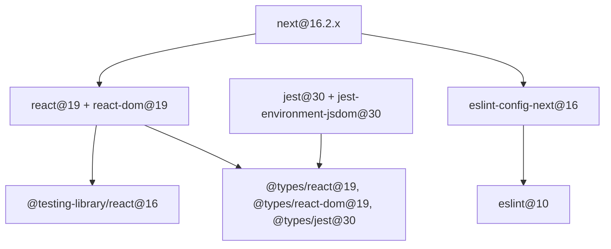

# Handoff: Coordinated Next.js 16 + React 19 stack upgrade

**Meta Agent routing** — 2026-07-10  
**Workflow:** Isolate (single module: `apps/dashboard`)  
**Executor domain:** `ui-ux`  
**Branch:** `feature/issue-343-nextjs-16-upgrade`  
**GitHub issue:** [#343](https://github.com/thienphung00/Juli-AI/issues/343)

---

## Context Plan

### Agent phase
- [x] Implementation: Meta routing → Executor (built-in TDD)
- [ ] Review + Testing: `review` → `validate` → `ship` (after Executor completes)

### Rules (Tier 2)
- [x] `.cursor/rules/code-quality.mdc`
- [x] `.cursor/rules/reliability.mdc`
- [ ] `.cursor/rules/security.mdc` (no auth changes expected)

### Skills
- [x] `.cursor/skills/domain/ui-ux/SKILL.md`
- [x] Plugin: `nextjs`, `next-upgrade`, `react-best-practices`
- [x] Plugin: `context7-mcp` (migration docs on demand)

### MCPs
- [ ] None required (local npm + CI)

### Load (required)
- `apps/dashboard/MODULE.md`
- `apps/dashboard/package.json`, `package-lock.json`
- `apps/dashboard/jest.config.js`, `next.config.js`, `.eslintrc.json`
- `.github/workflows/pr.yml` (`frontend` job)
- Blocked Dependabot PRs: #322, #325, #327, #332, #338, #339

### DO NOT load
- Backend (`backend/`, Python tests)
- TikTok integration docs
- Parallel frontend issues

---

## Problem statement

Dependabot opened **isolated major bumps** against a **Next 14 / React 18** baseline. Each PR fails CI for a different coupling reason; none should merge alone.

> **Note:** User references (#322, #325, …) are **pull request numbers**, not GitHub issues.

### CI evidence (2026-07-10)

| PR | Package bump | Failure |
|----|--------------|---------|
| [#322](https://github.com/thienphung00/Juli-AI/pull/322) | jest 30, @types/jest 30 | `frontend`: 80/80 suites — `clearMocksOnScope is not a function` (jest 30 + jest-environment-jsdom 29 skew) |
| [#325](https://github.com/thienphung00/Juli-AI/pull/325) | react 19, @types/react 19 | `npm ci` ERESOLVE — `@testing-library/react@15` wants `@types/react@^18` |
| [#332](https://github.com/thienphung00/Juli-AI/pull/332) | react-dom 19, @types/react-dom 19 | Same peer graph as #325 |
| [#338](https://github.com/thienphung00/Juli-AI/pull/338) | eslint 10 | Blocked until eslint-config-next + eslint peers align |
| [#339](https://github.com/thienphung00/Juli-AI/pull/339) | eslint-config-next 16 | `npm ci` ERESOLVE — needs `eslint>=9` and `next@16` |
| [#327](https://github.com/thienphung00/Juli-AI/pull/327) | jest-environment-jsdom 30 | Must land **with** #322 jest 30 bump |

---

## Dependency graph (must move together)



---

## Executor allocation (single agent, phased TDD)

**Owner:** Executor Agent (`ui-ux` domain)  
**Mode:** One branch, one PR — **do not** cherry-pick Dependabot commits.

### Phase 1 — Atomic manifest (Slice P1)

Update `apps/dashboard/package.json` + regenerate `package-lock.json` in **one commit**:

| Package | From | To |
|---------|------|-----|
| `next` | ^14.2.0 | ^16.2.10 |
| `react`, `react-dom` | ^18.3.0 | ^19.2.7 |
| `eslint` | ^8.57.0 | ^10.6.0 |
| `eslint-config-next` | ^14.2.0 | ^16.2.10 |
| `jest`, `jest-environment-jsdom` | ^29.7.0 | ^30.4.x |
| `@types/jest` | ^29.5.0 | ^30.0.0 |
| `@types/react`, `@types/react-dom` | ^18.3.0 | ^19.2.x |
| `@testing-library/react` | ^15.0.0 | ^16.0.0 |

Verify: `npm ci` succeeds (no `--legacy-peer-deps`).

### Phase 2 — Tooling config (Slice P2)

1. **ESLint** — migrate from `.eslintrc.json` to flat config (`eslint.config.mjs`) per Next 16 + ESLint 10 docs; keep `next/core-web-vitals` ruleset.
2. **Jest** — confirm `jest.config.js` + `ts-jest` compatibility with Jest 30; bump `ts-jest` if resolver/transform errors appear.
3. **Next** — run `npx @next/codemod@canary upgrade latest` (or stepped 15→16 if codemod recommends); review `next.config.js` for deprecated `experimental` keys.

### Phase 3 — Code fixes (Slice P3)

Fix compile/test failures surfaced by Phases 1–2:

- React 19 typing changes (`React.FC`, `ref`, `children` props)
- Next 16 async request APIs / `params` / `searchParams` if any routes use sync access
- Jest 30 snapshot / mock behavior changes

**TDD loop:** run `npm run test` after each fix cluster; add regression tests only when fixing real behavior bugs.

### Phase 4 — Verification gate (Slice P4)

```bash
cd apps/dashboard
npm ci
npm run lint
npm run type-check
npm run test
NEXT_PUBLIC_UI_ONLY=1 npm run build
```

CI must match: `.github/workflows/pr.yml` `frontend` job.

### Phase 5 — Docs + cleanup (Slice P5)

- Update `apps/dashboard/MODULE.md` stack line: Next.js 16, React 19
- Close superseded Dependabot PRs #322, #325, #327, #332, #338, #339 with comment linking parent issue/PR
- Write `agent-runtime/artifacts/implementations/implementation-issue-<N>.json`

---

## Review Agent checklist

- No `--legacy-peer-deps` workaround in CI or `.npmrc`
- Production build succeeds with App Review env vars (`NEXT_PUBLIC_UI_ONLY=1`)
- Vietnamese UI tests still pass (80+ jest suites)
- ESLint runs via `npm run lint` without deprecated `.eslintrc` warnings

---

## GitHub ops

- **Isolate lock:** hold `apps/dashboard` in `docs/handoffs/parallel-status.md` (or create row if file revived)
- **One PR** only; stagger `git push` / `gh pr create` per ops lock rules
- Dependabot PRs: close as superseded, do not merge

---

## Risks

| Risk | Mitigation |
|------|------------|
| Next 14→16 two-major jump | Use official `@next/codemod upgrade`; fix incrementally with green tests |
| ESLint flat config churn | Scope lint changes to `apps/dashboard` only |
| Recharts / radix-ui React 19 peers | Resolve at lockfile time; pin only if upstream blocks |
| VPS deploy Node version | CI uses Node 20 — confirm production `juli-web` Node ≥ 20 before merge |

---

## Bootstrap prompt (Executor Agent)

```
Implement GitHub issue #<N> — coordinated Next.js 16 + React 19 upgrade for apps/dashboard.

Read docs/handoffs/nextjs-16-coordinated-upgrade.md (full Meta handoff).
Load: ui-ux executor, nextjs + next-upgrade skills, apps/dashboard/MODULE.md.

Do NOT merge Dependabot PRs #322, #325, #327, #332, #338, #339.
Single branch feature/issue-<N>-nextjs-16-upgrade; atomic package.json bump first.

Exit gate: npm ci, lint, type-check, test, build all pass in apps/dashboard.
```
