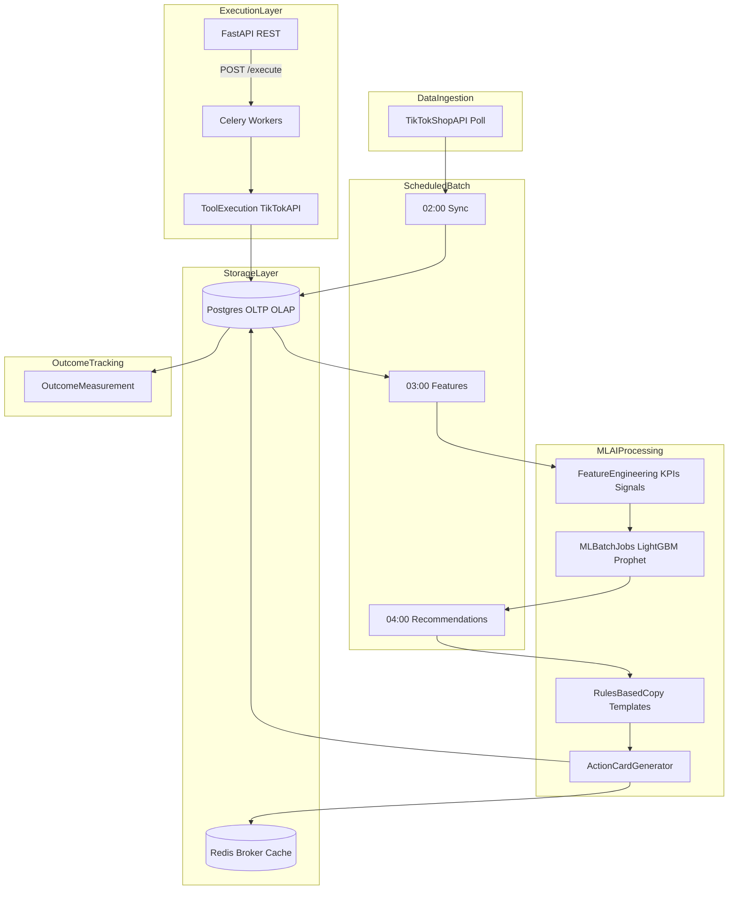

# Phase 2 — Pipeline Validation (0 Shops)

> **Tier 1 — target stack & schedule.** Read [`EXECUTION.md`](../../EXECUTION.md) first for slices.  
> **Owns:** architecture diagram, daily UTC schedule, deployment stack, Celery introduction, cache roles, account-health contract.  
> **Does not own:** subsystem envelopes (`system-design.md`), module paths (`map.md`), data phase matrix (`data-sources.md`), ADR rationale (`decisions/`).

**Goal:** Validate the entire machine end-to-end with no external users.

```
TikTok Data → Feature Store → Signal Engine → Recommendation → Execution → Outcome Tracking
```

Success means:

```
Input Data → Generated Action → Executed Action → Outcome Measured
```

---

## Architecture overview



**Transactional path:** FastAPI → create job → Celery → TikTok API → store result.  
**Analytics + AI path:** Postgres → batch ML → recommendations → Redis + Postgres.  
**No WebSockets. No Kafka. No public frontend required.**

---

## Celery introduction

Celery first appears in Phase 2 because execution is already core functionality.

Example flow:

```
Generate SEO Action → Execute SEO Update → TikTok API
```

This must **never** happen inside `POST /execute`. Instead:

```
POST /execute → Create Job → Celery → TikTok API → Store Result
```

Tool execution is a first-class subsystem, not an HTTP side effect.

---

## Daily schedule (UTC)

| Time | Job | Notes |
|------|-----|-------|
| 02:00 | TikTok sync | Orders, Products, Affiliate, Ads → Postgres |
| 03:00 | Feature build | Postgres → feature matrices |
| 04:00 | Recommendations | Batch inference → rules-based copy → action cards |
| On approval | Celery execution | Async tool calls; result persisted |

Data freshness target: **daily**.

---

## Infrastructure

Railway / VPS deployment:

| Service | Role |
|---------|------|
| **app** | FastAPI REST API |
| **worker** | Celery task execution |
| **scheduler** | Cron / APScheduler for batch jobs |
| **postgres** | OLTP + OLAP (Supabase or self-hosted) |
| **redis** | Celery broker, action-card cache, session tokens |

**Cost:** $15–50/month (server, Postgres, Redis). No LLM cost — rules-only copy layer.

---

## Copy layer (rules-based)

Phase 2 uses **deterministic rule templates** to summarize and package ML outputs into
recommendations. The LLM never decides what to recommend — it only formats copy in later phases.

```
ML signals → rank → select workflow → rules template → action card
```

- Templates keyed by `workflow_id`, signal tier, and health indicators (same pattern as Phase 1.8).
- Log `copy_source: rules` for all generated recommendation copy.
- No cloud LLM (Haiku / Claude). No raw financial PII leaves the system.
- Cloud LLM copy is deferred to beta launch (see forward phase docs under `docs/phases/`).

---

## Data & cache

| Store | Role |
|-------|------|
| **Postgres OLTP** | Accounts, jobs, action cards, execution results, outcome records |
| **Postgres OLAP** | Materialized views, KPI aggregates, feature tables, ML datasets |
| **Redis** | Celery broker, action cards (≤6/seller), SQL view cache |

ML features stay in Python (ADR-010); plain SQL views serve charts only.

---

## Account health contract

```
health_data_source: api | proxy | unavailable
```

Partner API field exposure gated at P2-B1. Dual-read VP/AHR May–July 2026 (ADR-005, ADR-006).

---

## Anomaly ML scope

Buyer-behavior only: `item_swap`, `empty_return` (ADR-008). Affiliate fraud = policy rules.

---

## Exit criteria

| Area | Requirement |
|------|-------------|
| **Data** | TikTok → Postgres reliable |
| **ML** | Signal generation stable |
| **Execution** | Tool execution succeeds >95% |
| **Tracking** | Outcome measurement works |

When all pass → advance to Phase 3 (First User Testing).
