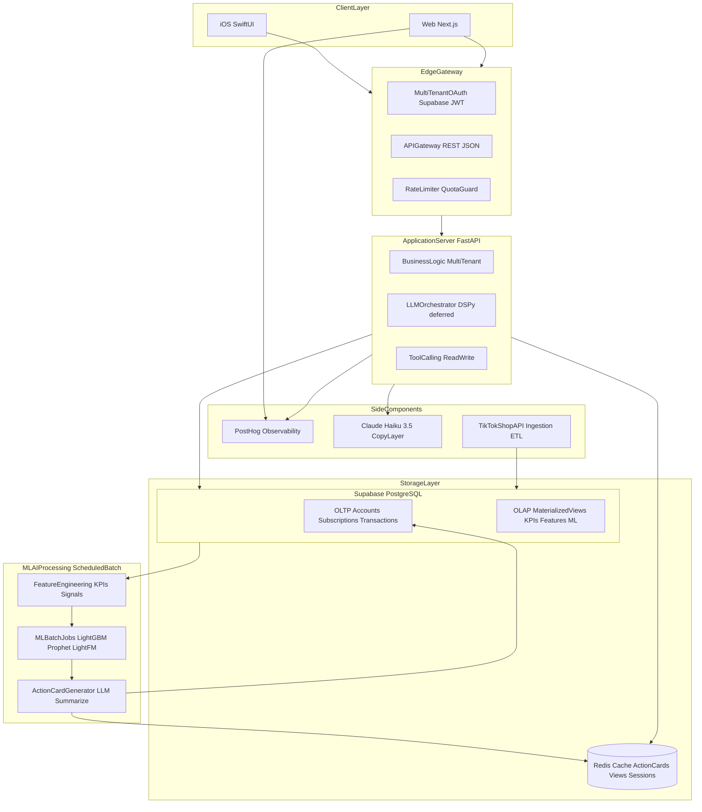

# Phase 2 — MVP Architecture

> **Tier 1 — target stack & schedule.** Read [`EXECUTION.md`](../../EXECUTION.md) first for slices.  
> **Owns:** architecture diagram, daily UTC schedule, deployment stack, cache roles, account-health contract.  
> **Does not own:** subsystem envelopes (`system-design.md`), module paths (`map.md`), data phase matrix (`data-sources.md`), ADR rationale (`decisions/`).

---

## Architecture overview



**Transactional path:** Business logic → OLTP.  
**Analytics + AI path:** OLAP → batch ML → action cards → Redis + OLTP.

---

## Daily schedule (UTC)

| Time | Job | Notes |
|------|-----|-------|
| Overnight | TikTok API poll | Orders, Products, Affiliate, Ads |
| 06:00–07:00 | Feature build | Postgres → feature matrices |
| 08:00 | Batch inference | Loads promoted artifacts from `models/` |
| After inference | Haiku copy layer | Rules fallback on failure |
| Business hours | UI + executor | Serves latest inference; fires on approval |

---

## Data & cache

| Store | Role |
|-------|------|
| **Postgres OLTP** | Accounts, subscriptions, transactions, action-card writes |
| **Postgres OLAP** | Materialized views, KPI aggregates, feature tables, ML datasets |
| **Redis** | Action cards (≤6/seller), SQL view cache, session tokens |

ML features stay in Python (ADR-010); plain SQL views serve charts only.

---

## Copy layer

Claude Haiku 3.5 (≤6 calls/seller/day) + rules fallback. No raw financial PII to LLM (ADR-012).

---

## Deployment

Railway (FastAPI + cron) · Supabase (DB/Auth) · PostHog (observability).

---

## Account health contract

```
health_data_source: api | proxy | unavailable
```

Partner API field exposure gated at P2-B1. Dual-read VP/AHR May–July 2026 (ADR-005, ADR-006).

---

## Anomaly ML scope

Buyer-behavior only: `item_swap`, `empty_return` (ADR-008). Affiliate fraud = policy rules.
