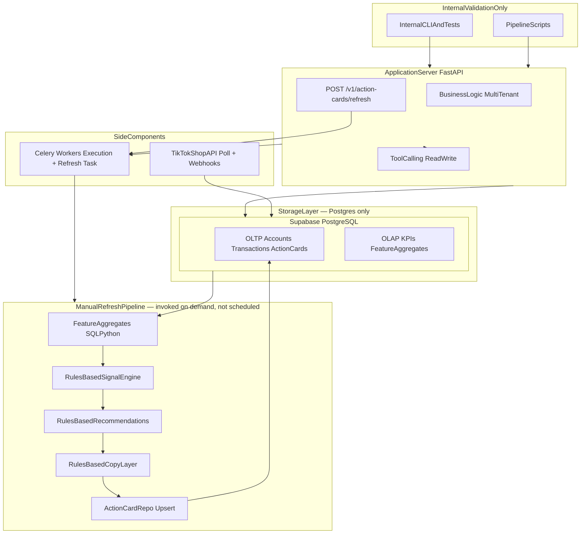

# Phase 2 — Pipeline Validation

> **Tier 1 — backend pipeline scope.** Read [`EXECUTION.md`](../../EXECUTION.md) first for slices.  
> **Owns:** pipeline architecture diagram, manual-refresh trigger model, data/cache roles, account-health contract.  
> **Does not own:** deployment (`phase-2.5-deployment.md`), subsystem envelopes (`system-design.md`), module paths (`map.md`).

**Goal:** Validate the backend pipeline end-to-end with **no public users**, **no landing page**,
**no production deployment**, and **no trained ML**.

**Signal layer:** Rules-based only. Policy rules, thresholds, and heuristics replace trained
models in Phase 2. Trained ML (T1–T8) begins in Phase 4.

**Trigger model (amended 2026-07-13, [ADR-021](../../adr/021-manual-refresh-pipeline-and-action-card-persistence.md)):**
The pipeline runs **on manual refresh only** — `POST /v1/action-cards/refresh` — never on a
schedule. No Celery beat, no cron, no scheduler of any kind ships in Phase 2. The section
below ("Daily schedule (UTC)") is retained for historical context only; it describes a
trigger model that was **never implemented and is no longer the plan**. The pipeline stage
order it documents (poll → aggregates → signals → copy) is still correct — only the "when"
changed from a clock to a user/API-initiated refresh call.

---

## Architecture overview



**Transactional path:** Business logic → OLTP.  
**Analytics + rules path (on manual refresh only):** OLAP → feature aggregates → rules-based
signals → recommendations → copy → Action Cards → OLTP.

Public web clients (`web/`, `ios/`) exist for internal dogfooding but are **not required**
for Phase 2 exit. Production deployment moves to Phase 2.5.

---

## Manual refresh trigger (supersedes the old daily schedule)

[ADR-021](../../adr/021-manual-refresh-pipeline-and-action-card-persistence.md): no cron,
no Celery beat, no scheduler. `POST /v1/action-cards/refresh` enqueues a Celery task that
runs the same stage order a clock would have run, on demand:

| Stage | Module | Notes |
|-------|--------|-------|
| 1. Poll | `workers/services/polling/orchestrate.py` | Orders, Products, Returns (Affiliate/Promotion pending contract) |
| 2. ETL | `services/etl/consumer.py` | Idempotent canonical upserts; shared with webhook handoff |
| 3. Feature aggregates | `services/aggregates/builder.py` | Postgres → KPI aggregates (not ML training features) |
| 4. Rules-based scoring | `services/scoring/pipeline.py` | Deterministic rules → signals → recommendations → copy |
| 5. Persist | `ActionCardsRepo` | Upsert by `(shop_id, workflow_key)` — idempotent, no duplicates |
| 6. On approval | Celery executor | Tool calls never block HTTP handler (unchanged from before) |

<details>
<summary>Historical: original daily schedule (UTC) — never implemented, superseded above</summary>

| Time | Job | Notes |
|------|-----|-------|
| Overnight | TikTok API poll | Orders, Products, Affiliate, Promotion API |
| 06:00–07:00 | Feature aggregates | Postgres → KPI aggregates (not ML training features) |
| 08:00 | Rules-based scoring | Deterministic rules → signals → recommendations |
| After scoring | Rules-based copy layer | Deterministic templates from rule signals |
| On approval | Celery executor | Tool calls never block HTTP handler |

</details>

---

## Data & cache

| Store | Role |
|-------|------|
| **Postgres OLTP** | Accounts, transactions, Action Card writes (sole mandatory store) |
| **Postgres OLAP** | Materialized views, KPI aggregates, feature aggregate tables |
| **Redis (optional, future)** | Read-through cache only if latency demands it — never system of record; not required for Phase 2 exit |

Feature aggregates stay in Python/SQL (ADR-010); no trained model artifacts loaded in Phase 2.

---

## Signal layer (rules-based)

| Technique type | Phase 2 implementation | Phase 4 (ML) |
|----------------|------------------------|--------------|
| Shop profile routing | Deterministic rules (`NEW_SHOP` / `MID_LARGE_SHOP`) | T8 router classifier |
| Policy / VP / AHR | Platform policy rules (ADR-005–010) | Same + ML enrichment |
| Anomaly detection | Threshold / EWMA rules | T4 / T6 trained detectors |
| Ads ranking | ROAS threshold rules | T2 ads regressor |
| Forecasting | Naive / moving-average display | T1 ETS forecaster |

See [`ml_layer.md`](../ml_layer.md) for the full T1–T8 catalog — **Phase 4 only**.

---

## Copy layer

**Rules-based only** in Phase 2 — deterministic templates from rule signals. No cloud LLM.

Cloud LLM (Claude Haiku) is deferred to Phase 4 per [`EXECUTION.md`](../../EXECUTION.md).

---

## Testing layers (Phase 2)

| Layer | Purpose | Merchant | Gate |
|-------|---------|----------|------|
| **0 — Contract discovery** | API Testing Tool cURL + response status per endpoint | Fujiwa (read) / SANDBOX_VN (write) | Required before implementation |
| **1 — Production read validation** | Verified read sync, ETL, Postgres upserts | Fujiwa only | P2-A1 |
| **2 — Sandbox write validation** | Signing, payload shape, auth, response parsing | SANDBOX_VN only | P2-A1 (technical validation) |
| **3 — Local mock integration** | Retries, idempotency, webhook handoff, sync state | Fixtures from Layer 0/1/2 | Post-A1 |

Fill contracts: [`docs/integrations/tiktok_api/contract-collection.md`](../integrations/tiktok_api/contract-collection.md).

---

## Deployment

**Phase 2.5 complete (2026-07-03):** App Review deploy live at `app-juli.com` +
`api.app-juli.com`; backend runtime in `backend/`. Phase 2 continues pipeline validation
on that stack — internal only, no public users.

Detail: [`phase-2.5-deployment.md`](phase-2.5-deployment.md).

---

## Account health contract

```
health_data_source: api | proxy | unavailable
```

**Phase 2 scope:** SPS (Shop Performance Score) / shop health via Partner API if a verified
contract exists. VP/AHR dual-read is **not** a P2 exit gate — deferred to optional/future
work when official API fields are confirmed. Proxy signals may be computed from Orders,
Products, and Returns polling when raw health fields are unavailable.

---

## Anomaly scope (Phase 2)

Buyer-behavior signals use **policy rules and thresholds** only — not trained anomaly models.
Trained `item_swap` / `empty_return` detectors deferred to Phase 4 (ADR-008).
