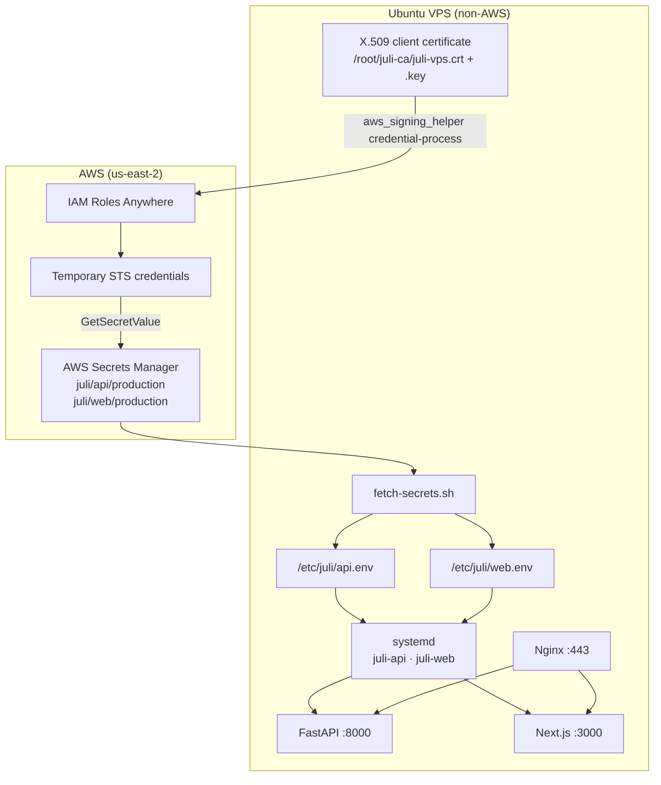
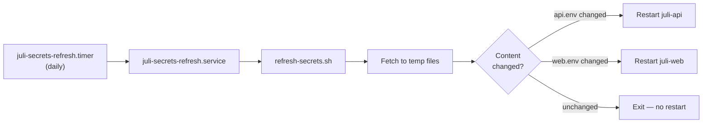

# Juli AI Production Deployment Runbook

> **Authority:** [ADR-020](../../docs/adr/020-vps-ssh-continuous-delivery-and-secrets-manager.md) ·
> [`EXECUTION.md`](../../EXECUTION.md) ·
> [`vps-wiring-runbook.md`](vps-wiring-runbook.md) (DNS/TLS bootstrap)

This document is the official guide for deploying, operating, and maintaining Juli AI on the production VPS. It assumes a single Ubuntu host running **Nginx**, **FastAPI**, **Next.js**, and **systemd**, with secrets sourced from **AWS Secrets Manager** and authenticated via **IAM Roles Anywhere** (X.509 client certificate — no EC2, no static AWS access keys, no shared credentials file).

A new engineer should be able to follow this runbook end-to-end without prior context.

---

## Table of contents

1. [Architecture overview](#architecture-overview)
2. [Prerequisites](#prerequisites)
3. [Provision a new production VPS](#provision-a-new-production-vps)
4. [Configure IAM Roles Anywhere](#configure-iam-roles-anywhere)
5. [Configure AWS Secrets Manager](#configure-aws-secrets-manager)
6. [Deploy the application](#deploy-the-application)
7. [Automatic secret synchronization](#automatic-secret-synchronization)
8. [Continuous delivery and rollback](#continuous-delivery-and-rollback)
9. [Routine maintenance](#routine-maintenance)
10. [Security](#security)
11. [Disaster recovery](#disaster-recovery)
12. [Monitoring and validation](#monitoring-and-validation)
13. [Troubleshooting](#troubleshooting)
14. [Reference](#reference)

---

## Architecture overview

### Production topology

| Component | Value |
|-----------|-------|
| Host | Single Ubuntu VPS (no HA, no autoscaling) |
| Reverse proxy | Nginx — TLS termination on port 443 |
| Frontend | `juli-web` → Next.js on `127.0.0.1:3000` |
| Backend | `juli-api` → FastAPI/uvicorn on `127.0.0.1:8000` |
| Frontend domain | `app-juli.com` |
| Backend domain | `api.app-juli.com` |
| Shop OAuth callback | `https://api.app-juli.com/v1/auth/tiktok/callback` |
| Business Advertiser OAuth callback | `https://api.app-juli.com/v1/auth/tiktok/business/callback` |
| Business account-holder OAuth callback | `https://api.app-juli.com/v1/auth/tiktok/business/account-holder/callback` |
| TLS | Let's Encrypt (certbot) |
| AWS region | `us-east-2` |
| Canonical checkout | `~/Juli-AI-v2` |
| Active release | `~/releases/current` → `~/releases/<short-sha>/` |

### Secrets and authentication flow



### Periodic secret refresh flow



### VPS directory layout

```text
~/Juli-AI-v2/                 Canonical clone — infra scripts, git worktree source
~/releases/<short-sha>/         One worktree per release (.venv + apps/dashboard/node_modules)
~/releases/current              Symlink to active release — systemd WorkingDirectory
~/releases/deploy-history.log   Append-only deploy/rollback audit trail
/etc/juli/api.env               Backend runtime env (root:root, 600)
/etc/juli/web.env               Frontend runtime env (root:root, 600)
/etc/aws/config                 IAM Roles Anywhere credential_process config
/root/juli-ca/                  X.509 CA + client certificate (see Security)
```

### Config files in this directory

| Path | Purpose |
|------|---------|
| [`nginx/`](nginx/) | Nginx vhosts for frontend and API |
| [`systemd/juli-api.service`](systemd/juli-api.service) | Backend systemd unit |
| [`systemd/juli-web.service`](systemd/juli-web.service) | Frontend systemd unit |
| [`systemd/juli-secrets-refresh.service`](systemd/juli-secrets-refresh.service) | Daily secret sync (oneshot) |
| [`systemd/juli-secrets-refresh.timer`](systemd/juli-secrets-refresh.timer) | 24-hour timer for secret sync |
| [`systemd/juli-restore-drill.service`](systemd/juli-restore-drill.service) | Weekly backup restore drill (oneshot) |
| [`systemd/juli-restore-drill.timer`](systemd/juli-restore-drill.timer) | Weekly timer for restore drill |
| [`restore-drill.sh`](scripts/restore-drill.sh) | Restore latest pg_dump into scratch DB, verify, drop |
| [`fetch-secrets.sh`](fetch-secrets.sh) | Pull secrets → `/etc/juli/*.env` |
| [`refresh-secrets.sh`](refresh-secrets.sh) | Compare-and-restart secret sync |
| [`deploy-release.sh`](deploy-release.sh) | CD entrypoint (worktree, migrate, build, cutover) |
| [`rollback-release.sh`](rollback-release.sh) | Re-point `current` symlink + restart |
| [`aws/iam-policy-secrets-reader.json`](aws/iam-policy-secrets-reader.json) | Least-privilege IAM policy template |
| [`env/api.env.example`](env/api.env.example) | Backend env key reference (placeholders only) |
| [`env/web.env.example`](env/web.env.example) | Frontend env key reference (placeholders only) |
| [`vps-wiring-runbook.md`](vps-wiring-runbook.md) | DNS + Nginx + TLS bootstrap |

---

## Prerequisites

| Item | Requirement |
|------|-------------|
| VPS | Ubuntu 22.04+ with static public IPv4 |
| DNS | A records for `app-juli.com` and `api.app-juli.com` |
| Firewall | Inbound TCP 22, 80, 443 |
| AWS account | Secrets Manager + IAM Roles Anywhere enabled in `us-east-2` |
| GitHub | Deploy SSH key in Actions secrets (`VPS_SSH_HOST`, `VPS_SSH_USER`, `VPS_SSH_KEY`) |
| Packages | `nginx`, `certbot`, `python3-venv`, `nodejs`, `npm`, `awscli`, `aws_signing_helper` |

**Do not commit** real credentials, certificates, private keys, or env files to git. Secrets live **outside** source control on the VPS and in AWS Secrets Manager.

---

## Provision a new production VPS

### Step 1 — Base system packages

SSH into the VPS as a user with `sudo` access:

```bash
sudo apt-get update
sudo apt-get install -y \
  nginx certbot python3-certbot-nginx \
  python3 python3-venv python3-pip \
  git curl jq unzip \
  nodejs npm

sudo mkdir -p /var/www/certbot /etc/juli /etc/aws
sudo chmod 700 /etc/juli
sudo systemctl enable --now nginx
```

Install the AWS CLI v2 and IAM Roles Anywhere signing helper per [AWS documentation](https://docs.aws.amazon.com/rolesanywhere/latest/userguide/getting-started.html). Place `aws_signing_helper` at `/usr/local/bin/aws_signing_helper`.

### Step 2 — DNS and TLS

Follow [`vps-wiring-runbook.md`](vps-wiring-runbook.md) to:

1. Create A records pointing both domains at the VPS public IP.
2. Install Nginx vhosts from this repo.
3. Issue Let's Encrypt certificates.

Confirm DNS before continuing:

```bash
dig +short app-juli.com A
dig +short api.app-juli.com A
```

### Step 3 — Clone the repository

```bash
cd ~
git clone git@github.com:thienphung00/Juli-AI-v2.git
cd Juli-AI-v2
```

Adjust the remote URL to match your org's repository.

### Step 4 — Install systemd units

```bash
cd ~/Juli-AI-v2
chmod +x infra/scripts/fetch-secrets.sh infra/scripts/refresh-secrets.sh

sudo cp infra/systemd/juli-api.service /etc/systemd/system/
sudo cp infra/systemd/juli-web.service /etc/systemd/system/
sudo cp infra/systemd/juli-secrets-refresh.service /etc/systemd/system/
sudo cp infra/systemd/juli-secrets-refresh.timer /etc/systemd/system/
sudo cp infra/systemd/juli-restore-drill.service /etc/systemd/system/
sudo cp infra/systemd/juli-restore-drill.timer /etc/systemd/system/

sudo systemctl daemon-reload
```

Do **not** start `juli-api` or `juli-web` yet — secrets and the first release must exist first.

---

## Configure IAM Roles Anywhere

The VPS is **not** running inside AWS. There is no EC2 instance profile. Authentication uses a **private PKI** trusted by an AWS **Trust Anchor**, an IAM **Profile**, and an IAM **Role** that grants least-privilege access to Secrets Manager.

### Step 1 — Generate the certificate authority and client certificate

On the VPS (or a secure offline machine, then transfer):

```bash
sudo mkdir -p /root/juli-ca
cd /root/juli-ca

# Root CA (keep offline or tightly access-controlled)
openssl genrsa -out juli-ca.key 4096
openssl req -x509 -new -nodes -key juli-ca.key -sha256 -days 3650 \
  -out juli-ca.crt -subj "/CN=Juli VPS CA"

# Client certificate for this VPS
openssl genrsa -out juli-vps.key 2048
openssl req -new -key juli-vps.key -out juli-vps.csr \
  -subj "/CN=juli-production-vps"

cat > client-ext.cnf <<'EOF'
basicConstraints = CA:FALSE
keyUsage = digitalSignature
extendedKeyUsage = clientAuth
EOF

openssl x509 -req -in juli-vps.csr -CA juli-ca.crt -CAkey juli-ca.key \
  -CAcreateserial -out juli-vps.crt -days 365 -sha256 -extfile client-ext.cnf

openssl verify -CAfile juli-ca.crt juli-vps.crt
# Expected: juli-vps.crt: OK
```

Set permissions immediately:

```bash
sudo chmod 600 /root/juli-ca/juli-ca.key /root/juli-ca/juli-vps.key
sudo chmod 644 /root/juli-ca/juli-ca.crt /root/juli-ca/juli-vps.crt
sudo chown -R root:root /root/juli-ca
```

### Step 2 — Create AWS Trust Anchor, Profile, and Role

In the AWS Console (or via CLI/Terraform) in **`us-east-2`**:

1. **Trust Anchor** — upload `/root/juli-ca/juli-ca.crt` as the source of trust.
2. **Profile** — associate the Trust Anchor; set session duration (e.g. 1 hour).
3. **IAM Role** — create `juli-vps-secrets-role` with the policy in
   [`aws/iam-policy-secrets-reader.json`](aws/iam-policy-secrets-reader.json).
   Replace `AWS_ACCOUNT_ID` with your account ID.
4. **Profile ↔ Role** — attach `juli-vps-secrets-role` to the Profile.

Record the ARNs:

| Resource | Example ARN pattern |
|----------|---------------------|
| Trust Anchor | `arn:aws:rolesanywhere:us-east-2:<account>:trust-anchor/<id>` |
| Profile | `arn:aws:rolesanywhere:us-east-2:<account>:profile/<id>` |
| Role | `arn:aws:iam::<account>:role/juli-vps-secrets-role` |

### Step 3 — Configure `/etc/aws/config`

Create `/etc/aws/config` (root-owned, `chmod 644`):

```ini
[profile juli-vps-secrets-reader]

region = us-east-2

credential_process = /usr/local/bin/aws_signing_helper credential-process \
  --certificate /root/juli-ca/juli-vps.crt \
  --private-key /root/juli-ca/juli-vps.key \
  --trust-anchor-arn arn:aws:rolesanywhere:us-east-2:ACCOUNT_ID:trust-anchor/TA_ID \
  --profile-arn arn:aws:rolesanywhere:us-east-2:ACCOUNT_ID:profile/PROFILE_ID \
  --role-arn arn:aws:iam::ACCOUNT_ID:role/juli-vps-secrets-role
```

Set environment defaults for root-operated scripts:

```bash
sudo tee /etc/profile.d/juli-aws.sh <<'EOF'
export AWS_CONFIG_FILE=/etc/aws/config
export AWS_PROFILE=juli-vps-secrets-reader
export AWS_REGION=us-east-2
EOF
```

### Step 4 — Verify authentication

```bash
sudo AWS_CONFIG_FILE=/etc/aws/config \
  AWS_PROFILE=juli-vps-secrets-reader \
  AWS_REGION=us-east-2 \
  aws sts get-caller-identity
```

Expected output includes:

```text
arn:aws:sts::<account-id>:assumed-role/juli-vps-secrets-role/...
```

If this fails, see [IAM Roles Anywhere troubleshooting](#iam-roles-anywhere).

---

## Configure AWS Secrets Manager

Secrets are stored as **JSON blobs** — one secret per application, not one secret per key.

### Secret inventory

#### Backend — `juli/api/production`

| Key | Required | Notes |
|-----|----------|-------|
| `DATABASE_URL` | Yes | Supabase session pooler URI (IPv4-compatible) |
| `DATABASE_DIRECT_URL` | Yes | Direct connection URI for migrations |
| `SUPABASE_URL` | Yes | Supabase project URL |
| `SUPABASE_ANON_KEY` | Yes | Public anon key |
| `SUPABASE_SERVICE_ROLE_KEY` | Yes | Service role key — server-side only |
| `SUPABASE_JWT_SECRET` | Yes | JWT validation for protected routes |
| `TIKTOK_APP_KEY` | Yes | TikTok Partner Center app key |
| `TIKTOK_APP_SECRET` | Yes | TikTok Partner Center app secret |
| `TIKTOK_BUSINESS_APP_ID` | Yes (Business OAuth) | TikTok for Business / Marketing API app id |
| `TIKTOK_BUSINESS_APP_SECRET` | Yes (Business OAuth) | TikTok for Business / Marketing API app secret |
| `TIKTOK_BUSINESS_REDIRECT_URI` | Yes (Business OAuth) | Exact Advertiser redirect: `https://api.app-juli.com/v1/auth/tiktok/business/callback` |
| `TIKTOK_BUSINESS_ACCOUNT_HOLDER_REDIRECT_URI` | Yes (Business OAuth) | Exact account-holder redirect: `https://api.app-juli.com/v1/auth/tiktok/business/account-holder/callback` |
| `TIKTOK_TOKEN_ENCRYPTION_KEY` | Yes | Master key for encrypted OAuth tokens — see [Token encryption key](#tiktok_token_encryption_key) |
| `CORS_ALLOW_ORIGINS` | Yes | e.g. `https://app-juli.com` |

> **High-risk — do not rename registered portal URIs.** The Advertiser and
> account-holder redirect URLs above are registered in the TikTok for Business
> developer portal (ADR-034). Changing or renaming a registered URI later
> requires a portal update and can break in-flight authorizations. Keep env
> values (`TIKTOK_BUSINESS_REDIRECT_URI`,
> `TIKTOK_BUSINESS_ACCOUNT_HOLDER_REDIRECT_URI`) byte-identical to the portal
> fields and to the production paths above (no query/fragment).

#### Frontend — `juli/web/production`

| Key | Required | Notes |
|-----|----------|-------|
| `NEXT_PUBLIC_API_URL` | Yes | `https://api.app-juli.com` — **baked at build time** |
| `NEXT_PUBLIC_APP_URL` | Yes | `https://app-juli.com` — **baked at build time** |
| `NEXT_PUBLIC_UI_ONLY` | Optional | Set to `1` for demo/review mode |

### Create secrets (first time)

From a secure workstation with AWS admin credentials (not on the VPS):

```bash
# Write values to local temp files — never commit these
cat > /tmp/juli-api-production.json <<'EOF'
{
  "DATABASE_URL": "postgresql://...",
  "DATABASE_DIRECT_URL": "postgresql://...",
  "SUPABASE_URL": "https://xxxx.supabase.co",
  "SUPABASE_ANON_KEY": "...",
  "SUPABASE_SERVICE_ROLE_KEY": "...",
  "SUPABASE_JWT_SECRET": "...",
  "TIKTOK_APP_KEY": "...",
  "TIKTOK_APP_SECRET": "...",
  "TIKTOK_BUSINESS_APP_ID": "...",
  "TIKTOK_BUSINESS_APP_SECRET": "...",
  "TIKTOK_BUSINESS_REDIRECT_URI": "https://api.app-juli.com/v1/auth/tiktok/business/callback",
  "TIKTOK_BUSINESS_ACCOUNT_HOLDER_REDIRECT_URI": "https://api.app-juli.com/v1/auth/tiktok/business/account-holder/callback",
  "TIKTOK_TOKEN_ENCRYPTION_KEY": "...",
  "CORS_ALLOW_ORIGINS": "https://app-juli.com"
}
EOF

aws secretsmanager create-secret \
  --region us-east-2 \
  --name juli/api/production \
  --description "Juli API production runtime configuration" \
  --secret-string file:///tmp/juli-api-production.json

cat > /tmp/juli-web-production.json <<'EOF'
{
  "NEXT_PUBLIC_API_URL": "https://api.app-juli.com",
  "NEXT_PUBLIC_APP_URL": "https://app-juli.com",
  "NEXT_PUBLIC_UI_ONLY": "0"
}
EOF

aws secretsmanager create-secret \
  --region us-east-2 \
  --name juli/web/production \
  --description "Juli web production build-time configuration" \
  --secret-string file:///tmp/juli-web-production.json

rm -f /tmp/juli-api-production.json /tmp/juli-web-production.json
```

### Edit or update secrets

```bash
# Update in place (creates a new version)
aws secretsmanager put-secret-value \
  --region us-east-2 \
  --secret-id juli/api/production \
  --secret-string file:///path/to/updated-values.json
```

After updating a secret on the VPS:

```bash
# Immediate pickup (restarts both services)
sudo /root/Juli-AI-v2/infra/scripts/fetch-secrets.sh
sudo systemctl restart juli-api juli-web

# Or wait for the daily refresh timer (restarts only if content changed)
# Or trigger manually:
sudo systemctl start juli-secrets-refresh.service
```

If `NEXT_PUBLIC_*` values changed, you **must** redeploy the frontend:

```bash
cd ~/Juli-AI-v2 && ./infra/scripts/deploy-release.sh
```

### Verify secrets (admin workstation)

```bash
aws secretsmanager describe-secret \
  --region us-east-2 --secret-id juli/api/production

aws secretsmanager get-secret-value \
  --region us-east-2 --secret-id juli/api/production \
  --query SecretString --output text | jq 'keys'
```

### Validate access (from VPS via IAM Roles Anywhere)

```bash
sudo AWS_CONFIG_FILE=/etc/aws/config \
  AWS_PROFILE=juli-vps-secrets-reader \
  AWS_REGION=us-east-2 \
  aws secretsmanager get-secret-value \
    --secret-id juli/api/production \
    --query SecretString --output text | python3 -c "import json,sys; print(len(json.load(sys.stdin)), 'keys OK')"

sudo /root/Juli-AI-v2/infra/scripts/fetch-secrets.sh
sudo wc -l /etc/juli/api.env /etc/juli/web.env
sudo ls -la /etc/juli/api.env /etc/juli/web.env
# Expect root:root, mode 600
```

### IAM policy (least privilege)

Attach [`aws/iam-policy-secrets-reader.json`](aws/iam-policy-secrets-reader.json) to `juli-vps-secrets-role`. The policy grants **only**:

- `secretsmanager:GetSecretValue`
- `secretsmanager:DescribeSecret`

…scoped to the two production secret ARNs.

**Do not** attach `SecretsManagerFullAccess`.

**Avoid `secretsmanager:ListSecrets`** on production roles unless an operational tool genuinely requires discovery across all secrets. Listing secrets expands the blast radius of a compromised certificate and is unnecessary when secret IDs are known and fixed.

### `TIKTOK_TOKEN_ENCRYPTION_KEY`

`TIKTOK_TOKEN_ENCRYPTION_KEY` is the application's **long-lived master encryption key**. It encrypts persisted TikTok OAuth access and refresh tokens at rest.

| Rule | Rationale |
|------|-----------|
| **Never auto-rotate** | Rotating without a migration re-encrypts nothing — existing tokens become unreadable |
| **Back up securely** | Loss of this key means permanent loss of stored OAuth tokens |
| **Manual rotation only** | Requires a planned migration: multiple active keys, token re-encryption, validation, then decommission of the old key |

Scheduled automatic rotation is **disabled** for this key. All other secrets may be rotated normally via `put-secret-value` + `refresh-secrets.sh` or the daily timer.

---

## Deploy the application

### First deploy (bootstrap)

Prerequisites on the VPS:

1. IAM Roles Anywhere verified (`aws sts get-caller-identity`).
2. Secrets exist in AWS Secrets Manager.
3. DNS and TLS are wired.

```bash
cd ~/Juli-AI-v2
git fetch origin main && git checkout main && git pull --ff-only

# 1. Fetch runtime env files
sudo ./infra/scripts/fetch-secrets.sh

# 2. Run the CD script (creates release worktree, migrates, builds, cuts over)
./infra/scripts/deploy-release.sh

# 3. Enable and start services
sudo systemctl enable --now juli-api juli-web

# 4. Enable daily secret refresh
sudo systemctl enable --now juli-secrets-refresh.timer

# 5. Enable weekly backup restore drill
sudo systemctl enable --now juli-restore-drill.timer

# 6. Smoke test
./infra/scripts/smoke-test.sh
```

### How `deploy-release.sh` works

Each deploy:

1. Runs `fetch-secrets.sh` to refresh `/etc/juli/api.env` and `/etc/juli/web.env`.
2. Creates (or re-checks-out) a release worktree at `~/releases/<short-sha>/`.
3. Backend: creates `.venv`, `pip install`, `alembic upgrade head`.
4. Frontend: copies `/etc/juli/web.env` → `apps/dashboard/.env.production`, runs `build-frontend-review.sh`.
5. Atomically flips `~/releases/current` symlink.
6. Restarts `juli-api` and `juli-web`.
7. Health-checks `http://127.0.0.1:8000/health` and `http://127.0.0.1:3000/` (60s timeout).
8. Appends to `deploy-history.log` and prunes old worktrees (keeps last 3).

### systemd units

Both services re-fetch secrets on every start via `ExecStartPre`:

```ini
# /etc/systemd/system/juli-api.service (excerpt)
[Service]
ExecStartPre=/root/Juli-AI-v2/infra/scripts/fetch-secrets.sh
EnvironmentFile=/etc/juli/api.env
WorkingDirectory=/root/releases/current
ExecStart=/root/releases/current/.venv/bin/uvicorn backend.api.api.main:app \
    --host 127.0.0.1 --port 8000 --workers 1
```

```ini
# /etc/systemd/system/juli-web.service (excerpt)
[Service]
ExecStartPre=/root/Juli-AI-v2/infra/scripts/fetch-secrets.sh
EnvironmentFile=/etc/juli/web.env
WorkingDirectory=/root/releases/current/apps/dashboard
ExecStart=/usr/bin/npm run start -- --port 3000 --hostname 127.0.0.1
```

Full unit files: [`systemd/juli-api.service`](systemd/juli-api.service),
[`systemd/juli-web.service`](systemd/juli-web.service).

### Manual service restart

```bash
# Backend only
sudo systemctl restart juli-api
sudo systemctl status juli-api --no-pager

# Frontend only (does not rebuild — NEXT_PUBLIC_* unchanged)
sudo systemctl restart juli-web
sudo systemctl status juli-web --no-pager
```

### Independent frontend rebuild

`NEXT_PUBLIC_*` values are baked at **build time**. To change them:

```bash
cd ~/Juli-AI-v2
git pull
sudo ./infra/scripts/fetch-secrets.sh
./infra/scripts/deploy-release.sh
```

---

## Automatic secret synchronization

A **systemd timer** runs every 24 hours to pick up secret changes without unnecessary restarts.

### Install

```bash
sudo cp ~/Juli-AI-v2/infra/systemd/juli-secrets-refresh.service /etc/systemd/system/
sudo cp ~/Juli-AI-v2/infra/systemd/juli-secrets-refresh.timer /etc/systemd/system/
sudo systemctl daemon-reload
sudo systemctl enable --now juli-secrets-refresh.timer
```

### Verify timer

```bash
systemctl list-timers juli-secrets-refresh.timer
systemctl status juli-secrets-refresh.timer --no-pager
```

### Manual trigger

```bash
sudo systemctl start juli-secrets-refresh.service
journalctl -u juli-secrets-refresh.service -n 20 --no-pager
```

### Behaviour

| Condition | Action |
|-----------|--------|
| Fetched secrets match on-disk files | Exit 0 — no service restart |
| `api.env` changed | Atomic replace → `systemctl restart juli-api` |
| `web.env` changed | Atomic replace → `systemctl restart juli-web` + warning if `NEXT_PUBLIC_*` may need rebuild |

Automatic **rotation is disabled** for `TIKTOK_TOKEN_ENCRYPTION_KEY` — see above.

---

## Continuous delivery and rollback

### Automated deploy (`release.yml`)

Merges to `main` trigger `.github/workflows/release.yml`, which SSHes to the VPS and runs `deploy-release.sh`. GitHub Actions holds **only** the SSH deploy key — no AWS credentials in CI.

Required GitHub Actions secrets: `VPS_SSH_HOST`, `VPS_SSH_USER`, `VPS_SSH_KEY`, optionally `VPS_SSH_PORT`.

### Manual deploy

```bash
ssh <user>@<vps-host>
cd ~/Juli-AI-v2 && git fetch origin main && git checkout main && git pull --ff-only
./infra/scripts/deploy-release.sh            # latest main
./infra/scripts/deploy-release.sh <sha>      # specific commit
```

### Rollback

No blue/green — rollback re-points the `current` symlink and restarts.

**GitHub UI:** Actions → **Rollback** → Run workflow.

**On the VPS:**

```bash
cd ~/Juli-AI-v2
./infra/scripts/rollback-release.sh            # previous release
./infra/scripts/rollback-release.sh <sha>      # specific past release
```

Rollback does **not** run `alembic downgrade` — schema changes must stay backward compatible.

Audit trail: `~/releases/deploy-history.log`.

---

## Routine maintenance

### Daily (automated)

- `juli-secrets-refresh.timer` — sync secrets, restart only if changed.

### Weekly

```bash
# Review service health
systemctl status juli-api juli-web --no-pager
journalctl -u juli-api --since "7 days ago" -p err --no-pager
journalctl -u juli-web --since "7 days ago" -p err --no-pager

# Confirm timer fired
journalctl -u juli-secrets-refresh.service --since "8 days ago" --no-pager
systemctl list-timers juli-restore-drill.timer
journalctl -u juli-restore-drill.service --since "8 days ago" --no-pager

# TLS renewal (certbot timer should handle this; verify)
sudo certbot renew --dry-run
```

### Monthly

- Review IAM Roles Anywhere session logs in CloudTrail.
- Verify client certificate expiry: `openssl x509 -in /root/juli-ca/juli-vps.crt -noout -dates`
- Confirm `~/releases/` disk usage is bounded (last 3 releases retained).
- Rotate non-encryption secrets as needed via Secrets Manager + `refresh-secrets.sh`.

### Certificate renewal (client cert)

Before `juli-vps.crt` expires:

```bash
cd /root/juli-ca
# Re-issue client cert with same CA (see IAM Roles Anywhere setup)
openssl verify -CAfile juli-ca.crt juli-vps.crt
# No AWS-side change needed if the same CA is still trusted
```

---

## Security

### File permissions

| Path | Owner | Mode | Notes |
|------|-------|------|-------|
| `/root/juli-ca/juli-vps.key` | root:root | `600` | Client private key — most sensitive VPS asset |
| `/root/juli-ca/juli-ca.key` | root:root | `600` | CA private key — back up offline |
| `/root/juli-ca/juli-vps.crt` | root:root | `644` | Client certificate |
| `/root/juli-ca/juli-ca.crt` | root:root | `644` | CA certificate (also in AWS Trust Anchor) |
| `/etc/juli/api.env` | root:root | `600` | Backend secrets |
| `/etc/juli/web.env` | root:root | `600` | Frontend config |
| `/etc/juli/` | root:root | `700` | Env directory |
| `/etc/aws/config` | root:root | `644` | Contains ARNs only — no secrets |

```bash
sudo chmod 600 /root/juli-ca/juli-vps.key /root/juli-ca/juli-ca.key
sudo chmod 644 /root/juli-ca/juli-vps.crt /root/juli-ca/juli-ca.crt
sudo chmod 600 /etc/juli/api.env /etc/juli/web.env
sudo chmod 700 /etc/juli
```

### What must never exist on the VPS

- IAM user access keys (`aws_access_key_id` / `aws_secret_access_key`)
- `/etc/juli/aws-credentials` or `~/.aws/credentials` with static keys
- Secrets in the git checkout or release worktrees

### Backups

| Asset | Backup method |
|-------|---------------|
| `/root/juli-ca/` | Encrypted offline backup — required for DR |
| `TIKTOK_TOKEN_ENCRYPTION_KEY` | Secure secrets backup separate from AWS (break-glass) |
| `deploy-history.log` | Included in VPS snapshot or periodic copy |
| Database | Supabase managed backups |
| Pre-migration dumps | `safe-alembic-upgrade.sh` writes `~/backups/juli-pre-migrate-*.dump` on every deploy migration |

#### Weekly restore drill (VPS-local)

A **systemd timer** (`juli-restore-drill.timer`) runs weekly (Sunday ~03:00 UTC, with up to
30 minutes randomized delay) to prove the latest pre-migration dump is restorable. The drill:

1. Resolves the newest `juli-pre-migrate-*.dump` in `BACKUP_DIR` **once at start** (default
   `~/backups`, matching `safe-alembic-upgrade.sh`) so `BACKUP_RETENTION_DAYS` rotation cannot
   delete the file mid-restore.
2. Creates a throwaway database on the **same** Postgres instance (no second server).
3. `pg_restore`s the dump into that scratch database.
4. Re-runs protected-table row counts and a `tiktok_credentials` token-decrypt sample against
   the restored copy.
5. Drops the scratch database regardless of pass/fail.

**Constraint (ADR-027):** backup files contain OAuth tokens and commerce PII and **never leave
the VPS** — there is no GitHub Actions job or off-box transfer for this drill.

Manual run (same as the timer invokes):

```bash
sudo systemctl start juli-restore-drill.service
# Or directly:
RELEASE_DIR=/root/releases/current BACKUP_DIR=/root/backups \
  API_ENV_FILE=/etc/juli/api.env \
  /root/Juli-AI-v2/infra/scripts/restore-drill.sh
```

### Monitoring

- **Uptime:** `.github/workflows/uptime.yml` — 15-minute health poll, Slack alert on failure.
- **Logs:** `journalctl -u juli-api` / `journalctl -u juli-web`.
- **Restore drill:** `journalctl -u juli-restore-drill.service` — look for a single summary line:
  `RESTORE DRILL PASS` or `RESTORE DRILL FAIL`.
- **AWS:** CloudTrail for Roles Anywhere `CreateSession` and Secrets Manager `GetSecretValue`.

#### Interpreting a failed restore drill

A failed drill **does not automatically mean current production backups are unusable**. Common
causes:

| Symptom in logs | Likely cause | Does production backup work? |
|-----------------|--------------|------------------------------|
| `could not create scratch database` / disk space errors | VPS disk pressure or too many stale scratch DBs | Unknown — investigate disk; backups may still be fine |
| `pg_restore failed` on a **corrupt/truncated** file | Bad or incomplete dump on disk | **Yes, if newer dumps exist** — check whether rotation removed the only good copy |
| `pg_restore failed` on the **latest** dump after a recent deploy | Possible dump corruption during deploy | **Treat seriously** — run a manual restore drill after fixing disk/permissions |
| `token decrypt verification failed after restore` | `TIKTOK_TOKEN_ENCRYPTION_KEY` mismatch or corrupt credential rows in dump | Backups may restore schema/data but tokens need key alignment |
| `no juli-pre-migrate-*.dump backups found` | Empty `BACKUP_DIR` or rotation deleted all dumps | No recent local dumps — rely on Supabase managed backups until deploy creates a new dump |

To tell drill failure from backup rot: confirm the resolved backup path logged at drill start
still exists (`ls -la <path>`) and manually `pg_restore` into a scratch DB during a maintenance
window. If manual restore succeeds, the scheduled failure was likely transient (disk, permissions,
or scratch DB cleanup).

---

## Disaster recovery

### VPS lost — rebuild from scratch

1. Provision new VPS (same Ubuntu version).
2. Restore `/root/juli-ca/` from encrypted backup **or** issue new client cert and update Trust Anchor.
3. Restore `/etc/aws/config` (or recreate from ARNs).
4. Follow [Provision](#provision-a-new-production-vps) through [Deploy](#deploy-the-application).
5. DNS should already point at the new IP (update A records if IP changed).
6. Run `deploy-release.sh` and smoke tests.

### CA or client key compromised

1. Revoke the Trust Anchor or remove the Profile in AWS.
2. Generate new CA + client certificate.
3. Create new Trust Anchor trusting the new CA.
4. Update `/etc/aws/config` ARNs if Profile/Anchor changed.
5. Verify `aws sts get-caller-identity`, then restart services.

### Secrets Manager unavailable

Services already running continue with on-disk `/etc/juli/*.env`. New starts and `ExecStartPre` will fail until AWS is reachable. Monitor the uptime workflow for external impact.

---

## Monitoring and validation

### CI (no live VPS required)

```bash
python -m pytest tests/unit/test_phase_2_5_deploy_config.py -q
```

### Live smoke test

```bash
cd ~/Juli-AI-v2
./infra/scripts/smoke-test.sh
# Or with explicit domains:
APP_DOMAIN=app-juli.com API_DOMAIN=api.app-juli.com ./infra/scripts/smoke-test.sh
```

### Production acceptance checklist

- [ ] `https://app-juli.com/` loads over HTTPS.
- [ ] `https://api.app-juli.com/health` returns 2xx JSON.
- [ ] Shop OAuth callback route handles invalid params without 5xx.
- [ ] Business Advertiser OAuth: `https://api.app-juli.com/v1/auth/tiktok/business/callback` handles missing params without 5xx.
- [ ] Business account-holder OAuth: `https://api.app-juli.com/v1/auth/tiktok/business/account-holder/callback` handles missing params without 5xx.
- [ ] CORS allows `https://app-juli.com`.
- [ ] `aws sts get-caller-identity` returns `juli-vps-secrets-role`.
- [ ] `/etc/juli/api.env` and `/etc/juli/web.env` exist (mode 600).
- [ ] `juli-secrets-refresh.timer` is active.
- [ ] `juli-restore-drill.timer` is active.
- [ ] Latest `journalctl -u juli-restore-drill.service` shows `RESTORE DRILL PASS` (or investigate per runbook).
- [ ] `~/releases/current` points at a healthy release.

---

## Troubleshooting

### IAM Roles Anywhere

#### Unable to parse private key

| | |
|---|---|
| **Symptoms** | `credential_process` fails; `aws sts get-caller-identity` errors with key parse message |
| **Root cause** | Corrupt key file, wrong PEM format, or permissions too open |
| **Diagnose** | `openssl rsa -in /root/juli-ca/juli-vps.key -check`; `ls -la /root/juli-ca/juli-vps.key` |
| **Resolution** | Restore key from backup or re-issue client cert; ensure mode `600` |

#### AccessDeniedException

| | |
|---|---|
| **Symptoms** | `aws sts get-caller-identity` or `get-secret-value` returns `AccessDeniedException` |
| **Root cause** | Role not attached to Profile, or IAM policy missing required action/resource |
| **Diagnose** | `aws sts get-caller-identity` (auth vs secrets); check CloudTrail for denied `GetSecretValue` |
| **Resolution** | Verify Profile→Role mapping; attach [`iam-policy-secrets-reader.json`](aws/iam-policy-secrets-reader.json) with correct ARNs |

#### Untrusted certificate

| | |
|---|---|
| **Symptoms** | `UntrustedCertificate` or trust anchor rejection |
| **Root cause** | Client cert signed by a CA not registered in the Trust Anchor |
| **Diagnose** | `openssl verify -CAfile /root/juli-ca/juli-ca.crt /root/juli-ca/juli-vps.crt` |
| **Resolution** | Upload correct CA to Trust Anchor, or re-sign client cert with the trusted CA |

#### Insufficient certificate

| | |
|---|---|
| **Symptoms** | Certificate rejected despite valid signature |
| **Root cause** | Missing `clientAuth` EKU or `CA:FALSE` constraint |
| **Diagnose** | `openssl x509 -in /root/juli-ca/juli-vps.crt -text -noout \| grep -A2 "X509v3 extensions"` |
| **Resolution** | Re-issue cert with `extendedKeyUsage = clientAuth` and `basicConstraints = CA:FALSE` |

#### ResourceNotFoundException

| | |
|---|---|
| **Symptoms** | `get-secret-value` fails with `ResourceNotFoundException` |
| **Root cause** | Wrong secret name/region, or secret not created |
| **Diagnose** | `aws secretsmanager describe-secret --secret-id juli/api/production --region us-east-2` |
| **Resolution** | Create secret in `us-east-2`; verify `AWS_REGION=us-east-2` everywhere |

#### Incorrect Trust Anchor

| | |
|---|---|
| **Symptoms** | Auth fails immediately; no assumed-role ARN returned |
| **Root cause** | `--trust-anchor-arn` in `/etc/aws/config` does not match the anchor trusting your CA |
| **Diagnose** | Compare ARN in config vs AWS Console → Roles Anywhere → Trust anchors |
| **Resolution** | Update `/etc/aws/config` with correct ARN |

#### Incorrect IAM Role permissions

| | |
|---|---|
| **Symptoms** | `get-caller-identity` succeeds; `get-secret-value` denied |
| **Root cause** | Policy resource ARN mismatch (wrong suffix or region) |
| **Diagnose** | `aws secretsmanager get-secret-value --secret-id juli/api/production` with explicit `--region us-east-2` |
| **Resolution** | Update policy `Resource` ARNs to match actual secret ARNs (include `??????` suffix wildcard) |

#### Incorrect AWS Region

| | |
|---|---|
| **Symptoms** | `ResourceNotFoundException` or auth to wrong partition/region |
| **Root cause** | `AWS_REGION` or `region` in profile set to something other than `us-east-2` |
| **Diagnose** | `echo $AWS_REGION`; `grep region /etc/aws/config` |
| **Resolution** | Set `AWS_REGION=us-east-2` in profile, `/etc/profile.d/juli-aws.sh`, and systemd units |

#### Malformed credential_process

| | |
|---|---|
| **Symptoms** | AWS CLI cannot invoke signing helper; "error running credential_process" |
| **Root cause** | Line breaks in INI, missing backslash continuations, wrong helper path |
| **Diagnose** | `aws configure list`; run the `credential_process` command manually |
| **Resolution** | Fix `/etc/aws/config` formatting; confirm `/usr/local/bin/aws_signing_helper` exists and is executable |

#### Expired client certificate

| | |
|---|---|
| **Symptoms** | Auth suddenly fails after months of operation |
| **Root cause** | `juli-vps.crt` past `notAfter` date |
| **Diagnose** | `openssl x509 -in /root/juli-ca/juli-vps.crt -noout -dates` |
| **Resolution** | Re-issue client cert (same CA); no Trust Anchor change needed |

### Application

#### Service fails on start — secrets

```bash
sudo /root/Juli-AI-v2/infra/scripts/fetch-secrets.sh
journalctl -u juli-api -n 50 --no-pager
```

#### Blank homepage / 400 on JS chunks

Stale Next.js build. Rebuild and redeploy:

```bash
cd ~/Juli-AI-v2 && ./infra/scripts/deploy-release.sh
```

#### Health check fails after deploy

```bash
curl -sS http://127.0.0.1:8000/health
curl -sS -o /dev/null -w '%{http_code}\n' http://127.0.0.1:3000/
journalctl -u juli-api -n 100 --no-pager
```

Run rollback if the new release is broken:

```bash
./infra/scripts/rollback-release.sh
```

---

## Reference

### Environment variable templates

Committed templates (placeholders only): [`env/api.env.example`](env/api.env.example),
[`env/web.env.example`](env/web.env.example).

Runtime files (never in git): `/etc/juli/api.env`, `/etc/juli/web.env`.

### Related runbooks

| Document | Scope |
|----------|-------|
| [`vps-wiring-runbook.md`](vps-wiring-runbook.md) | DNS, Nginx, TLS |
| [`frontend-deploy-runbook.md`](frontend-deploy-runbook.md) | Frontend-specific deploy |
| [`backend-deploy-runbook.md`](backend-deploy-runbook.md) | Backend-specific deploy |
| [`smoke-checklist-runbook.md`](smoke-checklist-runbook.md) | Sign-off checklist |

### Log commands

```bash
sudo journalctl -u juli-api -f
sudo journalctl -u juli-web -f
sudo journalctl -u juli-secrets-refresh.service -n 50 --no-pager
sudo journalctl -u juli-restore-drill.service -n 50 --no-pager
sudo journalctl -u juli-api --since "1 hour ago" -p err
```

### Quick reference — secret update flow

```bash
# 1. Update in AWS (admin workstation)
aws secretsmanager put-secret-value --region us-east-2 \
  --secret-id juli/api/production --secret-string file://new-values.json

# 2. Pick up on VPS
sudo systemctl start juli-secrets-refresh.service
# Or immediate:
sudo /root/Juli-AI-v2/infra/scripts/fetch-secrets.sh && sudo systemctl restart juli-api
```
