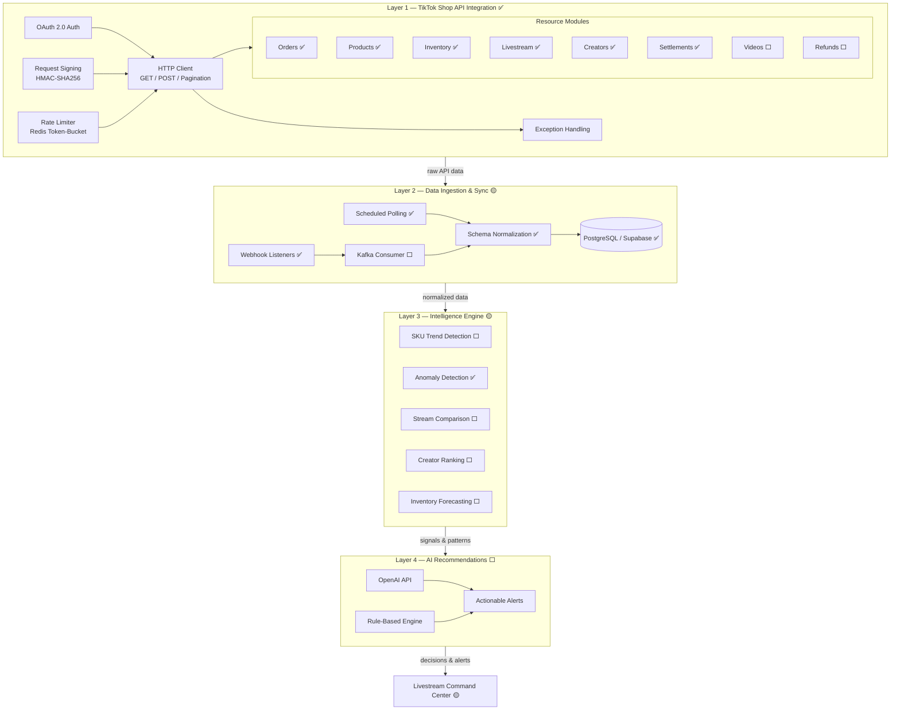

# TikTok Shop AI Operating System — Strategy & 45-Day Execution Plan

> **Reconstructed:** 2026-05-27 from git stash (`e7cb4a6`) and
> [`docs/handoffs/`](handoffs/) (`tiktok-mvp-issues-01`, `tiktok-mvp-ship-01`,
> `tiktok-mvp-ship-02`, `parallel-status`). Original doc was never merged to
> `main`; this version restores strategy content and adds a live progress
> snapshot.

---

## Implementation Progress (2026-05-27)

**MVP issue breakdown:** 14 of 24 vertical slices complete (**58%**) — see
[`docs/handoffs/tiktok-mvp-issues-01.md`](handoffs/tiktok-mvp-issues-01.md).

| Layer | Status | Shipped (issues) | Next unblocked |
|-------|--------|------------------|----------------|
| **L1** TikTok API client | Mostly done | #25 resources, #30 OAuth | Videos, Refunds |
| **L2** Ingestion & persistence | Partial | #24, #26–28, #31, webhook #27 | #32 ETL/Kafka consumer |
| **L3** Intelligence | Partial | #34 scoring/anomaly/retention/sentiment | #35 forecasting, #38 API |
| **L4** Recommendations & alerts | Not started | — | #35 → #39 → #43 |
| **Interface** (web + iOS) | Partial | #33, #37, #41, #42, #45 | #47 after #43 |

**Ship waves recorded in handoffs:**

- **Wave 1** ([`tiktok-mvp-ship-01.md`](handoffs/tiktok-mvp-ship-01.md)): data core,
  commerce schema, phone-OTP/JWT, TikTok OAuth, API bootstrap (PRs #48–#52).
- **Wave 2** ([`tiktok-mvp-ship-02.md`](handoffs/tiktok-mvp-ship-02.md)): orders/products/
  inventory/revenue API + livestream scoring module (PRs #59–#60).

**Critical path (remaining):** `#35 → #39 → #43 → #47` and `#36 → #40/#46`.

**Parallel work:** See [`docs/handoffs/parallel-status.md`](handoffs/parallel-status.md)
and [`_bootstrap.md`](handoffs/_bootstrap.md) for worktree claiming protocol.

---

## Strategic Positioning

### What You Are Actually Building

**Positioning:** "AI operating system for livestream commerce."

You are NOT building:
- A CRM
- Another dashboard
- Another POS analytics layer

You ARE building: **Realtime AI operations intelligence for TikTok Shop sellers.**

The product answers:
- What should I push tonight?
- Which host converts best?
- Which SKU is trending?
- Which livestream underperformed?
- What inventory will run out?
- Which creator actually drives GMV?
- Why did sales drop?

### Why Vietnam Requires a Different Execution Layer

U.S. products (HiveHQ AI, Dashboardly) focus on unified commerce visibility, attribution, operational analytics, AI-assisted decision making, and multi-channel intelligence — but Vietnam's winning product must be:

- Mobile-first
- Alert-first
- Action-first
- Livestream-native
- Operationally simple
- Emotionally rewarding
- AI-guided

Not dashboard-heavy. Not BI-heavy. Not enterprise-software-heavy.

---

## Best Initial ICP

### Primary Target

Mid-sized livestream-heavy sellers:

| Criteria | Details |
|---|---|
| GMV | 200M–3B VND/month |
| Team size | 5–30 employees |
| Sales model | Livestream-driven |
| Categories | Beauty / fashion / skincare / FMCG |
| Pain level | Operational chaos already exists |

**Why this ICP?**
- They already feel operational pain
- They already use multiple tools
- They have enough volume for analytics to matter
- They are still agile enough to adopt new software

---

## Most Important Product Insight

**Do NOT build "analytics pages." Build "decision feeds."**

| ❌ Bad | ✅ Good |
|---|---|
| Charts | Alerts |
| Reports | Rankings |
| BI dashboards | Recommendations |
| | Anomaly detection |
| | AI summaries |
| | Action suggestions |

The UX should feel closer to TikTok Creator tools, trading terminals, fantasy sports dashboards, and realtime livestream command centers — NOT Salesforce, HubSpot, or ERP systems.

---

## 45-Day Execution Plan

---

### Phase 1 — Days 1–7: Discovery & Seller Research

**Goal:** Validate the highest-pain workflow before writing a line of code.

#### Deliverables
- 15–20 seller interviews
- 5 livestream operation shadow sessions
- Wireframes
- Narrowed MVP problem statement

#### Target ICP for Interviews
- 200M–3B VND/month GMV
- 5–30 employees
- Livestream-driven (beauty / fashion / FMCG)

---

#### Interview Questions — Unbiased Framework

> **Rules before you start:**
> - Never mention "dashboard" or "analytics" first — let sellers name the problem
> - Ask "tell me about a time..." not "would you want..."
> - Silence is data — don't rush to fill pauses
> - Record and transcribe — patterns emerge across 10+ interviews

**A. Opening & Context (warm-up, no leading)**
1. Walk me through a typical day running your TikTok Shop — from morning to when the last stream ends.
2. How many livestreams do you run per week, and who is typically involved?
3. What tools or apps do you currently use to manage your operations? Why those?

**B. Decision-Making Loops (find recurring pain)**
1. Before you go live, what do you check or prepare? How long does that take?
2. How do you decide which products to feature in a stream? What information do you use?
3. After a stream ends, how do you know if it went well or poorly? What do you look at?
4. Tell me about a time a stream underperformed. How did you figure out what went wrong?
5. How do you manage inventory across your active streams? Has running out of stock ever cost you?

**C. Creator & Host Management**
1. Do you work with multiple hosts or creators? How do you evaluate who is performing well?
2. How do you decide which host leads which product or time slot?
3. Have you ever had a host who looked active but wasn't actually driving sales? How did you find out?

**D. Data & Reporting (reveal current gaps)**
1. Where do you currently get your sales and performance data? How often do you look at it?
2. Is there a metric or number you wish you could see but can't easily get right now?
3. Have you ever made a decision that turned out to be wrong because you didn't have the right information in time?

**E. Emotional & Operational Pain (open-ended)**
1. What part of running your TikTok Shop operation is most stressful or exhausting for you?
2. If you had a smart assistant that could tell you one thing every morning, what would you want it to tell you?
3. What would need to be true for you to pay for a tool that helps with this? What would make it worth it?

**F. Closing (validate priority)**
1. Of everything we've talked about, what is the single biggest operational headache for you right now?
2. Is there anything I didn't ask about that you think is important for me to understand?

---

#### What You Must Learn

**A. Livestream Workflow — map these:**
- How livestreams are scheduled
- Who manages what
- What metrics matter to the team
- How they decide which products to feature
- How inventory is tracked live
- How creators are evaluated

**B. Daily Decision Loops — find recurring questions like:**
- "Should we stream tonight?"
- "Which SKU should we push?"
- "Which host performs best at night?"
- "Why are viewers dropping?"
- "Should we reorder inventory?"

These become your alerts, AI recommendations, and homepage UX.

**C. Narrow MVP Ruthlessly**

MVP should solve ONLY:
- Livestream performance visibility
- SKU performance tracking
- Inventory risk alerts
- Creator / host attribution
- AI-generated operational insights

Do NOT build: CRM, accounting, HR, omnichannel, ticketing, ERP.

---

### Phase 2 — Days 8–15: Data Foundation

**Goal:** Build the data layer before touching UI.

#### Core Architecture

**Layer 1 — TikTok Shop API Integration** ✅ MOSTLY IMPLEMENTED

| Component | Status | Description |
|---|---|---|
| HTTP Client | ✅ Done | Signed GET/POST, cursor-based auto-pagination |
| OAuth 2.0 Auth | ✅ Done | Auth URL generation, code exchange, token refresh |
| Request Signing | ✅ Done | HMAC-SHA256 per TikTok spec |
| Exception Handling | ✅ Done | Typed hierarchy mapped from API error codes |
| Rate Limiter | ✅ Done | Redis token-bucket per app/shop/endpoint |
| Orders Resource | ✅ Done | Search, paginated search, detail retrieval |
| Products Resource | ✅ Done | Search, paginated search, detail retrieval |
| Inventory Resource | ✅ Done | Search, quantity updates |
| Livestream metrics | ✅ Done | `LivestreamsResource` (#25) |
| Affiliate / creator metrics | ✅ Done | `CreatorsResource` (#25) |
| Settlements | ✅ Done | `SettlementsResource` (#25) |
| Videos | ⬜ Pending | — |
| Refunds | ⬜ Pending | — |

Implementation: `src/integrations/tiktok/` — see
[`docs/architecture/map.md`](architecture/map.md).

**Layer 2 — Data Ingestion & Sync** 🟡 IN PROGRESS

| Component | Status | Issue / module |
|---|---|---|
| Auth + shop schema | ✅ Done | #24 `src/data` |
| Commerce + analytics tables | ✅ Done | #28 `src/data` |
| Phone-OTP + JWT | ✅ Done | #29 `src/auth` |
| TikTok OAuth + shop provisioning | ✅ Done | #30 `src/auth` |
| Webhook receiver + new event types | ✅ Done | #27 `src/services/webhook` |
| Polling workers (rename + extend sync) | ✅ Done | #26, #31 `src/services/polling` |
| API bootstrap + shop scoping | ✅ Done | #33 `src/api` |
| Kafka consumer + dedup + DLQ | ⬜ Pending | #32 `src/etl` |

- Realtime sync pipeline with normalized schemas — **partial** (polling + webhook publish; ETL consumer pending)
- Data persistence to Supabase Postgres — **done**

**Layer 3 — Operational Intelligence Engine** 🟡 PARTIAL

| Capability | Status | Issue / module |
|---|---|---|
| Livestream scoring (0–100 grade) | ✅ Done | #34 `src/intelligence/scoring` |
| Anomaly detection (≥2σ) | ✅ Done | #34 |
| Retention curves | ✅ Done | #34 |
| Vietnamese comment sentiment | ✅ Done | #34 |
| SKU trend detection | ⬜ Pending | — |
| Stream comparison | ⬜ Pending | — |
| Creator ranking | ⬜ Pending | — |
| Inventory depletion forecasting | ⬜ Pending | #35 `intelligence/forecasting` |

Heuristics first — no ML required for MVP scoring path.

**Layer 4 — AI Recommendation Layer** ⬜ PENDING

Examples:
- "This SKU converts 38% better after 9PM."
- "Host A performs better for skincare."
- "Inventory for Product X may run out in 4 days."
- "Yesterday's stream had lower retention after minute 23."

Tracked in issues #39, #43, #44, #47.

#### Finalized Stack

| Layer | Technology |
|---|---|
| Frontend (web) | Next.js, Tailwind, Recharts |
| Frontend (mobile) | iOS — Swift / SwiftUI (iOS 16+) |
| Backend | Python / FastAPI (extends existing codebase — see [ADR-001](decisions/001-keep-python-fastapi.md)) |
| Database & Auth | Supabase (managed Postgres + Auth + Realtime + Storage — see [ADR-002](decisions/002-supabase-backend-service.md)) |
| Realtime | Supabase Realtime (Postgres Changes) + Redis (caching, rate limiting) |
| Task Queue | Celery + Redis |
| Event Bus | Kafka |
| AI | OpenAI API + rule-based engine |
| Infra | Vercel (frontend), Railway or Fly.io (backend) |

> Do NOT over-engineer infrastructure at this stage.

#### Data Source Reality Check

Before committing to any layer above, confirm what is actually obtainable.
The canonical source-by-source matrix lives in
[`docs/architecture/data-sources.md`](architecture/data-sources.md). The
short version that drives Phase 2 scope:

**Available and used in MVP**

| Source | Powers | Notes |
|--------|--------|-------|
| TikTok Shop Official API | Orders, products, inventory, shop, finance, post-stream livestream summaries, affiliate creators (scope-gated per seller) | Bounded order history (~90d), per-shop rate limits, settlement lag 7–14d, buyer contact masked. |
| Derived event pipeline (`etl` → `intelligence/*`) | "Realtime" cockpit insights | Near-realtime (<120s p95 webhook-to-insight), **not** in-stream telemetry. |
| Zalo OA (output) + FCM | Seller-facing alerts | Zalo template-constrained and approval-gated; FCM is the always-on fallback. |
| Supabase Postgres | Persistence, realtime sub for the cockpit | One backend service — see [ADR-002](decisions/002-supabase-backend-service.md). |

**Explicitly NOT available in MVP — substitute strategy used instead**

| Want | Reality | Substitute |
|------|---------|-----------|
| Realtime in-stream viewers / comments / gifts | No safe API — unofficial websockets break on every TikTok update and carry ToS risk | Post-stream attribution: tie order events to `livestream_id`; cockpit reacts to webhook events fast enough to feel realtime. |
| Hidden Seller Center analytics | Browser scraping is fragile and risks seller account suspension | Skip entirely; ship what the official API exposes. |
| Cross-shop creator intelligence | Not exposed by TikTok | Defer to v1.5 — paid vendor (FastMoss / Kalodata / Shoplus) feeds `intelligence/ranking`. |
| Historical trends >90 days | Order search window is bounded | Defer to v1.5 via vendor archives. |
| MoMoPay wallet flows | Requires bespoke partnership | TikTok Shop Finance API covers settlement signals the MVP needs. |
| Buyer contact details | Masked for privacy | Use `buyer_id` for retention analysis only. |
| Product page views / true conversion rate | Not in API | Use orders ÷ stream-attributed sessions as a proxy where available. |

**Explicitly forbidden in any PR**

- Unofficial livestream websockets (ToS risk, unstable).
- Seller Center browser scraping (anti-bot detection → seller account
  suspension risk).
- Any source that requires storing private chat / DM data.

**Operational implications for Phase 2 build**

- Webhook receiver is authoritative for low-latency UX, but **must be
  paired with reconciliation polling** every 15 minutes — webhooks are
  not 100% deliverable.
- Backfills are **staggered per shop** to respect per-(app × shop ×
  endpoint) rate limits — never sync all sellers in the same second.
- Settlement values are **held as `pending`** for 7–14 days before being
  treated as final.
- Anomaly detection and forecasting **gate on ≥30 days of history per
  shop** — use moving-average fallback below that threshold.
- The alert layer is built as a **channel-pluggable abstraction** (FCM
  + Zalo OA in MVP; Telegram + Sheets ready to slot in at v1.5).

---

### Phase 3 — Days 16–25: Livestream Command Center MVP

**Goal:** Build the killer feature — a realtime operational cockpit, not dashboards.

#### Core Homepage Modules

1. **Today's GMV** — simple, prominent
2. **Livestream Performance Feed**
   - Stream underperforming alerts
   - Viewer retention drops
   - Product trending notifications
   - Comment spike detection
3. **AI Recommendations Feed**
   - "Push Product X tonight"
   - "Restock SKU Y"
   - "Creator Minh driving strongest conversion"
   - "Best stream slot: 8PM–10PM"
4. **Inventory Risk**
   - Low stock warnings
   - Projected depletion timeline
   - Velocity change alerts
5. **Top Performing Clips**
   - Which short videos drive GMV
   - Which clips spike conversion
   - Creator performance by content type
   - *(This bridges content → commerce — a major market gap in Vietnam)*

#### Interface progress (2026-05-27)

| Surface | Shipped | Remaining |
|---------|---------|-----------|
| Web — auth, homepage, orders | ✅ #41 | Alerts + recommendations feed (#47) |
| Web — products, inventory, livestreams, creators | ✅ #45 | — |
| iOS — auth + daily value loop shell | ✅ #42 | Push + live alerts (#46) |
| API — orders, products, inventory, revenue | ✅ #37 | Livestream/creator/settlement (#38), alerts/recs (#43) |

#### Vietnam-Specific UX Principles

| Principle | Implementation |
|---|---|
| Mobile-first | Most sellers operate on phones — desktop-only is a mistake |
| Plain language | "Best product tonight" not "conversion rate optimization" |
| Aggressive notifications | Alerts, urgency, momentum — this market responds strongly |
| Gamified performance | Host rankings, creator scorecards, livestream streaks |

---

### Phase 4 — Days 26–35: Beta Launch (5–10 Sellers)

**Goal:** Operational dependency, not scale.

#### The Signal You're Looking For

> "I check this before every livestream." — This is product-market fit.

Other strong signals:
- "I saw the alert and changed the product lineup before going live."
- "I didn't realize my host was underperforming until the app showed me."

#### Metrics to Track

| Metric | Why It Matters |
|---|---|
| Daily active usage | Critical baseline |
| Pre/during stream opens | Huge PMF signal |
| Recommendation click-through | Are users acting on AI suggestions? |
| Time-to-insight | How fast can users understand what happened and why |

#### Beta Seller Selection Criteria
- Already running 5+ streams/week
- Has 2+ hosts or creators
- Willing to give weekly feedback
- Enough GMV for anomaly detection to fire

---

### Phase 5 — Days 36–45: Vietnam-Native Refinement

**Goal:** Localize, tighten, prepare for growth.

#### Localization Priorities
- Full Vietnamese UX copy
- Mobile PWA or app wrapper
- Zalo / SMS notification integration
- VND-native number formatting throughout

#### Pricing Model

| Tier | Price | Includes |
|---|---|---|
| Starter | 499k–999k VND/month | 1–2 streams/day, basic alerts |
| Growth | 2M–5M VND/month | Unlimited streams, AI recommendations, creator ranking |
| Agency | Custom | Multi-store, MCN management, white-label |

**ROI pitch:** "One optimization insight pays for the software."

#### Post-PMF Expansion Roadmap

1. MCNs & Agencies — high ARPU
2. Multi-store operations — huge pain point
3. AI creator intelligence — very powerful moat
4. Trend forecasting layer
5. Cross-platform commerce — TikTok + Shopee + Facebook + livestream

> Long-term vision: the Bloomberg Terminal for Vietnam livestream commerce.

---

## Your True Competitive Moat

Not dashboards. Not integrations. Not AI alone.

1. **Vietnam Livestream Data Layer** — stream behavior, host performance, creator attribution, SKU momentum
2. **Operational Recommendation Engine** — "Tell me what to do." That is the entire product.
3. **Livestream Commerce Intelligence** — still extremely underbuilt in Vietnam vs. China

---

## The Biggest Mistake to Avoid

Do NOT copy U.S. SaaS UX directly.

Vietnam TikTok sellers:
- Move faster
- Think operationally
- Care about cashflow
- Hate complexity
- Love realtime feedback
- Are mobile-native
- Are not BI users

Winning requires: speed, simplicity, recommendations, operational leverage, emotional clarity.

> The product should feel like **"a smart livestream operator sitting beside me"** — not business intelligence software.

---

## Related Documentation

| Doc | Purpose |
|-----|---------|
| [`docs/handoffs/tiktok-mvp-issues-01.md`](handoffs/tiktok-mvp-issues-01.md) | 24-issue registry, dependency graph, conflict matrix |
| [`docs/handoffs/tiktok-mvp-ship-01.md`](handoffs/tiktok-mvp-ship-01.md) | Foundation ship wave (data, auth, API) |
| [`docs/handoffs/tiktok-mvp-ship-02.md`](handoffs/tiktok-mvp-ship-02.md) | API + intelligence/scoring ship wave |
| [`docs/architecture/map.md`](architecture/map.md) | Module registry and dependency graph |
| [`docs/tiktok_api/mvp-roadmap.md`](tiktok_api/mvp-roadmap.md) | Phased API integration roadmap |
| GitHub issue #2 | Parent PRD — TikTok Shop AI Operating System |
